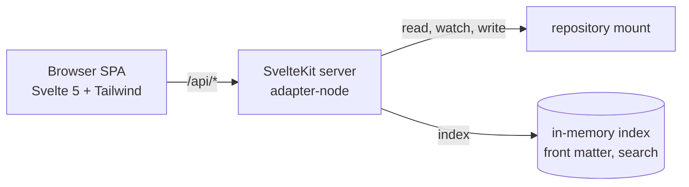

# flaiover dashboard

`flaiover` is the web view of a conforming repo. It renders every markdown document, searches `design/` and `wip/`, shows the kanban board, and charts the flow metrics defined in [metrics.md](metrics.md). It runs locally in Docker with the repo mounted read-write and is started by `flai dashboard`.

Source: `./flaiover` in this monorepo. Image: `ghcr.io/bytepunx/flaiover`.

## Shape

SvelteKit with `adapter-node`. The browser side is a single-page app (`ssr = false` at the root layout) so navigation is instant and state lives in the client. The server side is a thin set of `+server.ts` endpoints under `/api` that read and write the mounted repo. This is the only way a browser app can reach the filesystem, so "SPA" here means the UI, not the deployment. See ADR 0007.



## Views

| Route | View | Data |
|-------|------|------|
| `/` | Overview: WIP by column, throughput this week, aging items, epics burn-up sparkline | `/api/stats` |
| `/board` | Kanban board: one column per state with WIP count against the limit, story cards (epics and tasks on request) with age in column, nature, blocked flag, and the parent's ID bottom right with its title as tooltip and accessible name (`BoardCard.svelte`, S-0048), that detail row in one size under a thin divider, wrapping when crowded (S-0054); the card's background tinted by nature and its left edge striped by type, a red ring on a blocked card, a dashed faded card while dragged, and a legend above the columns built from the same map as the cards (`$lib/cardcolour.ts`, `BoardLegend.svelte`, S-0055); drag to another column to transition, refused moves show the rule; a card dropped on `cancelled` first opens `CancelConfirm.svelte`, which lists the open items that go with it from the move endpoint's dry run, calls out stories in review, names the branches and worktrees that stay, and takes the reason (S-0070, ADR-0028); `backlog` and `ready` are laid out in the pull order (`inPullOrder` in `board.ts`, flai's rule from [workflow.md](workflow.md)) and a story dragged within either is placed with `flai order`, with an insertion marker while dragging, up and down buttons beside the card's link on hover and keyboard focus, and Alt+arrow on a focused card (`$lib/reorder.ts`, `CardReorder.svelte`, S-0057); a drag within any other column is not a drop target; refreshes on SSE (S-0013) | `/api/board`, `POST /api/items/:id/move`, `POST /api/items/:id/order` |
| `/new` | Create an epic or a story from markdown (`NewItemForm.svelte`, S-0059), reached from the board's "+ new" action, which a read-only dashboard does not show: type, parent among the open epics, nature with its meaning and release consequence (`$lib/natures.ts`), title, optional tags and touches, and the body from the template with the explorer's preview beside it; no front matter. A refusal shows the findings and keeps the text; success lands on the item | `POST /api/items`, `GET /api/items/template`, `GET /api/items` |
| `/items/:id` | Item detail: front matter, rendered body, children, transitions timeline, blocked intervals, narrative link, and actions for allowed moves (a cancellation through the same confirmation as on the board), block, unblock, and a narrative log entry (S-0013) | `/api/items/:id`, `POST .../move`, `.../block`, `.../unblock`, `POST /api/streams/:id/log` |
| `/review/:id` | Review of one story in review (S-0041), linked from the item page and from cards in the review column: acceptance criteria with their ticks, the narrative's current state and next steps, open threads, the story branch's diff against main as files with collapsible hunks, and the release plan with blockers and uncommitted files from the acceptance preview. Accept runs as the designer and shows each step as it completes, then the tags, or flai's error verbatim with the story still in review. Send back asks for the reason in the page and moves the story to in-progress | `/api/items/:id`, `/api/items/:id/diff`, `/api/items/:id/acceptance`, `POST /api/items/:id/accept`, `POST /api/items/:id/move`, `/api/docs/file`, `/api/threads` |
| `/activity` | Who is working on what (S-0042), derived from the narratives: each active stream with its agent and session, the story's state and blocked flag, the task in progress, and the last log entry with its age. Nothing is written for presence: an agent that stops logging ages out | `/api/activity` |
| `/inbox` | What needs a human (S-0042): threads awaiting the designer, open questions from narratives, stories in review, blocked items, and `wip.overlap` warnings, each linking to its page. A count badge in the navigation; both refresh on change events. A per-browser toggle, off by default, raises a desktop notification for an entry that appears while the page is open | `/api/inbox` |
| `/charts/cycle-time` | Cycle time scatter by nature with p50 and p85 lines (S-0014) | `/api/stats` |
| `/charts/burn-up` | Scope and done, per epic or total | `/api/stats` |
| `/charts/cfd` | Cumulative flow diagram | `/api/stats` |
| `/charts/time-in-state` | Stacked bars per completed item and the share bar | `/api/stats` |
| `/charts/throughput` | Weekly bars by nature | `/api/stats` |
| `/charts/aging` | Aging WIP against p85 | `/api/stats` |
| `/charts/estimates` | Estimate versus actual with the perfect-estimate diagonal | `/api/stats` |
| `/docs/<path>` | Documentation explorer: collapsible tree of `design/` (including `conventions/` and `issues/`), `docs/`, and `wip/`; rendered markdown with Mermaid, highlighted code, task lists, heading anchors, rewritten links; front matter panel (S-0012) | `/api/docs/tree`, `/api/docs/file` |
| `/edit/<path>` | Editor for one document ([ADR-0023](../adrs/0023-documents-are-saved-through-flai.md), S-0040), reached from the Edit link on the document and item pages when the dashboard is writable. flai decides what may be edited: body and front matter for design and docs, body only for work items, narratives, and the board (front matter shown read-only), nothing for generated files, threads, issues, and the archive. A textarea with the explorer's renderer as preview; the "being worked on by" warning from `touches`; a thread can be opened on the heading under the cursor. Save reports the commit, a refusal with the check's findings, or a conflict with a diff and the choice to load the current version or save over it | `/api/docs/edit`, `PUT /api/docs/file`, `/api/threads` |
| `/conventions` | The conventions in read order with project additions highlighted; the same set `flai prime` prints | `/api/conventions` |
| `/adrs` | ADR list with status, date, and supersession chain linking into the explorer (S-0012) | `/api/docs/adrs` |
| `/adrs/new` | Record an architecture decision from markdown (`NewAdrForm.svelte`, S-0060), reached from "+ new ADR" on `/adrs`, which shows only when flai answers; the list also has an accept button on proposed records, shows `refines` in the chain column, and follows the files over SSE. The form: title, proposed or accepted, supersedes and refines chosen from the existing records (not both for one ADR), and the body from the project's template sections with the explorer's preview; no front matter. A refusal keeps the text; success lands on the ADR in the explorer | `POST /api/adrs`, `GET /api/adrs/template`, `POST /api/adrs/:id/accept`, `GET /api/docs/adrs` |
| `/streams` | Active narratives with current state and next steps | `/api/streams` |
| `/search` | Search across `design/` and `wip/`, `docs/` on request, with snippets and routes (S-0012); item hits tinted by nature and striped by type (S-0055) | `/api/search?q=&docs=` |

Every chart has the same filter bar: window, type, and epic where the chart supports it; a summary strip shows completed, cancelled, WIP, throughput, and cycle time percentiles; a table view sits under every chart.

## API (S-0011)

| Route | Returns |
|-------|---------|
| `GET /api/manifest` | `system-flow.yaml` parsed |
| `GET /api/items?type=&status=&archived=` | Every item from kanban and archive without bodies, sorted by ID; timestamps as `YYYY-MM-DDTHH:MM:SSZ` strings |
| `POST /api/items` `{ type, title, nature?, parent?, tags?, touches?, body }` | Creates an epic or a story with the designer's markdown as its body (S-0059, ADR-0016): `flai <type> new --body-stdin --autocommit` with the designer as owner and the dashboard's trailer. Values reach flai as `--flag=value` and the title after `--` (the wrapper puts `--json` before it), so nothing typed is read as a flag. Tasks are refused (400). 422 `{ error, findings }` when the check refuses, and then nothing was created |
| `GET /api/items/template?type=epic\|story` | `{ type, body }`: the body the project's item template gives the type (`flai <type> new --print-body`), which the form starts from |
| `GET /api/threads?on=<path\|id>&all=1`, `POST /api/threads` `{ on, heading?, title, text }`, `POST /api/threads/:id/reply` `{ text }`, `POST /api/threads/:id/resolve` `{ reason? }` | Threads read from `wip/threads`, written through `flai thread` with the manifest owner as author (S-0038) |
| `POST /api/login` | `{ token }` from the login page; sets the session cookie (S-0036) |
| `POST /api/logout` | Clears the session cookie |
| `GET /api/items/:id` | `{ item, children }` with the body; the ID may be given with any zero padding or none, so a two, three, or four digit spelling of the same number resolves to the same item |
| `GET /api/docs/tree` | Three trees (design, docs, wip) of `{ name, path, kind, title?, frontMatter?, children? }` |
| `GET /api/docs/file?path=` | `{ path, frontMatter, body, raw }` for one markdown file; paths outside the repo or non-markdown are 400, missing 404 |
| `GET /api/docs/edit?path=` | `flai doc show`: `{ path, content, hash, mode, reason? }`, mode `full`, `body`, or `none` |
| `PUT /api/docs/file` `{ path, content, hash, message? }` | `flai doc save` with the content on stdin. 200 `{ path, hash, committed, commit?, warnings[] }`; 409 `{ error, current, hash, diff }` when the file changed since it was loaded; 422 `{ error, findings[] }` when flai refuses the content (a check error on the file, or front matter it owns was changed) |
| `GET /api/events` | Server-sent events: `ready` once, then `change` with `{ path }` per changed file under design, docs, wip, or the manifest |
| `GET /api/search?q=&docs=` | `{ query, indexed, hits[] }`; each hit has `path`, `kind`, `itemId?`, `title`, `scope`, `status?`, `type?`, `nature?` (S-0055), `score`, `snippet`, `route` |
| `GET /api/docs/adrs` | ADR front matter: `id`, `title`, `status`, `date`, `supersedes[]`, `supersededBy[]`, `path` |
| `POST /api/adrs` `{ title, status?, supersedes?, refines?, body }` | Records an ADR through `flai adr new --body-stdin --autocommit` with the dashboard's trailer (S-0060, ADR-0016). ADR references are reduced to numbers, values go as `--flag=value`, and the title follows `--`. 422 `{ error, findings }` when the check refuses, and then nothing was created |
| `GET /api/adrs/template` | `{ body }`: the sections of the project's `design/adrs/0000-template.md` (`flai adr new --print-body`). It answers only when flai is available, so the ADRs page uses it to decide whether to offer writing |
| `POST /api/adrs/:id/accept` | `flai adr accept`: a proposed ADR becomes accepted, dated today, its index row updated, committed on its own |
| `GET /api/board` | `{ wip_limits, order, writable, columns: { <state>: card[] } }`; a card has `id`, `type`, `title`, `nature`, `parent`, `parent_title` (the parent item's title, absent without a parent; S-0048), `status`, `blocked`, `age_seconds`, `entered_at` |
| `POST /api/items/:id/move` `{ to, reason?, by?, include_uncommitted?, dry_run? }` | flai move; `dry_run: true` on a move to `cancelled` changes nothing and answers `{ id, cancelled[], left_behind[] }`, what the cancellation would take with it; a real cancellation answers the same fields (S-0070); `include_uncommitted: true` on a move to done is the designer's choice in the confirmation to put uncommitted files outside `wip/` into the acceptance commit and becomes flai's `--yes`, the only way the dashboard passes it (S-0051); `{ id, status, warnings[] }` or 400 `{ error }` with the rule. A story moved to done is accepted: the response also carries `merged`, `tags`, `pushed`, `push_error` (S-0046) |
| `POST /api/items/:id/order` `{ before \| after \| top \| bottom }` | Runs `flai order <id>` with exactly one placement (S-0057, ADR-0016: `board.md` is never edited by the dashboard). Only item IDs are passed to flai. Returns `{ id, status, sequence, order }`; flai's refusals (an epic or task, another state, a reference in another column) are 400 with its reason |
| `GET /api/unpushed` | `{ unpushed: { branch, upstream, remote, commits, acceptances[], tags[], behind?, command } \| null, problem? }` from `flai push --pending --dry-run` (S-0063): whether the clone holds an acceptance its remote has not got, asked offline and with no credential. `null` when there is nothing, when what is ahead holds no acceptance, and when flai is unavailable; `problem` carries flai's message for a diverged clone. `UnpushedNotice.svelte` shows it on the board and on an accepted story's page, asks again on every board change, on window focus, and each minute while showing, and has no button |
| `GET /api/agent` | Whether a flai on the host has this dashboard connected, and `project.info` asked over the channel (S-0072): `{ configured, connected, since, flai, serves, info }` or `error` in place of `info` |
| `GET /api/items/:id/acceptance` | `flai accept --dry-run`, without `--yes` so it checks what the move checks: `{ plan, branch, blockers[], uncommitted[] }`, shown in the confirmation dialog before a story is dropped on done. Blockers disable accept. Uncommitted paths outside `wip/` are listed with a checkbox, off by default, to include them; accept waits for it (S-0051) A research story's plan is a no-release plan with `unreleased: [{ component, files }]`, which the confirmation and the review page list (`UnreleasedList.svelte`, ADR-0025); an experiment arrives as a blocker |
| `GET /api/items/:id/diff` | `flai stream diff`: `{ branch, base, files: [{ path, old_path?, status, additions, deletions, binary, truncated, patch }], truncated }`, the story branch against its merge base with the main branch |
| `POST /api/items/:id/accept` `{ include_uncommitted? }` | Runs `flai accept <id> --by <designer>`, the designer being the manifest's `owner` as for threads and board moves: one project token has one holder (ADR-0018). The response is newline-delimited JSON, written as flai runs: `{ event: "progress", msg, ... }` for each step flai logs, then `{ event: "done", result }` with what `flai accept --json` printed, or `{ event: "error", error, blockers? }` with flai's message verbatim. The HTTP status is 200 once the stream has started; the last line says how it ended. The container pushes only when `flai dashboard` was given a push key (ADR-0026, S-0062): the environment git runs in is all that differs, and flaiover itself knows nothing of the key; without one the result says accepted locally and not pushed |
| `GET /api/activity` | `{ streams: [{ stream, title, agent, session, updated, age_seconds, status, blocked, task?: { id, title }, last_log?: { at, text }, path }] }`, newest first, from `wip/agents/*.md` and the items |
| `GET /api/inbox` | `{ total, counts: { thread, question, review, blocked, overlap }, entries: [{ key, kind, title, detail?, href, at? }], notes[] }`. Threads count when the last entry is not the designer's (the manifest's `owner`). Questions are the bullets under a narrative's `## Open questions`, outside the generated threads block. Overlaps are the `wip.overlap` findings of `flai check --json`, cached until the repository changes; without flai they are left out and `notes` says so |
| `/mcp`, any method | 410 with a JSON-RPC error that says where MCP lives now: flai serves it on the host, over stdio and over HTTP ([ADR-0030](../adrs/0030-mcp-is-served-by-flai-on-the-host-over-stdio-and-http-and-the-dashboard-s-api.md), S-0076). No token is needed, because the answer says nothing about the project. The dashboard served MCP here from S-0043 until then (ADR-0024, superseded) |
| `POST /api/items/:id/block` `{ reason }`, `POST /api/items/:id/unblock` | flai block and unblock |
| `POST /api/streams/:id/log` `{ entry }` | flai stream log |
| `GET /api/stats?since=&type=&by=` | `flai stats --json` verbatim (see metrics.md), cached per query and cleared on change; bad arguments are 400 |
| `GET /_health`, `GET /_ready`, `GET /metrics` | Liveness, readiness with named dependency checks, Prometheus metrics (S-0032, see docs/operators) |

Errors are `{ error }` with the status. The reader caches by path and mtime and is invalidated by the watcher.

## Writes (S-0075, ADR-0029)

Every write is a named method of flai on the host, asked over the channel; nothing runs in the container, and the image holds no `flai`, no `git`, and no `ssh`. flai validates the arguments as data, builds the command line itself, and runs the same command the CLI has, so its rules are the only rules ([ADR-0016](../adrs/0016-dashboard-delegates-to-flai.md), [ADR-0023](../adrs/0023-documents-are-saved-through-flai.md)). The mount is still given to the container and is no longer used; S-0077 removes it.

- **The routes** map a request body to a method and pass the answer through: `item.move` (and `item.move.preview` for a cancellation's dry run), `item.order`, `item.block`, `item.unblock`, `item.new`, `item.template`, `accept.preview`, `accept.run`, `stream.diff`, `stream.log`, `thread.new`, `thread.reply`, `thread.resolve`, `doc.show`, `doc.save`, `adr.new`, `adr.template`, `adr.accept`, `stats.get`, `push.pending`. They name nobody: flai records a change as the manifest's owner, so a request cannot sign a move with another name (`by` in a body is ignored).
- **`Repo.write()`** adds a request ID and a 60 second limit (ten minutes for an acceptance). When the connection is lost before the answer and flai is back within five seconds, the same request is sent once more with the same ID, and flai answers from its journal if it had already done it. `Repo.run()` is for what changes nothing (previews, templates, the diff, statistics, the pending push) and carries no ID. After a write everything asked before is forgotten.
- **Errors** keep their meaning: a workflow rule is 400 with flai's sentence, an argument that is not what it should be is 400, a document that changed since it was loaded is 409 with the current version and its hash, content the check refuses is 422 with the findings, no flai is 503, no answer in time is 504, and anything else flai reports is 500 with its message.
- **Acceptance** (`POST /api/items/:id/accept`) streams NDJSON as before. The steps arrive as `$/progress` notifications for the request while flai runs the acceptance, and the hub hands them to the route. When the connection is lost on the way the last line is an error that says the acceptance may have completed on the host and how to find out, because the dashboard cannot know.
- **An older flai.** The image no longer brings a flai of its own commit, so the flai on the host can be older than the dashboard. flai names the methods it offers when it connects; the hub compares them with `REQUIRED_METHODS` and `/api/agent` reports what is missing as an error, which the banner shows on every page with the advice to upgrade flai. A Go test (`contract_test.go`) fails when that list and flai's table drift.
- **`/mcp`** is gone since S-0076: MCP is flai's on the host ([ADR-0030](../adrs/0030-mcp-is-served-by-flai-on-the-host-over-stdio-and-http-and-the-dashboard-s-api.md)), the bridge and its settings were removed, and the route answers 410 with where to go. With it went the last thing in the dashboard's server that started a process; a test keeps it so.
- **Tried** with the image run by hand with no project mount, only the two secrets: moves, a rule's refusal, an argument that is a flag, block, unblock, order, a new story committed as the host's user with the dashboard's trailer, a story the check refused (422, nothing created), a thread opened, answered, and resolved, a document saved and then refused as changed (409), an ADR recorded and accepted, statistics, the pending push, the acceptance preview, the branch diff, and an acceptance of a story on its own branch and worktree, streamed step by step in 230 ms, from the API and from the review page in a browser. With `flai serve` frozen the acceptance ended after 11 seconds with the error above, and had in fact not run. The container held no `flai`, `git`, or `ssh`. The image is 692 MB against 740 MB.

## Search

Search is flai's since S-0074: see [search.md](../tech/search.md). What follows describes the page and the route, which are unchanged.

Server builds a MiniSearch index over title, tags, ID, headings, and body text of every markdown file under `design/` (conventions and issues included) and `wip/`, rebuilt on file change. Results link to the docs explorer or the item page.

## Runtime

- Container listens on `3000`. `flai dashboard` publishes it on the configured host port, default `4242`, on every interface by default (`dashboard.bind` or `--bind` restricts it, for example to `127.0.0.1`), and runs the container as the host user (`--user uid:gid`), so the image must work as an arbitrary non-root UID: no privileged ports, no writes outside `/project` and `/tmp`, and a writable working directory is not assumed.
- `flai dashboard` mounts the repository at the same absolute path it has on the host and sets `PROJECT_DIR` to it ([ADR-0022](../adrs/0022-repository-mounted-at-its-host-path.md)). Git links a story worktree to its repository with absolute paths, so they resolve in the container only when the two paths match; with the old fixed `/project` mount, accepting a story with a branch failed (I-0017). The image's own default is still `PROJECT_DIR=/project` for running it by hand, and `PROJECT_DIR` is also how development outside Docker points at a repository. When the host path cannot be a container path (a Windows drive path), `flai dashboard` falls back to `/project` and says that stories with a branch must be accepted from a shell, or worktrees made relative with `worktrees.relative_paths`.
- Everything the dashboard shows and everything it changes is asked of flai on the host (S-0073 to S-0075, below); the image holds no `flai`, `git`, or `ssh`, and `/_ready` is not ready without a connected flai.
- The image's entry is `node server.js`, not `node build`: see the channel to flai on the host, below. `FLAIOVER_AGENT_KEY_FILE` names the agent credential `flai dashboard` mounts.
- File watching is flai's on the host (S-0073): its `change` notifications invalidate what was asked and the search index, and push updates to open tabs with server-sent events.
- No authentication. It is a local tool bound to localhost by `flai`. Operators exposing it further are told not to in `docs/operators`.

## Internal structure

```text
flaiover/
├── src/
│   ├── lib/
│   │   ├── server/       # repo reader, front matter, metrics port, search index, watcher
│   │   ├── components/   # board, cards, charts, doc tree, markdown renderer
│   │   └── stores/       # client state
│   └── routes/
│       ├── +layout.ts    # ssr = false
│       ├── api/          # +server.ts endpoints
│       └── ...           # views above
├── static/
├── Dockerfile            # multi-stage, node:24-alpine runtime
└── tests/                # vitest unit, playwright e2e against the template sample repo
```

## What the container can write (S-0064, [ADR-0027](../adrs/0027-git-hooks-config-and-info-are-read-only-in-the-dashboard-container.md))

`flai dashboard` mounts the clone read-write and then, over it and read-only, `.git/hooks`, `.git/info`, `.git/config`, `.flai-cache/dashboard.token`, and the host's flai config when it lies inside the clone (`flai/cmd/dashboard_guard.go`). flaiover knows nothing of this; it is how the container is started. The routes by which a process in the container could leave something git later runs on the host, and what became of each:

| Route | Invisible to `git status` | Now |
|-------|---------------------------|-----|
| A hook in `.git/hooks` | yes | closed: read-only; tried, the write fails |
| `core.hooksPath`, `core.fsmonitor`, `core.sshCommand`, editor, pager, askpass, credential helpers, shell aliases, includes, `gpg.program`, filter, diff, and merge drivers, `url.*.insteadOf`, `pushurl` in `.git/config` | yes | closed: `git config` and a rename of the file fail with the config read-only; `git branch -d`, the one legitimate rewrite, tolerates it |
| Per-worktree config (`config.worktree`) | yes | closed: it is read only when `extensions.worktreeConfig` is set in the read-only config |
| `.git/info/exclude` hiding a planted file, `.git/info/attributes` naming a filter | yes | closed: read-only |
| A hook in `.git/worktrees/<name>/hooks` | yes | not a route: it can be written and git does not run it (hooks come from the common directory) |
| The dashboard token's file, and a flai config inside the clone (image, push key) | yes (ignored) | closed: read-only |
| Refs, `HEAD`, the index | shows in `git log` and `git status` | open by necessity: acceptance moves branches and commits |
| A tracked file, including a script the operator runs | no, it shows | open by necessity: a merge writes the work tree; acceptance refuses uncommitted changes outside `wip/` unless asked (S-0051), and review is where a change is seen |
| A file git ignores that the host executes (a built binary, `node_modules/.bin`, tool caches) | yes | open: project specific, flai does not know which a project has |

What the container's own work writes under `.git`, measured for the ADR: `ORIG_HEAD`, `COMMIT_EDITMSG`, `index`, logs, refs, `worktrees/`, objects, and a rewrite of `config` with identical content. A file bind mount pins the file as it was at start, so the container reads the git config of that moment until the dashboard is restarted.

## Theme (S-0044)

The dashboard wears the brand palette (`#f7f3e3`, `#23b5d3`, `#119822`, `#645853`, `#054a91`) through a token layer in `src/routes/layout.css`: CSS custom properties per theme, mapped to Tailwind utilities with `@theme inline` (`bg-ground`, `text-ink`, `border-line`, `text-accent`, ...). Dark is a selected theme: `data-theme` on `<html>`, stamped before first paint from `localStorage` (`flaiover-theme`) or the system preference, cycled by the button in the navigation (`src/lib/theme.svelte.ts`). The palette has no dark colour, so the dark ground and surface are deep steps of the warm grey hue. Pages and components use tokens only; `src/lib/theme.test.ts` parses the stylesheet and checks every text pair at 4.5:1 and every control pair at 3:1.

| Token | Role | Light | Dark |
|-------|------|-------|------|
| ground | page background | `#f7f3e3` (brand) | `#191615` |
| surface | cards, header | `#fdfbf3` | `#272220` |
| raised | hover and code backgrounds | `#ece6d3` | `#38312e` |
| ink | body text | `#1c1917` | `#f7f3e3` (brand) |
| ink-soft | secondary text | `#3d3633` | `#e6dfd0` |
| muted | captions, metadata | `#645853` (brand) | `#a79a95` |
| line / line-strong | card borders / input borders | `#d5cfcd` / `#8b7b74` | `#433b38` / `#7b6c66` |
| primary / on-primary | buttons, active states | `#054a91` (brand) / `#ffffff` | `#0866c8` / `#ffffff` |
| accent / accent-strong | links, focus ring / indicators and badges | `#17788c` / `#23b5d3` (brand) | `#23b5d3` (brand) |
| good / good-strong / good-soft | success text / success fills with ink text / soft background | `#0c6e19` / `#119822` (brand) / `#d1fad6` | `#62c96f` / `#119822` (brand) / `#084910` |
| warn, danger, info (+ -soft) | status text on status backgrounds, always with a label | `#7a4a00`, `#9b1c1c`, `#0f5d70` | `#f0c36b`, `#f28b82`, `#6fd0e6` |
| nature-feature, -improvement, -remediation, -research, -experiment | board card background, by the item's nature (S-0055) | `#e9f1fa`, `#eaf5e8`, `#fdeedd`, `#f0ecfa`, `#fae9f1` | `#1b2634`, `#1c291e`, `#322517`, `#262035`, `#321d2d` |
| type-epic, -story, -task | board card left stripe and legend swatch, by the item's type (S-0055); carries no text | `#8f7fd6`, `#4fb0c8`, `#b3a392` | `#a99be0`, `#7cc4d6`, `#c9bcae` |

Board cards are colour coded (S-0055): a pastel tint per nature as the card's background and a colour per type as a 4 px stripe on its left edge, chosen by the operator from rendered options, with the pastels softened at their request. The card still writes the nature, the type, and BLOCKED, and for that reason the operator waived colour blindness checks on the palette: telling the colours apart is never the only way to read a card. Reading the text on a tint is not waived, and `theme.test.ts` holds ink, muted, and danger at 4.5:1 on every nature tint in both themes (the lowest is muted at 5.4:1). A nature or type outside the schema keeps the plain card. The same coding appears wherever an item is named by its kind, from the same maps (`KindChips.svelte`): the item page's header writes the type beside a swatch of its stripe colour and the nature on its tint; an item hit in search is tinted and striped like a board card, its hit now carrying `nature`, and a document hit stays plain; the item table under the cycle time charts shows the nature on its tint. Chart series do not take the pastels, because a mark needs a saturated colour to be seen on the chart surface: they keep the fixed slot per nature in `$lib/viz/palette.ts`, which is the same hue as the nature's tint, and `cardcolour.test.ts` holds each pair within 25 degrees of hue in both themes.

Contrast (WCAG): ink on ground 15.7 light and 16.2 dark; muted on ground 6.2 and 6.6; accent on ground 4.6 and 7.4; white on primary 8.8 and 5.6; good on ground 5.8 and 8.7; line-strong on ground 3.6 and 3.6; primary against ground 7.9 and 3.2. `#23b5d3` reads at 2.2:1 and `#119822` at 3.4:1 on the cream ground, so light-theme text uses the darker steps `#17788c` and `#0c6e19`, and the brand cyan and green fill indicators and badges with ink text (7.2:1 and 4.6:1).

Charts (`src/lib/viz/palette.ts`) follow the same brand: slot 0 is the blue family, slot 2 the cyan family, slot 5 the green family, with supplementary hues stepped to the light band (L 0.43–0.77) and the dark band; both palettes pass the dataviz validator against the chart surfaces (`#fdfbf3`, `#272220`) on 2026-09-18. Workflow states and natures keep fixed slots so an entity's colour never changes with the filter.

## Workbench (E-0006)

The dashboard becomes the designer's workbench: authenticated (ADR-0018), able to edit documents and commit through flai, host threads anchored to documents and items (ADR-0020), show who is working on what (`touches`, ADR-0019), review and accept stories, and expose `flai mcp` over HTTP for remote agents.

- Authentication: per-project token from `.flai-cache/dashboard.token`, mounted read-only, `Authorization: Bearer` primary, HttpOnly cookie set by `/login` from a URL fragment; `/_health` and `/_ready` open; `/metrics` behind the token unless `FLAIOVER_METRICS_PUBLIC=true`.
- Editing: body editable, flai-owned front matter read-only, save validated by `flai check`, committed on `main` with the designer as author, content-hash conflict detection.
- Threads: `wip/threads/*.md` rendered beside their anchor; posting writes through `flai thread`.
- Review: branch diff against `main`, criteria, narrative, threads, `flai accept` and send-back.
- Presence and inbox: derived from `wip/agents` and threads; optional notifications.
- Hub readiness: every `/api/*` response carries `project: { name, key }`. MCP was served at `/mcp` until S-0076 and is flai's on the host since ([ADR-0030](../adrs/0030-mcp-is-served-by-flai-on-the-host-over-stdio-and-http-and-the-dashboard-s-api.md)); how a dashboard and a host reach each other was decided by ADR-0029.

## Project identity in responses

Every `/api/*` response names the project it came from (ADR-0024, S-0043; carried forward by [ADR-0030](../adrs/0030-mcp-is-served-by-flai-on-the-host-over-stdio-and-http-and-the-dashboard-s-api.md), under which `flai mcp` over HTTP sends the same two headers): JSON object bodies carry `project: { name, key }` from `system-flow.yaml`, and every response, arrays, streams, and errors included, carries `X-Flai-Project-Key` and `X-Flai-Project-Name` (URI-encoded). List endpoints that answer with an array (`/api/items`, `/api/threads`, `/api/docs/tree`, `/api/docs/adrs`) keep their shape and are identified by the headers. `flai check` warns when the manifest has no `key`.

## The channel to flai on the host (S-0072, ADR-0029)

The first step of reaching a project only through flai on the host: the channel exists, one method is asked over it, and the mount is unchanged.

- **The endpoint.** `/agent`, a WebSocket that `flai serve` opens. SvelteKit cannot upgrade a connection, so the image runs `flaiover/server.js`: adapter-node's `handler` on a plain `http.Server`, whose `upgrade` event goes to `globalThis.__flaioverAgentUpgrade`, set by the server's `init` hook (`exposeAgentUpgrade` in `$lib/server/agent.ts`). A Vite plugin in `vite.config.ts` does the same for the development server and leaves Vite's own upgrades alone. `server.js` also closes idle connections on SIGTERM and every connection `SHUTDOWN_TIMEOUT` seconds later (default 5), so that an open event stream cannot keep a server that no longer listens alive (I-0025).
- **The hub.** `AgentHub` in `$lib/server/agent.ts`, one per process, reads the credential once from `FLAIOVER_AGENT_KEY_FILE`. It refuses any path but `/agent` (404), any request with an `Origin` (403), everything when it has no credential (503), and a fifth unproven socket (429). The handshake: flai's `hello` (protocol 1, its nonce, its version, the project), the hub's answer (its nonce, `HMAC(key, "dashboard|c|s")`, its version), flai's `hello.prove` (`HMAC(key, "flai|s|c")`), compared in constant time, within five seconds, or the socket is closed (4401 not proven, 4408 timed out, 4400 malformed). A newer proven connection replaces the older (4000). Pings every 4 seconds; a missed pong terminates.
- **Asking.** `agent().ask(method, params, timeoutMs)` sends a JSON-RPC request with the connected project's key added to the params and resolves with the result. It rejects with `AgentError`: 503 when no flai is connected (the message names the commands that start one), 504 when the answer does not come in time (and sends `$/cancel`), 502 when flai answers with an error (its message and code kept) or goes away first. Messages are capped at 16 MiB.
- **Status.** `GET /api/agent` answers `{ configured, connected, since, flai, serves, info }`, where `info` is `project.info` asked over the channel with a two second limit, so connected means it answers; `error` replaces `info` when it does not. `HostFlai.svelte` in the header polls it every ten seconds: "host flai: connected", or "not connected" with the command in its tooltip; nothing when `configured` is false, which is a container started by an older flai.
- **Tests.** `agent.test.ts` runs the hub on a real HTTP server with a `ws` client as flai: the handshake, a wrong credential, an `Origin`, another path, no credential, a request in flight when flai goes, a timeout and its cancel, flai's error passed on, replacement, and a flai that stops answering pings.

## Where the data comes from (S-0073)

Everything the dashboard shows is asked of flai on the host over the channel: the project, work items, threads, and the board since S-0073, and documents, the ADR list, narratives and activity, the designer's inbox, and search since S-0074. flaiover's server reads no file of the project and parses none: no front matter parser, no YAML, no search library, no file watcher, no path guard of its own. `no-project-files.test.ts` fails when server code imports `node:fs` outside a short list with a reason for each entry (the two secrets handed to the container, the lookup of the flai binary that still performs writes until S-0075, and test support). The mount is still there for those writes only; with it removed by hand, every page that reads worked (tried, S-0074).

- **`Repo`** (`$lib/server/repo.ts`) takes an `Ask`, by default the hub's. `docsTree()` is `docs.tree` and `docFile()` is `doc.get`; flai decides what a document is (a Markdown file under the manifest's three folders, by its real location) and refuses the rest as a bad argument, which the route answers as 400. `search.ts`, `inbox.ts`, and `activity.ts` ask `search.query`, `adrs.list`, `inbox.designer`, and `activity.get`, and add only what is the dashboard's own: the route of a search hit, the link of an inbox entry (`hrefFor`), and an age counted from `updated` at the time of the request. `manifest()` is `project.info`, `items()` is `items.list` with the archive and bodies, `itemById()` is `item.get`, `threads()` and `threadsFor()` are `threads.list`, and `boardView()` is `board.get` with epics and tasks. Each answer is kept until flai says a file changed, and none is kept from a flai that has gone: the hub's `gone` forgets them, so a missing flai is a 503 and never yesterday's board. flai's refusals become the statuses the routes answer with: not found 404, a bad argument 400, no flai 503, no answer in time 504.
- **`board.ts`** maps flai's board view to the shape the page uses and counts a card's age from `entered_at`. The pull order and the columns are flai's; the TypeScript copy of the ordering rule is deleted.
- **Changes.** `flai serve` watches each project's design, docs, and wip folders and its manifest and sends `change` with the repository-relative path. The hub emits it, `Repo.changed()` forgets what was asked and re-emits it, and `/api/events`, the search index, the stats and inbox caches, and the notifier listen as they did to chokidar, which is gone. A flai that connects is announced as a change to `system-flow.yaml`, so open pages look again by themselves. The inbox webhook starts when a flai first connects, because its address is in the manifest.
- **Without a flai.** `/api/manifest`, `/api/board`, `/api/items`, `/api/items/:id`, `/api/threads`, and whatever composes them answer 503 with "no host flai is connected; run flai dashboard in the project, or flai serve start"; `/_ready` has a `host_flai` check and is not ready. `HostFlaiBanner.svelte` under the header says on every page what is missing and the commands that bring it back, and tells a container started by an older flai apart; it and the header badge share `$lib/hostflai.svelte.ts`, which looks every three seconds while flai is away and every ten while it is there.
- **Tests.** `flaiAsk(root)` in `$lib/server/testing.ts` answers a `Repo` by running `flai hostapi` from this tree on a fixture folder, so the tests read what the dashboard will be served, by the same code; `useRepo()` swaps the process-wide `Repo` for route tests. `repo-channel.test.ts` covers the keeping and forgetting, the item shape, the statuses, and the board mapping with a fake `Ask`.
- **Measured** on a copy of this repository (350 items, 428 Markdown files under wip), the published 0.19.1 image reading the mount against this story's image asking flai, thirty requests each after the first:

| Request | 0.19.1, mount: first, then median | S-0073, channel: first, then median |
|---------|-----------------------------------|-------------------------------------|
| `/api/board` | 56 ms, 41 ms | 81 ms, 2 ms |
| `/api/items/S-0070` | 40 ms, 39 ms | 59 ms, 2 ms |
| `/api/items` (217 KiB) | 41 ms, 41 ms | 69 ms, 5 ms |
| `/api/threads?all=1` | 7 ms, 5 ms | 14 ms, 2 ms |
| `/api/manifest` | 3 ms, 2 ms | 5 ms, 2 ms |

The first request after a change costs more, because flai reads every item file again and the answer crosses the channel; every request after it costs a twentieth of what it did, because the mount was stat-ed file by file on every request. A move made on the host reached an open event stream in about half a second (the watcher's 300 ms look plus one tick of debounce).

## Hub shape

Not built, and no longer the plan: ADR-0024, which sketched it, is superseded by [ADR-0030](../adrs/0030-mcp-is-served-by-flai-on-the-host-over-stdio-and-http-and-the-dashboard-s-api.md), and ADR-0029 has flai on the host dial the dashboard instead; one dashboard for every project is S-0080. What follows is the sketch as it was. A hub fronts several projects for one designer. Each project's flaiover dials out to the hub over a websocket, presenting its token, and keeps the connection open; the hub never connects in, so a project needs no inbound port and no public address. The hub routes a request to a connection by project key and labels what comes back from the identity above. What exists today already fits: one bearer token per project, identity in every response, MCP and the API on one port behind it.
