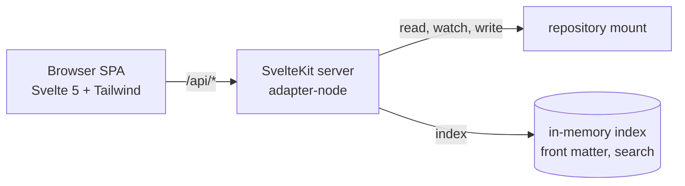

# flaiover dashboard

`flaiover` is the web view of a conforming repo. It renders every markdown document, searches `design/` and `wip/`, shows the kanban board, and charts the flow metrics defined in [metrics.md](metrics.md). It runs locally in Docker with the repo mounted read-write and is started by `flai dashboard`.

Source: `./flaiover` in this monorepo. Image: `ghcr.io/bytepunx/flaiover`.

## Shape

SvelteKit with `adapter-node`. The browser side is a single-page app (`ssr = false` at the root layout) so navigation is instant and state lives in the client. The server side is a thin set of `+server.ts` endpoints under `/api` that read and write the mounted repo. This is the only way a browser app can reach the filesystem, so "SPA" here means the UI, not the deployment. See ADR 0007.



## Views

| Route | View | Data |
|-------|------|------|
| `/` | Overview: WIP by column, throughput this week, aging items, epics burn-up sparkline | `/api/stats` |
| `/board` | Kanban board: one column per state with WIP count against the limit, story cards (epics and tasks on request) with age in column, nature, blocked flag, and the parent's ID bottom right with its title as tooltip and accessible name (`BoardCard.svelte`, S-0048), that detail row in one size under a thin divider, wrapping when crowded (S-0054); the card's background tinted by nature and its left edge striped by type, a red ring on a blocked card, a dashed faded card while dragged, and a legend above the columns built from the same map as the cards (`$lib/cardcolour.ts`, `BoardLegend.svelte`, S-0055); drag to another column to transition, refused moves show the rule; `backlog` and `ready` are laid out in the pull order (`inPullOrder` in `board.ts`, flai's rule from [workflow.md](workflow.md)) and a story dragged within either is placed with `flai order`, with an insertion marker while dragging, up and down buttons beside the card's link on hover and keyboard focus, and Alt+arrow on a focused card (`$lib/reorder.ts`, `CardReorder.svelte`, S-0057); a drag within any other column is not a drop target; refreshes on SSE (S-0013) | `/api/board`, `POST /api/items/:id/move`, `POST /api/items/:id/order` |
| `/items/:id` | Item detail: front matter, rendered body, children, transitions timeline, blocked intervals, narrative link, and actions for allowed moves, block, unblock, and a narrative log entry (S-0013) | `/api/items/:id`, `POST .../move`, `.../block`, `.../unblock`, `POST /api/streams/:id/log` |
| `/review/:id` | Review of one story in review (S-0041), linked from the item page and from cards in the review column: acceptance criteria with their ticks, the narrative's current state and next steps, open threads, the story branch's diff against main as files with collapsible hunks, and the release plan with blockers and uncommitted files from the acceptance preview. Accept runs as the designer and shows each step as it completes, then the tags, or flai's error verbatim with the story still in review. Send back asks for the reason in the page and moves the story to in-progress | `/api/items/:id`, `/api/items/:id/diff`, `/api/items/:id/acceptance`, `POST /api/items/:id/accept`, `POST /api/items/:id/move`, `/api/docs/file`, `/api/threads` |
| `/activity` | Who is working on what (S-0042), derived from the narratives: each active stream with its agent and session, the story's state and blocked flag, the task in progress, and the last log entry with its age. Nothing is written for presence: an agent that stops logging ages out | `/api/activity` |
| `/inbox` | What needs a human (S-0042): threads awaiting the designer, open questions from narratives, stories in review, blocked items, and `wip.overlap` warnings, each linking to its page. A count badge in the navigation; both refresh on change events. A per-browser toggle, off by default, raises a desktop notification for an entry that appears while the page is open | `/api/inbox` |
| `/charts/cycle-time` | Cycle time scatter by nature with p50 and p85 lines (S-0014) | `/api/stats` |
| `/charts/burn-up` | Scope and done, per epic or total | `/api/stats` |
| `/charts/cfd` | Cumulative flow diagram | `/api/stats` |
| `/charts/time-in-state` | Stacked bars per completed item and the share bar | `/api/stats` |
| `/charts/throughput` | Weekly bars by nature | `/api/stats` |
| `/charts/aging` | Aging WIP against p85 | `/api/stats` |
| `/charts/estimates` | Estimate versus actual with the perfect-estimate diagonal | `/api/stats` |
| `/docs/<path>` | Documentation explorer: collapsible tree of `design/` (including `conventions/` and `issues/`), `docs/`, and `wip/`; rendered markdown with Mermaid, highlighted code, task lists, heading anchors, rewritten links; front matter panel (S-0012) | `/api/docs/tree`, `/api/docs/file` |
| `/edit/<path>` | Editor for one document ([ADR-0023](../adrs/0023-documents-are-saved-through-flai.md), S-0040), reached from the Edit link on the document and item pages when the dashboard is writable. flai decides what may be edited: body and front matter for design and docs, body only for work items, narratives, and the board (front matter shown read-only), nothing for generated files, threads, issues, and the archive. A textarea with the explorer's renderer as preview; the "being worked on by" warning from `touches`; a thread can be opened on the heading under the cursor. Save reports the commit, a refusal with the check's findings, or a conflict with a diff and the choice to load the current version or save over it | `/api/docs/edit`, `PUT /api/docs/file`, `/api/threads` |
| `/conventions` | The conventions in read order with project additions highlighted; the same set `flai prime` prints | `/api/conventions` |
| `/adrs` | ADR list with status, date, and supersession chain linking into the explorer (S-0012) | `/api/docs/adrs` |
| `/streams` | Active narratives with current state and next steps | `/api/streams` |
| `/search` | Search across `design/` and `wip/`, `docs/` on request, with snippets and routes (S-0012); item hits tinted by nature and striped by type (S-0055) | `/api/search?q=&docs=` |

Every chart has the same filter bar: window, type, and epic where the chart supports it; a summary strip shows completed, cancelled, WIP, throughput, and cycle time percentiles; a table view sits under every chart.

## API (S-0011)

| Route | Returns |
|-------|---------|
| `GET /api/manifest` | `system-flow.yaml` parsed |
| `GET /api/items?type=&status=&archived=` | Every item from kanban and archive without bodies, sorted by ID; timestamps as `YYYY-MM-DDTHH:MM:SSZ` strings |
| `GET /api/threads?on=<path\|id>&all=1`, `POST /api/threads` `{ on, heading?, title, text }`, `POST /api/threads/:id/reply` `{ text }`, `POST /api/threads/:id/resolve` `{ reason? }` | Threads read from `wip/threads`, written through `flai thread` with the manifest owner as author (S-0038) |
| `POST /api/login` | `{ token }` from the login page; sets the session cookie (S-0036) |
| `POST /api/logout` | Clears the session cookie |
| `GET /api/items/:id` | `{ item, children }` with the body; the ID may be given with any zero padding or none, so a two, three, or four digit spelling of the same number resolves to the same item |
| `GET /api/docs/tree` | Three trees (design, docs, wip) of `{ name, path, kind, title?, frontMatter?, children? }` |
| `GET /api/docs/file?path=` | `{ path, frontMatter, body, raw }` for one markdown file; paths outside the repo or non-markdown are 400, missing 404 |
| `GET /api/docs/edit?path=` | `flai doc show`: `{ path, content, hash, mode, reason? }`, mode `full`, `body`, or `none` |
| `PUT /api/docs/file` `{ path, content, hash, message? }` | `flai doc save` with the content on stdin. 200 `{ path, hash, committed, commit?, warnings[] }`; 409 `{ error, current, hash, diff }` when the file changed since it was loaded; 422 `{ error, findings[] }` when flai refuses the content (a check error on the file, or front matter it owns was changed) |
| `GET /api/events` | Server-sent events: `ready` once, then `change` with `{ path }` per changed file under design, docs, wip, or the manifest |
| `GET /api/search?q=&docs=` | `{ query, indexed, hits[] }`; each hit has `path`, `kind`, `itemId?`, `title`, `scope`, `status?`, `type?`, `nature?` (S-0055), `score`, `snippet`, `route` |
| `GET /api/docs/adrs` | ADR front matter: `id`, `title`, `status`, `date`, `supersedes[]`, `supersededBy[]`, `path` |
| `GET /api/board` | `{ wip_limits, order, writable, columns: { <state>: card[] } }`; a card has `id`, `type`, `title`, `nature`, `parent`, `parent_title` (the parent item's title, absent without a parent; S-0048), `status`, `blocked`, `age_seconds`, `entered_at` |
| `POST /api/items/:id/move` `{ to, reason?, by?, include_uncommitted? }` | flai move; `include_uncommitted: true` on a move to done is the designer's choice in the confirmation to put uncommitted files outside `wip/` into the acceptance commit and becomes flai's `--yes`, the only way the dashboard passes it (S-0051); `{ id, status, warnings[] }` or 400 `{ error }` with the rule. A story moved to done is accepted: the response also carries `merged`, `tags`, `pushed`, `push_error` (S-0046) |
| `POST /api/items/:id/order` `{ before \| after \| top \| bottom }` | Runs `flai order <id>` with exactly one placement (S-0057, ADR-0016: `board.md` is never edited by the dashboard). Only item IDs are passed to flai. Returns `{ id, status, sequence, order }`; flai's refusals (an epic or task, another state, a reference in another column) are 400 with its reason |
| `GET /api/items/:id/acceptance` | `flai accept --dry-run`, without `--yes` so it checks what the move checks: `{ plan, branch, blockers[], uncommitted[] }`, shown in the confirmation dialog before a story is dropped on done. Blockers disable accept. Uncommitted paths outside `wip/` are listed with a checkbox, off by default, to include them; accept waits for it (S-0051) A research story's plan is a no-release plan with `unreleased: [{ component, files }]`, which the confirmation and the review page list (`UnreleasedList.svelte`, ADR-0025); an experiment arrives as a blocker |
| `GET /api/items/:id/diff` | `flai stream diff`: `{ branch, base, files: [{ path, old_path?, status, additions, deletions, binary, truncated, patch }], truncated }`, the story branch against its merge base with the main branch |
| `POST /api/items/:id/accept` `{ include_uncommitted? }` | Runs `flai accept <id> --by <designer>`, the designer being the manifest's `owner` as for threads and board moves: one project token has one holder (ADR-0018). The response is newline-delimited JSON, written as flai runs: `{ event: "progress", msg, ... }` for each step flai logs, then `{ event: "done", result }` with what `flai accept --json` printed, or `{ event: "error", error, blockers? }` with flai's message verbatim. The HTTP status is 200 once the stream has started; the last line says how it ended. The container pushes only when `flai dashboard` was given a push key (ADR-0026, S-0062): the environment git runs in is all that differs, and flaiover itself knows nothing of the key; without one the result says accepted locally and not pushed |
| `GET /api/activity` | `{ streams: [{ stream, title, agent, session, updated, age_seconds, status, blocked, task?: { id, title }, last_log?: { at, text }, path }] }`, newest first, from `wip/agents/*.md` and the items |
| `GET /api/inbox` | `{ total, counts: { thread, question, review, blocked, overlap }, entries: [{ key, kind, title, detail?, href, at? }], notes[] }`. Threads count when the last entry is not the designer's (the manifest's `owner`). Questions are the bullets under a narrative's `## Open questions`, outside the generated threads block. Overlaps are the `wip.overlap` findings of `flai check --json`, cached until the repository changes; without flai they are left out and `notes` says so |
| `POST /mcp`, `DELETE /mcp`, `GET /mcp` (405) | MCP over Streamable HTTP ([ADR-0024](../adrs/0024-mcp-over-http-and-project-identity.md), S-0043): the same server as `flai mcp`, one `flai mcp` process per session, bridged over its standard input and output. `initialize` without a session starts one and returns `Mcp-Session-Id`; a request returns its response as `application/json`, a notification 202; an unknown session is 404; DELETE ends it; sessions idle out (`FLAIOVER_MCP_IDLE_MINUTES`, default 30) and are capped (`FLAIOVER_MCP_MAX_SESSIONS`, default 16). Bearer token only, never the cookie; a cross-origin `Origin` is refused. The agent's name is `X-Flai-Agent` on `initialize`, else the client's name |
| `POST /api/items/:id/block` `{ reason }`, `POST /api/items/:id/unblock` | flai block and unblock |
| `POST /api/streams/:id/log` `{ entry }` | flai stream log |
| `GET /api/stats?since=&type=&by=` | `flai stats --json` verbatim (see metrics.md), cached per query and cleared on change; bad arguments are 400 |
| `GET /_health`, `GET /_ready`, `GET /metrics` | Liveness, readiness with named dependency checks, Prometheus metrics (S-0032, see docs/operators) |

Errors are `{ error }` with the status. The reader caches by path and mtime and is invalidated by the watcher.

## Writes

The mount is read-write so the board can be operated from the browser. Every write (move, block, unblock, narrative log) is performed by invoking the bundled `flai` binary with `--json` inside the project ([ADR-0016](../adrs/0016-dashboard-delegates-to-flai.md)); a refused write returns flai's rule text. The server finds the binary through `FLAI_BIN`, then `PATH`, and runs it with `FLAI_CONFIG` and `FLAI_CACHE_DIR` under the project's `.flai-cache` and `FLAI_AGENT=flaiover`. Without a binary the dashboard is read-only and the board says so. Writes are ordinary file edits, so they show up in `git status` for the human to commit. Metrics (S-0014) come from `flai stats --json` the same way.

## Search

Server builds a MiniSearch index over title, tags, ID, headings, and body text of every markdown file under `design/` (conventions and issues included) and `wip/`, rebuilt on file change. Results link to the docs explorer or the item page.

## Runtime

- Container listens on `3000`. `flai dashboard` publishes it on the configured host port, default `4242`, on every interface by default (`dashboard.bind` or `--bind` restricts it, for example to `127.0.0.1`), and runs the container as the host user (`--user uid:gid`), so the image must work as an arbitrary non-root UID: no privileged ports, no writes outside `/project` and `/tmp`, and a writable working directory is not assumed.
- `flai dashboard` mounts the repository at the same absolute path it has on the host and sets `PROJECT_DIR` to it ([ADR-0022](../adrs/0022-repository-mounted-at-its-host-path.md)). Git links a story worktree to its repository with absolute paths, so they resolve in the container only when the two paths match; with the old fixed `/project` mount, accepting a story with a branch failed (I-0017). The image's own default is still `PROJECT_DIR=/project` for running it by hand, and `PROJECT_DIR` is also how development outside Docker points at a repository. When the host path cannot be a container path (a Windows drive path), `flai dashboard` falls back to `/project` and says that stories with a branch must be accepted from a shell, or worktrees made relative with `worktrees.relative_paths`.
- File watching with `chokidar`, debounced, invalidates the index and pushes updates to open tabs with server-sent events.
- No authentication. It is a local tool bound to localhost by `flai`. Operators exposing it further are told not to in `docs/operators`.

## Internal structure

```text
flaiover/
├── src/
│   ├── lib/
│   │   ├── server/       # repo reader, front matter, metrics port, search index, watcher
│   │   ├── components/   # board, cards, charts, doc tree, markdown renderer
│   │   └── stores/       # client state
│   └── routes/
│       ├── +layout.ts    # ssr = false
│       ├── api/          # +server.ts endpoints
│       └── ...           # views above
├── static/
├── Dockerfile            # multi-stage, node:24-alpine runtime
└── tests/                # vitest unit, playwright e2e against the template sample repo
```

## Theme (S-0044)

The dashboard wears the brand palette (`#f7f3e3`, `#23b5d3`, `#119822`, `#645853`, `#054a91`) through a token layer in `src/routes/layout.css`: CSS custom properties per theme, mapped to Tailwind utilities with `@theme inline` (`bg-ground`, `text-ink`, `border-line`, `text-accent`, ...). Dark is a selected theme: `data-theme` on `<html>`, stamped before first paint from `localStorage` (`flaiover-theme`) or the system preference, cycled by the button in the navigation (`src/lib/theme.svelte.ts`). The palette has no dark colour, so the dark ground and surface are deep steps of the warm grey hue. Pages and components use tokens only; `src/lib/theme.test.ts` parses the stylesheet and checks every text pair at 4.5:1 and every control pair at 3:1.

| Token | Role | Light | Dark |
|-------|------|-------|------|
| ground | page background | `#f7f3e3` (brand) | `#191615` |
| surface | cards, header | `#fdfbf3` | `#272220` |
| raised | hover and code backgrounds | `#ece6d3` | `#38312e` |
| ink | body text | `#1c1917` | `#f7f3e3` (brand) |
| ink-soft | secondary text | `#3d3633` | `#e6dfd0` |
| muted | captions, metadata | `#645853` (brand) | `#a79a95` |
| line / line-strong | card borders / input borders | `#d5cfcd` / `#8b7b74` | `#433b38` / `#7b6c66` |
| primary / on-primary | buttons, active states | `#054a91` (brand) / `#ffffff` | `#0866c8` / `#ffffff` |
| accent / accent-strong | links, focus ring / indicators and badges | `#17788c` / `#23b5d3` (brand) | `#23b5d3` (brand) |
| good / good-strong / good-soft | success text / success fills with ink text / soft background | `#0c6e19` / `#119822` (brand) / `#d1fad6` | `#62c96f` / `#119822` (brand) / `#084910` |
| warn, danger, info (+ -soft) | status text on status backgrounds, always with a label | `#7a4a00`, `#9b1c1c`, `#0f5d70` | `#f0c36b`, `#f28b82`, `#6fd0e6` |
| nature-feature, -improvement, -remediation, -research, -experiment | board card background, by the item's nature (S-0055) | `#e9f1fa`, `#eaf5e8`, `#fdeedd`, `#f0ecfa`, `#fae9f1` | `#1b2634`, `#1c291e`, `#322517`, `#262035`, `#321d2d` |
| type-epic, -story, -task | board card left stripe and legend swatch, by the item's type (S-0055); carries no text | `#8f7fd6`, `#4fb0c8`, `#b3a392` | `#a99be0`, `#7cc4d6`, `#c9bcae` |

Board cards are colour coded (S-0055): a pastel tint per nature as the card's background and a colour per type as a 4 px stripe on its left edge, chosen by the operator from rendered options, with the pastels softened at their request. The card still writes the nature, the type, and BLOCKED, and for that reason the operator waived colour blindness checks on the palette: telling the colours apart is never the only way to read a card. Reading the text on a tint is not waived, and `theme.test.ts` holds ink, muted, and danger at 4.5:1 on every nature tint in both themes (the lowest is muted at 5.4:1). A nature or type outside the schema keeps the plain card. The same coding appears wherever an item is named by its kind, from the same maps (`KindChips.svelte`): the item page's header writes the type beside a swatch of its stripe colour and the nature on its tint; an item hit in search is tinted and striped like a board card, its hit now carrying `nature`, and a document hit stays plain; the item table under the cycle time charts shows the nature on its tint. Chart series do not take the pastels, because a mark needs a saturated colour to be seen on the chart surface: they keep the fixed slot per nature in `$lib/viz/palette.ts`, which is the same hue as the nature's tint, and `cardcolour.test.ts` holds each pair within 25 degrees of hue in both themes.

Contrast (WCAG): ink on ground 15.7 light and 16.2 dark; muted on ground 6.2 and 6.6; accent on ground 4.6 and 7.4; white on primary 8.8 and 5.6; good on ground 5.8 and 8.7; line-strong on ground 3.6 and 3.6; primary against ground 7.9 and 3.2. `#23b5d3` reads at 2.2:1 and `#119822` at 3.4:1 on the cream ground, so light-theme text uses the darker steps `#17788c` and `#0c6e19`, and the brand cyan and green fill indicators and badges with ink text (7.2:1 and 4.6:1).

Charts (`src/lib/viz/palette.ts`) follow the same brand: slot 0 is the blue family, slot 2 the cyan family, slot 5 the green family, with supplementary hues stepped to the light band (L 0.43–0.77) and the dark band; both palettes pass the dataviz validator against the chart surfaces (`#fdfbf3`, `#272220`) on 2026-09-18. Workflow states and natures keep fixed slots so an entity's colour never changes with the filter.

## Workbench (E-0006)

The dashboard becomes the designer's workbench: authenticated (ADR-0018), able to edit documents and commit through flai, host threads anchored to documents and items (ADR-0020), show who is working on what (`touches`, ADR-0019), review and accept stories, and expose `flai mcp` over HTTP for remote agents.

- Authentication: per-project token from `.flai-cache/dashboard.token`, mounted read-only, `Authorization: Bearer` primary, HttpOnly cookie set by `/login` from a URL fragment; `/_health` and `/_ready` open; `/metrics` behind the token unless `FLAIOVER_METRICS_PUBLIC=true`.
- Editing: body editable, flai-owned front matter read-only, save validated by `flai check`, committed on `main` with the designer as author, content-hash conflict detection.
- Threads: `wip/threads/*.md` rendered beside their anchor; posting writes through `flai thread`.
- Review: branch diff against `main`, criteria, narrative, threads, `flai accept` and send-back.
- Presence and inbox: derived from `wip/agents` and threads; optional notifications.
- Hub readiness: every `/api/*` response carries `project: { name, key }`; MCP at `/mcp` over Streamable HTTP; the future hub is reached by flaiover dialing out over a websocket with its token, so no inbound ports are needed.

## Project identity in responses

Every `/api/*` and `/mcp` response names the project it came from (ADR-0024, S-0043): JSON object bodies carry `project: { name, key }` from `system-flow.yaml`, and every response, arrays, streams, and errors included, carries `X-Flai-Project-Key` and `X-Flai-Project-Name` (URI-encoded). List endpoints that answer with an array (`/api/items`, `/api/threads`, `/api/docs/tree`, `/api/docs/adrs`) keep their shape and are identified by the headers. `flai check` warns when the manifest has no `key`.

## Hub shape

Not built; recorded so that nothing built now is in its way (ADR-0024). A hub fronts several projects for one designer. Each project's flaiover dials out to the hub over a websocket, presenting its token, and keeps the connection open; the hub never connects in, so a project needs no inbound port and no public address. The hub routes a request to a connection by project key and labels what comes back from the identity above. What exists today already fits: one bearer token per project, identity in every response, MCP and the API on one port behind it.
