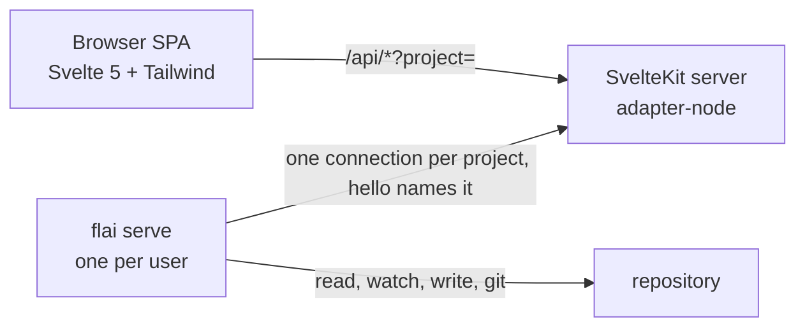

# flaiover dashboard

`flaiover` is the web view of a conforming repo. It renders every markdown document, searches `design/` and `wip/`, shows the kanban board, and charts the flow metrics defined in [metrics.md](metrics.md). It runs locally in Docker with the repo mounted read-write and is started by `flai dashboard`.

Source: `./flaiover` in this monorepo. Image: `ghcr.io/bytepunx/flaiover`, one multi-platform manifest for `linux/amd64` and `linux/arm64` under each tag (S-0119).

## Shape

SvelteKit with `adapter-node`. The browser side is a single-page app (`ssr = false` at the root layout) so navigation is instant and state lives in the client. The server side is a thin set of `+server.ts` endpoints under `/api` that ask flai on the host for everything they show and change (ADR-0029); the container holds no file of the project ([ADR-0031](../adrs/0031-the-dashboard-s-container-holds-nothing-of-the-project-a-port-and-two-secrets.md)). "SPA" here means the UI, not the deployment. See ADR 0007.



## Views

| Route | View | Data |
|-------|------|------|
| `/` | Overview: WIP by column, throughput this week, aging items, epics burn-up sparkline; a project list with each one's glance (review, threads awaiting, agent attending) in its place while more than one project is known and none is chosen (S-0080) | `/api/stats`, `/api/projects` |
| `/board` | Kanban board: one column per state with WIP count against the limit, story cards (epics and tasks on request) with age in column, nature, blocked flag, and the parent's ID bottom right with its title as tooltip and accessible name (`BoardCard.svelte`, S-0048), a dot beside the ID for what the story's agent is doing (S-0104), that detail row in one size under a thin divider, wrapping when crowded (S-0054); the card's background tinted by nature and its left edge striped by type, a red ring on a blocked card, a dashed faded card while dragged, and a legend above the columns built from the same map as the cards (`$lib/cardcolour.ts`, `BoardLegend.svelte`, S-0055); drag to another column to transition, refused moves show the rule; a card dropped on `cancelled` first opens `CancelConfirm.svelte`, which lists the open items that go with it from the move endpoint's dry run, calls out stories in review, names the branches and worktrees that stay, and takes the reason (S-0070, ADR-0028); `backlog` and `ready` are laid out in the pull order (`inPullOrder` in `board.ts`, flai's rule from [workflow.md](workflow.md)) and a story dragged within either is placed with `flai order`, with an insertion marker while dragging, up and down buttons beside the card's link on hover and keyboard focus, and Alt+arrow on a focused card (`$lib/reorder.ts`, `CardReorder.svelte`, S-0057); a drag within any other column is not a drop target; refreshes on SSE (S-0013) | `/api/board`, `POST /api/items/:id/move`, `POST /api/items/:id/order` |
| `/new` | Create an epic or a story from markdown (`NewItemForm.svelte`, S-0059), reached from the board's "+ new" action, which a read-only dashboard does not show: type, parent among the open epics, nature with its meaning and release consequence (`$lib/natures.ts`), title, optional tags and touches, for a story the agent (`AgentFields.svelte`, S-0103: harness, model, and config one `key=value` a line, the project's default from `/api/manifest` as placeholders, and only what is typed sent), and the body from the template with the explorer's preview beside it; no front matter. A refusal shows the findings and keeps the text; success lands on the item | `POST /api/items`, `GET /api/items/template`, `GET /api/items` |
| `/items/:id` | Item detail: what the story's agent is doing (`StoryAgent.svelte`, S-0104), front matter (a story's agent as one line, S-0103), rendered body, children, transitions timeline, blocked intervals, narrative link, and actions for allowed moves (a cancellation through the same confirmation as on the board), block, unblock, and a narrative log entry (S-0013) | `/api/items/:id`, `POST .../move`, `.../block`, `.../unblock`, `POST /api/streams/:id/log` |
| `/review/:id` | Review of one story in review (S-0041), linked from the item page and from cards in the review column: acceptance criteria with their ticks, the narrative's current state and next steps, open threads, the story branch's diff against main as files with collapsible hunks, and the release plan with blockers and uncommitted files from the acceptance preview. Accept runs as the designer and shows each step as it completes, then the tags, or flai's error verbatim with the story still in review. Send back asks for the reason in the page and moves the story to in-progress | `/api/items/:id`, `/api/items/:id/diff`, `/api/items/:id/acceptance`, `POST /api/items/:id/accept`, `POST /api/items/:id/move`, `/api/docs/file`, `/api/threads` |
| `/activity` | Who is working on what (S-0042), derived from the narratives: each active stream with its agent and session, the story's state and blocked flag, the task in progress, and the last log entry with its age. Nothing is written for presence: an agent that stops logging ages out | `/api/activity` |
| `/inbox` | What needs a human (S-0042): threads awaiting the designer, open questions from narratives, stories in review, blocked items, and `wip.overlap` warnings, each linking to its page. A count badge in the navigation; both refresh on change events. A per-browser toggle, off by default, raises a desktop notification for an entry that appears while the page is open. A hand-written open question (one with no thread of its own) can be answered right there when the dashboard is writable (S-0090): it moves to the narrative's Decisions and drops off the list | `/api/inbox`, `POST /api/streams/:id/answer` |
| `/charts/cycle-time` | Cycle time scatter by nature with p50 and p85 lines (S-0014) | `/api/stats` |
| `/charts/burn-up` | Scope and done, per epic or total | `/api/stats` |
| `/charts/cfd` | Cumulative flow diagram | `/api/stats` |
| `/charts/time-in-state` | Stacked bars per completed item and the share bar | `/api/stats` |
| `/charts/throughput` | Weekly bars by nature | `/api/stats` |
| `/charts/aging` | Aging WIP against p85 | `/api/stats` |
| `/charts/estimates` | Estimate versus actual with the perfect-estimate diagonal | `/api/stats` |
| `/docs/<path>` | Documentation explorer: collapsible tree of `design/` (including `conventions/` and `issues/`), `docs/`, and `wip/`; rendered markdown with Mermaid, highlighted code, task lists, heading anchors, rewritten links; front matter panel (S-0012) | `/api/docs/tree`, `/api/docs/file` |
| `/edit/<path>` | Editor for one document ([ADR-0023](../adrs/0023-documents-are-saved-through-flai.md), S-0040), reached from the Edit link on the document and item pages when the dashboard is writable. flai decides what may be edited: body and front matter for design and docs, body only for work items, narratives, and the board (front matter shown read-only), nothing for generated files, threads, issues, and the archive. A textarea with the explorer's renderer as preview; the "being worked on by" warning from `touches`; a thread can be opened on the heading under the cursor. Save reports the commit, a refusal with the check's findings, or a conflict with a diff and the choice to load the current version or save over it | `/api/docs/edit`, `PUT /api/docs/file`, `/api/threads` |
| `/conventions` | The conventions in read order with project additions highlighted; the same set `flai prime` prints | `/api/conventions` |
| `/adrs` | ADR list with status, date, and supersession chain linking into the explorer (S-0012) | `/api/docs/adrs` |
| `/adrs/new` | Record an architecture decision from markdown (`NewAdrForm.svelte`, S-0060), reached from "+ new ADR" on `/adrs`, which shows only when flai answers; the list also has an accept button on proposed records, shows `refines` in the chain column, and follows the files over SSE. The form: title, proposed or accepted, supersedes and refines chosen from the existing records (not both for one ADR), and the body from the project's template sections with the explorer's preview; no front matter. A refusal keeps the text; success lands on the ADR in the explorer | `POST /api/adrs`, `GET /api/adrs/template`, `POST /api/adrs/:id/accept`, `GET /api/docs/adrs` |
| `/streams` | Active narratives with current state and next steps | `/api/streams` |
| `/host` | The dashboard container with check, restart, upgrade, and stop (`HostPanel.svelte`, S-0081). Below it, flai host with a row each for serve and the MCP servers (state, version, restarts), with Start, Stop, and Restart per row, one Check for upgrade, and one Upgrade (`HostProcesses.svelte`, S-0107) | `/api/dashboard`, `/api/host` |
| `/settings` | The host's settings for this project (`SettingsPanel.svelte`, S-0105, [ADR-0039](../adrs/0039-a-settings-host-action-turned-on-only-in-a-shell-lets-the-dashboard-change-the.md)), in the header after Host. It has a section each for: host actions (a checkbox each; `settings` itself and an action on for every project are shown, not changed); the default agent (`AgentFields`); the agent's name, minutes, and command; each harness's program and arguments; the checks and time limit, or the manifest's when the host has none; the import folders; the MCP and dashboard tokens. Each section is read-only, with the command that allows changing it, until `settings` is on here, or everywhere for what the host keeps for every project (`HOSTWIDE` in `$lib/settings.ts`). A command is edited one argument a line (`argv`, `lines`), so nothing is quoted or split. Each change says what flai answered in its section and reads the settings again. A rotated token is shown once | `/api/settings` |
| `/search` | Search across `design/` and `wip/`, `docs/` on request, with snippets and routes (S-0012); item hits tinted by nature and striped by type (S-0055) | `/api/search?q=&docs=` |

Every chart has the same filter bar: window, type, and epic where the chart supports it; a summary strip shows completed, cancelled, WIP, throughput, and cycle time percentiles; a table view sits under every chart.

## API (S-0011)

| Route | Returns |
|-------|---------|
| `GET /api/manifest` | `system-flow.yaml` parsed |
| `GET /api/items?type=&status=&archived=` | Every item from kanban and archive without bodies, sorted by ID; timestamps as `YYYY-MM-DDTHH:MM:SSZ` strings |
| `POST /api/items` `{ type, title, nature?, parent?, tags?, touches?, agent?, body }` | Creates an epic or a story with the designer's markdown as its body (S-0059, ADR-0016): `flai <type> new --body-stdin --autocommit` with the designer as owner and the dashboard's trailer. Values reach flai as `--flag=value` and the title after `--` (the wrapper puts `--json` before it), so nothing typed is read as a flag. Tasks are refused (400). 422 `{ error, findings }` when the check refuses, and then nothing was created |
| `GET /api/items/template?type=epic\|story` | `{ type, body }`: the body the project's item template gives the type (`flai <type> new --print-body`), which the form starts from |
| `GET /api/threads?on=<path\|id>&all=1`, `POST /api/threads` `{ on, heading?, title, text }`, `POST /api/threads/:id/reply` `{ text }`, `POST /api/threads/:id/resolve` `{ reason? }` | Threads read from `wip/threads`, written through `flai thread` with the manifest owner as author (S-0038) |
| `POST /api/login` | `{ token }` from the login page; sets the session cookie (S-0036) |
| `POST /api/logout` | Clears the session cookie |
| `GET /api/items/:id` | `{ item, children }` with the body; the ID may be given with any zero padding or none, so a two, three, or four digit spelling of the same number resolves to the same item |
| `GET /api/docs/tree` | Three trees (design, docs, wip) of `{ name, path, kind, title?, frontMatter?, children? }` |
| `GET /api/docs/file?path=` | `{ path, frontMatter, body, raw }` for one markdown file; paths outside the repo or non-markdown are 400, missing 404 |
| `GET /api/docs/edit?path=` | `flai doc show`: `{ path, content, hash, mode, reason? }`, mode `full`, `body`, or `none` |
| `PUT /api/docs/file` `{ path, content, hash, message? }` | `flai doc save` with the content on stdin. 200 `{ path, hash, committed, commit?, warnings[] }`; 409 `{ error, current, hash, diff }` when the file changed since it was loaded; 422 `{ error, findings[] }` when flai refuses the content (a check error on the file, or front matter it owns was changed) |
| `GET /api/events` | Server-sent events: `ready` once, then `change` with `{ path }` per changed file under design, docs, wip, or the manifest |
| `GET /api/search?q=&docs=` | `{ query, indexed, hits[] }`; each hit has `path`, `kind`, `itemId?`, `title`, `scope`, `status?`, `type?`, `nature?` (S-0055), `score`, `snippet`, `route` |
| `GET /api/docs/adrs` | ADR front matter: `id`, `title`, `status`, `date`, `supersedes[]`, `supersededBy[]`, `path` |
| `POST /api/adrs` `{ title, status?, supersedes?, refines?, body }` | Records an ADR through `flai adr new --body-stdin --autocommit` with the dashboard's trailer (S-0060, ADR-0016). ADR references are reduced to numbers, values go as `--flag=value`, and the title follows `--`. 422 `{ error, findings }` when the check refuses, and then nothing was created |
| `GET /api/adrs/template` | `{ body }`: the sections of the project's `design/adrs/0000-template.md` (`flai adr new --print-body`). It answers only when flai is available, so the ADRs page uses it to decide whether to offer writing |
| `POST /api/adrs/:id/accept` | `flai adr accept`: a proposed ADR becomes accepted, dated today, its index row updated, committed on its own |
| `GET /api/board` | `{ wip_limits, order, writable, columns: { <state>: card[] } }`; a card has `id`, `type`, `title`, `nature`, `parent`, `parent_title` (the parent item's title, absent without a parent; S-0048), `status`, `blocked`, `age_seconds`, `entered_at` |
| `POST /api/items/:id/move` `{ to, reason?, by?, include_uncommitted?, dry_run? }` | flai move; `dry_run: true` on a move to `cancelled` changes nothing and answers `{ id, cancelled[], left_behind[] }`, what the cancellation would take with it; a real cancellation answers the same fields (S-0070); `include_uncommitted: true` on a move to done is the designer's choice in the confirmation to put uncommitted files outside `wip/` into the acceptance commit and becomes flai's `--yes`, the only way the dashboard passes it (S-0051); `{ id, status, warnings[] }` or 400 `{ error }` with the rule. A story moved to done is accepted: the response also carries `merged` (S-0046); since S-0087 acceptance tags and pushes nothing, so `tags`, `pushed`, and `push_error` are gone from it — see `/api/publish` below |
| `POST /api/items/:id/order` `{ before \| after \| top \| bottom }` | Runs `flai order <id>` with exactly one placement (S-0057, ADR-0016: `board.md` is never edited by the dashboard). Only item IDs are passed to flai. Returns `{ id, status, sequence, order }`; flai's refusals (an epic or task, another state, a reference in another column) are 400 with its reason |
| `GET /api/unpushed` | `{ unpushed: { branch, upstream, remote, commits, acceptances[], tags[], behind?, command } \| null, problem? }` from `flai push --pending --dry-run` (S-0063): whether the clone holds an acceptance its remote has not got, asked offline and with no credential. `null` when there is nothing, when what is ahead holds no acceptance, and when flai is unavailable; `problem` carries flai's message for a diverged clone. `UnpushedNotice.svelte` shows it on the board and on an accepted story's page, asks again on every board change, on window focus, and each minute while showing, and has no button |
| `GET /api/publish`, `POST /api/publish` | S-0087, `publish.preview`/`publish.run`: `{ plans: PendingPlan[], push_enabled }` — every component with something accepted and unreleased for it since its last tag, the highest level among it, and the story IDs it bundles; `POST` runs `flai release --pending` (applies, tags, pushes) as the push host action, same gate as `/api/unpushed`'s `POST`. `PublishBanner.svelte` at the top of the board's done column lists the plans and offers **Publish** when enabled; the board fetches once and also uses it to flag a done card `waiting to publish` when its story is in one of the plans |
| `GET /api/agent` | Whether a flai on the host has this dashboard connected, and `project.info` asked over the channel (S-0072): `{ configured, connected, since, flai, serves, info }` or `error` in place of `info` |
| `GET /api/projects` | `{ projects: [{ key, name, connected, since?, review?, threadsAwaiting?, agentAttending? }] }`: every project ever connected here, connected or not, with a glance for each connected one, each asked on its own 3s timeout and gathered with `Promise.allSettled` so a stalled or slow project cannot delay another's row (S-0080) Since S-0098 a repository offered for import is listed with `candidate: true` while it is connected, and without a glance |
| `GET /api/import`, `POST /api/import` | For the candidate `?project=` names (S-0098, [ADR-0035](../adrs/0035-repositories-under-folders-the-operator-names-can-be-imported-from-the-board.md)). GET is `import.preview`: the layout, moves, sub-projects, and `tests` with `tests_from` (`host`, `repository`, or `none`). POST is `import.run`, streamed as NDJSON as an acceptance is: `{event: progress, msg}` as each test starts and ends, then `{event: done, result, committed}` (committed false when a test failed, -32013 mapped to 422, with each test's outcome and output in `result.commit.tests`) or `{event: error, error, status}` |
| `GET /api/items/:id/acceptance` | `flai accept --dry-run`, without `--yes` so it checks what the move checks: `{ plan, branch, blockers[], uncommitted[] }`, shown in the confirmation dialog before a story is dropped on done. Blockers disable accept. Uncommitted paths outside `wip/` are listed with a checkbox, off by default, to include them; accept waits for it (S-0051) A research story's plan is a no-release plan with `unreleased: [{ component, files }]`, which the confirmation and the review page list (`UnreleasedList.svelte`, ADR-0025); an experiment arrives as a blocker |
| `GET /api/items/:id/diff` | `flai stream diff`: `{ branch, base, files: [{ path, old_path?, status, additions, deletions, binary, truncated, patch }], truncated }`, the story branch against its merge base with the main branch |
| `POST /api/items/:id/accept` `{ include_uncommitted? }` | Runs `flai accept <id> --by <designer>`, the designer being the manifest's `owner` as for threads and board moves: one project token has one holder (ADR-0018). The response is newline-delimited JSON, written as flai runs: `{ event: "progress", msg, ... }` for each step flai logs, then `{ event: "done", result }` with what `flai accept --json` printed, or `{ event: "error", error, blockers? }` with flai's message verbatim. The HTTP status is 200 once the stream has started; the last line says how it ended. Since S-0087 acceptance never pushes, whatever the push host action is set to: it merges, archives, and commits, nothing more. Publishing what accumulates is `/api/publish`, above |
| `GET /api/activity` | `{ streams: [{ stream, title, agent, session, updated, age_seconds, status, blocked, task?: { id, title }, last_log?: { at, text }, path }] }`, newest first, from `wip/agents/*.md` and the items |
| `GET /api/inbox` | `{ total, counts: { thread, question, review, blocked, overlap }, entries: [{ key, kind, title, detail?, href, at?, item? }], notes[] }`. Threads count when the last entry is not the designer's (the manifest's `owner`). Questions are the bullets under a narrative's `## Open questions`, outside the generated threads block; `item` is the story, so a question entry can be answered in place (S-0090) without also changing where it links. Overlaps are the `wip.overlap` findings of `flai check --json`, cached until the repository changes; without flai they are left out and `notes` says so |
| `/mcp`, any method | 410 with a JSON-RPC error that says where MCP lives now: flai serves it on the host, over stdio and over HTTP ([ADR-0030](../adrs/0030-mcp-is-served-by-flai-on-the-host-over-stdio-and-http-and-the-dashboard-s-api.md), S-0076). No token is needed, because the answer says nothing about the project. The dashboard served MCP here from S-0043 until then (ADR-0024, superseded) |
| `POST /api/items/:id/block` `{ reason }`, `POST /api/items/:id/unblock` | flai block and unblock |
| `POST /api/streams/:id/log` `{ entry }` | flai stream log |
| `POST /api/streams/:id/answer` `{ question, answer }` | flai stream answer: `question` must read exactly as the inbox entry's own title. Removes it from Open questions, records it with `answer` under Decisions |
| `GET /api/stats?since=&type=&by=` | `flai stats --json` verbatim (see metrics.md), cached per query and cleared on change; bad arguments are 400 |
| `GET /_health`, `GET /_ready`, `GET /metrics` | Liveness, readiness with named dependency checks, Prometheus metrics (S-0032, see docs/operators) |

Errors are `{ error }` with the status. The reader caches by path and mtime and is invalidated by the watcher.

## Writes (S-0075, ADR-0029)

Every write is a named method of flai on the host, asked over the channel; nothing runs in the container, and the image holds no `flai`, no `git`, and no `ssh`. flai validates the arguments as data, builds the command line itself, and runs the same command the CLI has, so its rules are the only rules ([ADR-0016](../adrs/0016-dashboard-delegates-to-flai.md), [ADR-0023](../adrs/0023-documents-are-saved-through-flai.md)). The mount is still given to the container and is no longer used; S-0077 removes it.

- **The routes** map a request body to a method and pass the answer through: `item.move` (and `item.move.preview` for a cancellation's dry run), `item.order`, `item.block`, `item.unblock`, `item.new`, `item.template`, `accept.preview`, `accept.run`, `stream.diff`, `stream.log`, `stream.answer`, `thread.new`, `thread.reply`, `thread.resolve`, `doc.show`, `doc.save`, `adr.new`, `adr.template`, `adr.accept`, `stats.get`, `push.pending`, `push.run`, and since S-0087 `publish.preview`, `publish.run`, and since S-0081 `dashboard.status`, `dashboard.check`, `dashboard.restart`, `dashboard.upgrade`, `dashboard.stop`. They name nobody: flai records a change as the manifest's owner, so a request cannot sign a move with another name (`by` in a body is ignored).
- **`Repo.write()`** adds a request ID and a 60 second limit (ten minutes for an acceptance). When the connection is lost before the answer and flai is back within five seconds, the same request is sent once more with the same ID, and flai answers from its journal if it had already done it. A detached write (a restart or upgrade, a checks run, an import) is recorded before it acts in `serve/requests.json`, which outlives flai serve, so a repeat that reaches the next serve after the write ended the one that took it is answered from that record, and a repeat while it runs is told it is under way (S-0109). The host panel still sends serve, all, and upgrade with `retry: false`, because it may be answered by a flai older than that record. `Repo.run()` is for what changes nothing (previews, templates, the diff, statistics, the pending push) and carries no ID. After a write everything asked before is forgotten.
- **Errors** keep their meaning: a workflow rule is 400 with flai's sentence, an argument that is not what it should be is 400, a document that changed since it was loaded is 409 with the current version and its hash, content the check refuses is 422 with the findings, no flai is 503, no answer in time is 504, and anything else flai reports is 500 with its message.
- **Acceptance** (`POST /api/items/:id/accept`) streams NDJSON as before. The steps arrive as `$/progress` notifications for the request while flai runs the acceptance, and the hub hands them to the route. When the connection is lost on the way the last line is an error that says the acceptance may have completed on the host and how to find out, because the dashboard cannot know.
- **An older flai.** The image no longer brings a flai of its own commit, so the flai on the host can be older than the dashboard. flai names the methods it offers when it connects; the hub compares them with `REQUIRED_METHODS` and `/api/agent` reports what is missing as an error, which the banner shows on every page with the advice to upgrade flai. A Go test (`contract_test.go`) fails when that list and flai's table drift.
- **`/mcp`** is gone since S-0076: MCP is flai's on the host ([ADR-0030](../adrs/0030-mcp-is-served-by-flai-on-the-host-over-stdio-and-http-and-the-dashboard-s-api.md)), the bridge and its settings were removed, and the route answers 410 with where to go. With it went the last thing in the dashboard's server that started a process; a test keeps it so.
- **Agents started by flai (S-0079).** `GET /api/host-agent` is flai's `agent.status`, asked each time because the state lies on the host. `HostAgentNotice` on the board shows nothing while the operator has not enabled the action or nothing has happened; else that an agent was started, for which story, by which command's name, as whom, and when; that a command could not be started, with the reason; that the last one ended, with its exit code; and why a ready story waits. It has no button. The dashboard cannot stop or configure an agent. The starts it can ask for are `StoryAgent`'s **Retry** (S-0116, S-0118) and **Start agent** (S-0115): `POST /api/items/<id>/agent {action: 'restart' | 'start'}`, flai's `agent.restart` and `agent.start`, gated by the `agent` action.
- **Each story's agent (S-0104, [ADR-0038](../adrs/0038-flai-serve-starts-a-story-s-own-agent-through-an-adapter-with-what-the-operator.md)).** `agent.status` carries `stories`: for each story flai started an agent for, its newest run and what it is doing, as `working`, `waiting` (running with a question of its own open on the story or the story blocked, ended asking, to be started again on the answer, or queued by a retry until the in-progress limit has room, S-0118), `failed` with `why`, or `worked`. The board asks once per load (`$lib/activity.ts`) and hands the answer to `HostAgentNotice` and to each card. It asks again every 15 s while an agent runs or waits, because an agent ends without changing a file. `AgentDot.svelte` puts a dot beside a card's ID: green working, yellow waiting, red failed, nothing once it worked. The dot has its own colour tokens (`--t-dot-working`, `--t-dot-waiting`, `--t-dot-failed`) because the theme's `warn` is a text colour, brown in the light theme; its label says the state in words. `StoryAgent.svelte`, at the top of a story's page, shows the same dot with the harness, the model, the agent's name, when it started and ended, the question it waits on, or why it failed, where its log is on the host, and that moving the story back to ready or changing its agent while it is in ready starts another (S-0116). For a failed agent of a story in ready or in progress it offers **Retry** to someone who may write, at the right of the pane's header (S-0118). Retry posts `restart`. It disappears when pressed and stays hidden until the state shows a newer run, and comes back only with flai's reason when flai refuses. With the in-progress limit full, flai queues the agent ([ADR-0044](../adrs/0044-a-retry-of-a-failed-agent-on-a-ready-story-with-the-in-progress-limit-full-is.md)). The pane then shows it as waiting, with a yellow dot and the queued reason, and offers no Retry. For a story in ready that has no run it says that flai serve has started no agent for it, with the story's reason from the state's `waiting` when there is one, and offers **Start agent** to someone who may write while the action is on (S-0115). The item page passes the story's `status` and `writable`. It asks again on the project's change events and on the same 15 s while an agent runs.
- **Editing a story or an epic (S-0085).** `GET /api/items/:id/edit` is flai's `item.show` (fields, the body below the heading, the hash, whether it may be edited and why not, the natures and the open parents it may be given). `PUT` is `item.edit`: `{ hash, title?, nature?, tags?, touches?, parent?, agent?, body? }`, only what is given is changed, and a story's `agent` is replaced whole or, as `null`, removed (S-0103); 409 `{ hash, current }` when the item changed after it was read, 422 `{ findings }` when the check refuses and nothing was changed, 400 for what is not allowed, 404 for an item or parent that is not there. `ItemEditor.svelte` sends only the fields that differ from what it loaded (for a story's agent, the three agent fields as one, `null` when all are emptied), keeps the text on a refusal, and on a conflict offers to load the current version or to save over it with the hash the conflict gave, which overwrites only the fields being sent. The item page shows `edit…` for an open story or epic, makes the rendered acceptance criteria tickable (`toggleCriterion` flips the nth criterion line of the section and nothing else; each tick is a `PUT` of the body with a fresh hash), and says on a task's page that tasks are the agent's to write. Values reach flai only as flag values or on standard input.
- **Pushing (S-0078).** `GET /api/unpushed` also answers `push_enabled`, asked of flai each time. `POST /api/unpushed` is flai's `push.run`, a host action: 403 with what enables it while the operator has not (`flai serve enable push`, on the host), 409 with the reason when the remote has moved, else what was pushed and published. Since S-0094, `push.run` (`flai push --pending`) tags everything accumulated and unreleased before it pushes, the same computation `publish.run` uses, so a release is never a separate step someone has to remember; `unpushed.tags` in the answer already carries what it just created, so `UnpushedNotice` shows it with no route change of its own. `UnpushedNotice` offers **Push now** only when enabled, shows `Pushing:`, then what was pushed or why not with the command to run by hand; off, it says what enables it. Nothing in the dashboard can enable an action. Until this story an acceptance from the board pushed unasked (I-0028): `accept.run` ran on the host without `--no-push`.
- **Publishing (S-0087).** Acceptance stopped computing or applying a release; `GET /api/publish` (`publish.preview`) answers what publishing now would release, per component, and `push_enabled`, the same host action pushing already used ([ADR-0032](../adrs/0032-accepting-a-story-merges-it-publishing-is-a-deliberate-batched-step-over.md)). `POST /api/publish` (`publish.run`) applies, tags, and pushes everything pending, the same 403/409 shape as `/api/unpushed`'s `POST`; since S-0094 pushing already does this same work first, so this is for seeing or forcing a release ahead of a push, not the only place it happens. `PublishBanner` at the top of the board's done column lists what is pending and offers **Publish** when enabled, off says what enables it; a done card whose story is in one of the plans is flagged `waiting to publish`.
- **The host's settings (S-0105).** `GET /api/settings` is flai's `settings.get`. `POST /api/settings` with `{kind, ...params}` runs `settings.<kind>` for a `kind` in `SETTINGS_KINDS` (else 400) and passes flai's 403 through, with `enable` and `hostwide`. For `dashboard_token` the route calls `setToken` with the token flai answered with (unless authentication is off) and sets the asking request's cookie to it: the rest of the sessions end, this one goes on without a restart. The answer carries the `login_url`, never the token alone.
- **Managing the dashboard from its own page (S-0081).** `GET /api/dashboard` (`dashboard.status`) answers what the shared container is running and `dashboard_enabled`, the `dashboard` host action; `POST /api/dashboard` with `{action}` in `check`, `restart`, `upgrade`, `stop` — `check` is `dashboard.check`, a read that pulls the configured image to compare it against what is running and changes nothing; the other three gate on the `dashboard` action, the same 403 shape `push.run` uses. `HostPanel.svelte`, at `/host` (linked from the header's host flai badge), shows the running image and, once enabled, the four actions. Restart always, a swapping upgrade, and a stop that is the last project stop the very container answering the request that asked for it: the client races each of those three fetches against a short timeout and treats a network error or that timeout as "proceeding", not a failure, then (restart and a swap) polls `GET /api/dashboard` until it answers again and reports whether the image changed, or (stop) says the container is gone, since there is nothing left to reconnect to. `check`, a no-op upgrade, and a refused write all behave like an ordinary route. An upgrade never stops the running container until a temporary one, started from the new image, has answered `/_health`; a failed upgrade is therefore an ordinary error, the running container untouched, not a partial state the page has to reconcile. Real Docker, not the fake-runner unit tests, found that the command backing these three writes was itself getting killed mid-run by the very connection death it causes (T-0325): `internal/hostapi`'s `spec.detachTimeout` runs them with a background context instead of the request's, so completing the swap no longer races its own cancellation.
- **The processes flai host keeps (S-0107).** `GET /api/host` answers flai's `host.status`: the host's pid and version, and its `children`, each `serve` or `mcp` with a `root`, a `state`, a `version`, and `restarts`. It also answers `host_enabled`, the `host` host action from `project.info`. No flai connected (503), or a serve that runs without a host, reads as `running: false` with the reason and not as an error. `POST /api/host` takes `{action, process}`. `check` is `host.check`, a read. `start`, `stop`, and `restart` of `serve`, `mcp`, or `all` are `host.process` with `{process, action}`, and `upgrade` is `host.upgrade`. All four writes gate on the `host` action; a bad action or process gets a 400. `HostProcesses.svelte`, on `/host` below `HostPanel`, shows one row for serve and one for the MCP servers as a group, because the host acts on them as one process. Each row has Start, Stop, and Restart, each disabled when it would do nothing, and the area has one Check for upgrade and one Upgrade. The dashboard reaches the host through serve, so a serve stop asks first and says only `flai host start serve` on the host brings serve back. A serve restart and an upgrade race their fetch against a short timeout, as `HostPanel` does, then poll `GET /api/host` until it answers and report the version that came back. The route sends those writes, and `host.process` for `serve` or `all`, with `retry: false` (`WriteOptions` in `$lib/server/repo.ts`). A lost connection is the expected outcome for them, and the serve that comes back has no record of the request: tried live, the usual one retry restarted serve a second time. The page takes the route's 502 for these writes as the work going ahead, not as a failure. It then waits for a new serve pid, or for a newer version after an upgrade, rather than taking the old process still answering.
- **A write on an item that is not there** answers 404 with flai's words, as a read does (S-0077). Until then it answered 500: the command runs as a process, its exit code for that is the generic one, and `outcome()` knew only mapped codes and `rule:`. It now recognises workitem's "<ID> not found", and a test takes the wording from the lookup itself so the two cannot drift apart.
- **Tried** with the image run by hand with no project mount, only the two secrets: moves, a rule's refusal, an argument that is a flag, block, unblock, order, a new story committed as the host's user with the dashboard's trailer, a story the check refused (422, nothing created), a thread opened, answered, and resolved, a document saved and then refused as changed (409), an ADR recorded and accepted, statistics, the pending push, the acceptance preview, the branch diff, and an acceptance of a story on its own branch and worktree, streamed step by step in 230 ms, from the API and from the review page in a browser. With `flai serve` frozen the acceptance ended after 11 seconds with the error above, and had in fact not run. The container held no `flai`, `git`, or `ssh`. The image is 692 MB against 740 MB.

## Search

Search is flai's since S-0074: see [search.md](../tech/search.md). What follows describes the page and the route, which are unchanged.

Server builds a MiniSearch index over title, tags, ID, headings, and body text of every markdown file under `design/` (conventions and issues included) and `wip/`, rebuilt on file change. Results link to the docs explorer or the item page.

## Runtime

- The image is built by `release-flaiover.yml` on an amd64 runner for both platforms, with QEMU for arm64 (S-0119). The Dockerfile's build stage runs on `$BUILDPLATFORM` for every target: the SvelteKit output and the production `node_modules` are plain JavaScript, so only the runtime stage's `apk add tini` runs emulated. A production dependency that ships a native binary would break the arm64 image and would need the build stage to run on the target platform instead. `flai dashboard` pulls the image for the Docker daemon's platform (`docker version`), not flai's own architecture, and pulls again when the image it has was built for another platform.
- Container listens on `3000`, named `flaiover` for every project on the host, not for one of them: `flai dashboard` starts it once and every later call, from any project, registers with the running one. It is published on the configured host port, default `4242`, on every interface by default (`dashboard.bind` or `--bind` restricts it, for example to `127.0.0.1`), and runs as the host user (`--user uid:gid`), so that it can read the two secret files, which are the host user's alone; the image must work as an arbitrary non-root UID: no privileged ports, no writes outside `/tmp`, and a writable working directory is not assumed.
- `flai dashboard` gives the container a published port and two secrets mounted read-only under `/run/secrets` (the login token and the agent credential), and nothing else: no project volume, no `PROJECT_DIR`, no git identity, excludes, or push key (S-0077, [ADR-0031](../adrs/0031-the-dashboard-s-container-holds-nothing-of-the-project-a-port-and-two-secrets.md), which supersedes ADR-0022, ADR-0026, and ADR-0027). Since S-0080 both secrets are per user, kept beside `flai serve`'s own state, not any one project's `.flai-cache`; every project registered with the same `flai serve` is handed the same two files ([ADR-0033](../adrs/0033-one-login-token-and-one-agent-credential-per-user-serve-every-project.md)). `PROJECT_DIR` remains only as how tests and development outside Docker name the directory that `testing.ts` asks flai about. `flai dashboard status` reads a running container's mounts, says when one was started by an older flai and still has a project mounted, and lists every project it currently serves.
- Everything the dashboard shows and everything it changes is asked of flai on the host (S-0073 to S-0075, below); the image holds no `flai`, `git`, or `ssh`, and `/_ready` is not ready without a connected flai.
- The scheme of a request (S-0083). adapter-node builds `event.url` from a protocol header and, when none is configured, assumes `https`. With none configured, `isSecure()` was always true, the session cookie was always `Secure`, and a browser kept it only on `http://localhost`: from any other plain-HTTP address a correct token led back to the login page. `server.js` now sets `PROTOCOL_HEADER` (default `x-forwarded-proto`) before it imports the handler, and `scheme.js` leaves every request with exactly `http` or `https` in that header: the first value a proxy sent when it is one of the two, else what the socket is (`encrypted`). Anything else is replaced, because adapter-node answers an odd value with an error per request. An operator's `ORIGIN` still overrides. The header is trusted from anyone on purpose: a client that lies about it only loses its own cookie. `scheme.js` lies beside `server.js`, outside the build, and is copied into the image with it; its test imports it from `src/lib/server/scheme.test.ts`. The login page asks for `/api/agent` after a successful login and says when the token was right and the cookie was not kept.
- The image's entry is `node server.js`, not `node build`: see the channel to flai on the host, below. `FLAIOVER_AGENT_KEY_FILE` names the agent credential `flai dashboard` mounts.
- File watching is flai's on the host (S-0073): its `change` notifications invalidate what was asked and the search index, and push updates to open tabs with server-sent events.
- No authentication. It is a local tool bound to localhost by `flai`. Operators exposing it further are told not to in `docs/operators`.

## Internal structure

```text
flaiover/
├── src/
│   ├── lib/
│   │   ├── server/       # repo reader, front matter, metrics port, search index, watcher
│   │   ├── components/   # board, cards, charts, doc tree, markdown renderer
│   │   └── stores/       # client state
│   └── routes/
│       ├── +layout.ts    # ssr = false
│       ├── api/          # +server.ts endpoints
│       └── ...           # views above
├── static/
├── Dockerfile            # multi-stage, node:24-alpine runtime
└── tests/                # vitest unit, playwright e2e against the template sample repo
```

## What the container can reach (S-0077, [ADR-0031](../adrs/0031-the-dashboard-s-container-holds-nothing-of-the-project-a-port-and-two-secrets.md))

Nothing of the project. While the clone was mounted (ADR-0022) a process in the container could leave something git would later run on the host as the operator (I-0022); S-0064 closed the routes git itself offers with read-only mounts (ADR-0027) and left three open by necessity: refs and the index, tracked files, and ignored files the host executes. S-0077 removed the mount, and with it every one of those routes, closed and open alike. Tried from inside a container started the new way: see the story's narrative.

| Within the container's reach | What it allows |
|------------------------------|----------------|
| Its published port and the network | Serving the dashboard |
| `/run/secrets/flaiover_token`, read-only | Checking a login; a compromised container could present it, which gains it nothing it lacks |
| `/run/secrets/flaiover_agent_key`, read-only | Proving itself to `flai serve`, and so asking for the channel's named methods |
| The channel's methods (`internal/hostapi`) | Reads of Markdown under the manifest's three folders and the manifest; moves, blocks, saves, thread entries, new items, and the acceptance of a story in review, each validated and performed by flai on the host. No command line, no path outside those folders, no git |
| `/tmp` | Its only writable place; gone with the container |

## Theme (S-0044)

The dashboard wears the brand palette (`#f7f3e3`, `#23b5d3`, `#119822`, `#645853`, `#054a91`) through a token layer in `src/routes/layout.css`: CSS custom properties per theme, mapped to Tailwind utilities with `@theme inline` (`bg-ground`, `text-ink`, `border-line`, `text-accent`, ...). Dark is a selected theme: `data-theme` on `<html>`, stamped before first paint from `localStorage` (`flaiover-theme`) or the system preference, cycled by the button in the navigation (`src/lib/theme.svelte.ts`). The palette has no dark colour, so the dark ground and surface are deep steps of the warm grey hue. Pages and components use tokens only; `src/lib/theme.test.ts` parses the stylesheet and checks every text pair at 4.5:1 and every control pair at 3:1.

| Token | Role | Light | Dark |
|-------|------|-------|------|
| ground | page background | `#f7f3e3` (brand) | `#191615` |
| surface | cards, header | `#fdfbf3` | `#272220` |
| raised | hover and code backgrounds | `#ece6d3` | `#38312e` |
| ink | body text | `#1c1917` | `#f7f3e3` (brand) |
| ink-soft | secondary text | `#3d3633` | `#e6dfd0` |
| muted | captions, metadata | `#645853` (brand) | `#a79a95` |
| line / line-strong | card borders / input borders | `#d5cfcd` / `#8b7b74` | `#433b38` / `#7b6c66` |
| primary / on-primary | buttons, active states | `#054a91` (brand) / `#ffffff` | `#0866c8` / `#ffffff` |
| accent / accent-strong | links, focus ring / indicators and badges | `#17788c` / `#23b5d3` (brand) | `#23b5d3` (brand) |
| good / good-strong / good-soft | success text / success fills with ink text / soft background | `#0c6e19` / `#119822` (brand) / `#d1fad6` | `#62c96f` / `#119822` (brand) / `#084910` |
| warn, danger, info (+ -soft) | status text on status backgrounds, always with a label | `#7a4a00`, `#9b1c1c`, `#0f5d70` | `#f0c36b`, `#f28b82`, `#6fd0e6` |
| nature-feature, -improvement, -remediation, -research, -experiment | board card background, by the item's nature (S-0055) | `#e9f1fa`, `#eaf5e8`, `#fdeedd`, `#f0ecfa`, `#fae9f1` | `#1b2634`, `#1c291e`, `#322517`, `#262035`, `#321d2d` |
| type-epic, -story, -task | board card left stripe and legend swatch, by the item's type (S-0055); carries no text | `#8f7fd6`, `#4fb0c8`, `#b3a392` | `#a99be0`, `#7cc4d6`, `#c9bcae` |

Board cards are colour coded (S-0055): a pastel tint per nature as the card's background and a colour per type as a 4 px stripe on its left edge, chosen by the operator from rendered options, with the pastels softened at their request. The card still writes the nature, the type, and BLOCKED, and for that reason the operator waived colour blindness checks on the palette: telling the colours apart is never the only way to read a card. Reading the text on a tint is not waived, and `theme.test.ts` holds ink, muted, and danger at 4.5:1 on every nature tint in both themes (the lowest is muted at 5.4:1). A nature or type outside the schema keeps the plain card. The same coding appears wherever an item is named by its kind, from the same maps (`KindChips.svelte`): the item page's header writes the type beside a swatch of its stripe colour and the nature on its tint; an item hit in search is tinted and striped like a board card, its hit now carrying `nature`, and a document hit stays plain; the item table under the cycle time charts shows the nature on its tint. Chart series do not take the pastels, because a mark needs a saturated colour to be seen on the chart surface: they keep the fixed slot per nature in `$lib/viz/palette.ts`, which is the same hue as the nature's tint, and `cardcolour.test.ts` holds each pair within 25 degrees of hue in both themes.

Contrast (WCAG): ink on ground 15.7 light and 16.2 dark; muted on ground 6.2 and 6.6; accent on ground 4.6 and 7.4; white on primary 8.8 and 5.6; good on ground 5.8 and 8.7; line-strong on ground 3.6 and 3.6; primary against ground 7.9 and 3.2. `#23b5d3` reads at 2.2:1 and `#119822` at 3.4:1 on the cream ground, so light-theme text uses the darker steps `#17788c` and `#0c6e19`, and the brand cyan and green fill indicators and badges with ink text (7.2:1 and 4.6:1).

Charts (`src/lib/viz/palette.ts`) follow the same brand: slot 0 is the blue family, slot 2 the cyan family, slot 5 the green family, with supplementary hues stepped to the light band (L 0.43–0.77) and the dark band; both palettes pass the dataviz validator against the chart surfaces (`#fdfbf3`, `#272220`) on 2026-09-18. Workflow states and natures keep fixed slots so an entity's colour never changes with the filter.

## Workbench (E-0006)

The dashboard becomes the designer's workbench: authenticated (ADR-0018), able to edit documents and commit through flai, host threads anchored to documents and items (ADR-0020), show who is working on what (`touches`, ADR-0019), review and accept stories, and expose `flai mcp` over HTTP for remote agents.

- Authentication: one login token per user, shared by every project the container serves, kept beside `flai serve`'s own state and mounted read-only (S-0080, [ADR-0033](../adrs/0033-one-login-token-and-one-agent-credential-per-user-serve-every-project.md)); `Authorization: Bearer` primary, HttpOnly cookie set by `/login` from a URL fragment; `/_health` and `/_ready` open; `/metrics` behind the token unless `FLAIOVER_METRICS_PUBLIC=true`.
- Editing: body editable, flai-owned front matter read-only, save validated by `flai check`, committed on `main` with the designer as author, content-hash conflict detection.
- Threads: `wip/threads/*.md` rendered beside their anchor; posting writes through `flai thread`.
- Review: branch diff against `main`, criteria, narrative, threads, `flai accept` and send-back.
- Presence and inbox: derived from `wip/agents` and threads; optional notifications.
- Hub readiness: every `/api/*` response carries `project: { name, key }`. MCP was served at `/mcp` until S-0076 and is flai's on the host since ([ADR-0030](../adrs/0030-mcp-is-served-by-flai-on-the-host-over-stdio-and-http-and-the-dashboard-s-api.md)); how a dashboard and a host reach each other was decided by ADR-0029.

## Project identity in responses

Every `/api/*` response names the project it came from (ADR-0024, S-0043; carried forward by [ADR-0030](../adrs/0030-mcp-is-served-by-flai-on-the-host-over-stdio-and-http-and-the-dashboard-s-api.md), under which `flai mcp` over HTTP sends the same two headers): JSON object bodies carry `project: { name, key }` from `system-flow.yaml`, and every response, arrays, streams, and errors included, carries `X-Flai-Project-Key` and `X-Flai-Project-Name` (URI-encoded). List endpoints that answer with an array (`/api/items`, `/api/threads`, `/api/docs/tree`, `/api/docs/adrs`) keep their shape and are identified by the headers. `flai check` warns when the manifest has no `key`.

## The channel to flai on the host (S-0072, ADR-0029)

The first step of reaching a project only through flai on the host: the channel exists, one method is asked over it, and the mount is unchanged.

- **The endpoint.** `/agent`, a WebSocket that `flai serve` opens. SvelteKit cannot upgrade a connection, so the image runs `flaiover/server.js`: adapter-node's `handler` on a plain `http.Server`, whose `upgrade` event goes to `globalThis.__flaioverAgentUpgrade`, set by the server's `init` hook (`exposeAgentUpgrade` in `$lib/server/agent.ts`). A Vite plugin in `vite.config.ts` does the same for the development server and leaves Vite's own upgrades alone. `server.js` also closes idle connections on SIGTERM and every connection `SHUTDOWN_TIMEOUT` seconds later (default 5), so that an open event stream cannot keep a server that no longer listens alive (I-0025).
- **The hub.** `AgentHub` in `$lib/server/agent.ts`, one per process, reads the credential once from `FLAIOVER_AGENT_KEY_FILE`. It refuses any path but `/agent` (404), any request with an `Origin` (403), everything when it has no credential (503), and a fifth unproven socket (429). The handshake: flai's `hello` (protocol 1, its nonce, its version, the project), the hub's answer (its nonce, `HMAC(key, "dashboard|c|s")`, its version), flai's `hello.prove` (`HMAC(key, "flai|s|c")`), compared in constant time, within five seconds, or the socket is closed (4401 not proven, 4408 timed out, 4400 malformed). A newer proven connection replaces the older (4000). Pings every 4 seconds; a missed pong terminates.
- **Asking.** `agent().ask(method, params, timeoutMs)` sends a JSON-RPC request with the connected project's key added to the params and resolves with the result. It rejects with `AgentError`: 503 when no flai is connected (the message names the commands that start one), 504 when the answer does not come in time (and sends `$/cancel`), 502 when flai answers with an error (its message and code kept) or goes away first. Messages are capped at 16 MiB.
- **Status.** `GET /api/agent` answers `{ configured, connected, since, flai, serves, info }`, where `info` is `project.info` asked over the channel with a two second limit, so connected means it answers; `error` replaces `info` when it does not. `HostFlai.svelte` in the header polls it every ten seconds: "host flai: connected", or "not connected" with the command in its tooltip; nothing when `configured` is false, which is a container started by an older flai.
- **Tests.** `agent.test.ts` runs the hub on a real HTTP server with a `ws` client as flai: the handshake, a wrong credential, an `Origin`, another path, no credential, a request in flight when flai goes, a timeout and its cancel, flai's error passed on, replacement, and a flai that stops answering pings.

## One dashboard for every project (S-0080)

One `flaiover` container, one login, one credential `flai serve` proves itself with, for every project on a host that serves more than one ([ADR-0033](../adrs/0033-one-login-token-and-one-agent-credential-per-user-serve-every-project.md)).

- **The container is named for what it is, not a project.** `flai dashboard` starts `flaiover` only when it is not already running; when it is, it registers the calling project with it and starts nothing. `flai dashboard stop` unregisters and only stops the container once no project is left registered.
- **The two secrets are per user, not per project**, kept beside `flai serve`'s own state; see Runtime, above.
- **`AgentRegistry`** (`$lib/server/agent.ts`) replaces the single `AgentHub` of S-0072: it performs the one shared-key handshake and then keeps a per-project `AgentHub`, chosen by the `project.key` each connection's `hello` names. `solo()` is the backward-compatible path: while exactly one project has ever connected, every request with no `?project=` is handed that one hub, so a single-project dashboard needs no configuration change at all.
- **flai still refuses a mismatch.** Every ordinary request repeats its project's key; flai's `Client.call()` compares it against the project that connection's `hello` named and refuses (`CodeUnknownProject`) a different one, unchanged since S-0072 and now exercised with two projects sharing one credential. Sharing a credential proves who flai is, not which project a connection may answer for.
- **Routing per request, server-side.** `hooks.server.ts` reads `?project=` from the URL and runs the rest of the request inside `withProject(key, ...)`, an `AsyncLocalStorage` that `repo()` and `agent()` read to pick the right project's cache and connection. No parameter falls back to `solo()` (agent) and a `defaultProjectKey` bucket (repo cache), so a single-project dashboard's URLs are unchanged.
- **Each `Repo` is bound to its own project (S-0095).** `repo()` makes a `Repo` for the key current when it is first asked for, and that `Repo` asks `agentFor(key)` at every call, so it answers for its own project even outside a request (the inbox webhook, a change handler). Its watcher listens at the registry, which re-emits every hub's `connected`, `gone`, and `change` with the project's key first, and keeps those that `concerns(key, from)`: its own project, or, for the default key, whichever project is the only one known when the event arrives. Before S-0095 a `Repo` bound to the hub `agent()` resolved when it started watching; the default `Repo`, watched at startup before any flai had connected, bound to `solo()`'s never-connected placeholder and heard nothing afterwards, and so did the inbox webhook's start-on-connect. `project-events.test.ts` holds both cases with real connections.
- **Repositories offered for import (S-0098, [ADR-0035](../adrs/0035-repositories-under-folders-the-operator-names-can-be-imported-from-the-board.md)).** A connection whose hello says `kind: candidate` is adopted as a candidate (`ConnInfo.candidate`, kept on the hub as `candidate` once it goes). Its missing methods are never counted, since it answers only the import methods by design. `list()` leaves it out once it is not connected: it was imported, or its folder is no longer named. `solo()` never counts it, so one project and several candidates still leave a request with no `?project=` meaning the project; the client likewise picks the one project when nothing is chosen. The switcher and the overview's project list show it as "(not imported)". The layout shows `ImportPrompt` in place of the page while the current project is a candidate. The prompt says what an import does and which tests it runs, then offers Import or Not now. Not now says to pick a different project, and is the prompt's own state, not remembered, so picking the repository again asks again. Import streams its steps and, once committed, waits for the project the repository became to connect and picks it. When a test failed it shows each failure's output and "not committed", with Open the project. While it shows what became of an import, `projectState.hold` keeps the candidate in the list after `flai serve` stops offering it. `/api/agent` does not ask a candidate for `project.info`, the host flai badge and banner say nothing on a candidate's page, and the inbox is not asked for one.
- **Choosing a project, client-side.** `projectState` (`$lib/project.svelte.ts`) holds the known projects and the chosen one, remembered in `localStorage` and reflected in the URL; `api()` and every `EventSource` tag their path with it. Since S-0095 `ProjectSwitcher.svelte` always names the active project in the top bar, and since S-0102 it is always a `<select>`, even with one project: the projects, then an `<optgroup>` "Not imported yet" with the candidates (S-0098), and, with nothing connected, disabled and saying so. It was a plain label with one project, which left the operator with no control to switch or import with, and a pick switches every screen in place rather than reloading: `+layout.svelte` renders the page inside `{#key projectState.current}`, so the page remounts, its `onMount` asks again for the project picked, and the `EventSource` it opened closes with it and reopens tagged for the new one; the header's badges outlive the page, so the layout restarts the inbox (`inboxState.restart()`, which also forgets the old project's entries so none of the new one's is announced as new) and re-asks the host flai status. Nav links carry `?project=`, so a copied link shows the same project, and the list is asked for again every 30 seconds and whenever the switcher gets focus, so a project whose flai connects later joins it without a reload.
- **The root page** shows a list of every known project, each with a glance (`GET /api/projects`), while more than one is known and none is chosen; otherwise the single-project overview it always showed (T-0309, see Views above).

## Where the data comes from (S-0073)

Everything the dashboard shows is asked of flai on the host over the channel: the project, work items, threads, and the board since S-0073, and documents, the ADR list, narratives and activity, the designer's inbox, and search since S-0074. flaiover's server reads no file of the project and parses none: no front matter parser, no YAML, no search library, no file watcher, no path guard of its own. `no-project-files.test.ts` fails when server code imports `node:fs` outside a short list with a reason for each entry (the two secrets handed to the container, the lookup of the flai binary that still performs writes until S-0075, and test support). The mount is still there for those writes only; with it removed by hand, every page that reads worked (tried, S-0074).

- **`Repo`** (`$lib/server/repo.ts`) takes an `Ask`, by default the hub's. `docsTree()` is `docs.tree` and `docFile()` is `doc.get`; flai decides what a document is (a Markdown file under the manifest's three folders, by its real location) and refuses the rest as a bad argument, which the route answers as 400. `search.ts`, `inbox.ts`, and `activity.ts` ask `search.query`, `adrs.list`, `inbox.designer`, and `activity.get`, and add only what is the dashboard's own: the route of a search hit, the link of an inbox entry (`hrefFor`), and an age counted from `updated` at the time of the request. `manifest()` is `project.info`, `items()` is `items.list` with the archive and bodies, `itemById()` is `item.get`, `threads()` and `threadsFor()` are `threads.list`, and `boardView()` is `board.get` with epics and tasks. Each answer is kept until flai says a file changed, and none is kept from a flai that has gone: the hub's `gone` forgets them, so a missing flai is a 503 and never yesterday's board. flai's refusals become the statuses the routes answer with: not found 404, a bad argument 400, no flai 503, no answer in time 504.
- **`board.ts`** maps flai's board view to the shape the page uses and counts a card's age from `entered_at`. The pull order and the columns are flai's; the TypeScript copy of the ordering rule is deleted.
- **Changes.** `flai serve` watches each project's design, docs, and wip folders and its manifest and sends `change` with the repository-relative path. The hub emits it, `Repo.changed()` forgets what was asked and re-emits it, and `/api/events`, the search index, the stats and inbox caches, and the notifier listen as they did to chokidar, which is gone. A flai that connects is announced as a change to `system-flow.yaml`, so open pages look again by themselves. The inbox webhook starts when a flai first connects, because its address is in the manifest.
- **Without a flai.** `/api/manifest`, `/api/board`, `/api/items`, `/api/items/:id`, `/api/threads`, and whatever composes them answer 503 with "no host flai is connected; run flai dashboard in the project, or flai serve start"; `/_ready` has a `host_flai` check and is not ready. `HostFlaiBanner.svelte` under the header says on every page what is missing and the commands that bring it back, and tells a container started by an older flai apart; it and the header badge share `$lib/hostflai.svelte.ts`, which looks every three seconds while flai is away and every ten while it is there.
- **Tests.** `flaiAsk(root)` in `$lib/server/testing.ts` answers a `Repo` by running `flai hostapi` from this tree on a fixture folder, so the tests read what the dashboard will be served, by the same code; `useRepo()` swaps the process-wide `Repo` for route tests. `repo-channel.test.ts` covers the keeping and forgetting, the item shape, the statuses, and the board mapping with a fake `Ask`.
- **Measured** on a copy of this repository (350 items, 428 Markdown files under wip), the published 0.19.1 image reading the mount against this story's image asking flai, thirty requests each after the first:

| Request | 0.19.1, mount: first, then median | S-0073, channel: first, then median |
|---------|-----------------------------------|-------------------------------------|
| `/api/board` | 56 ms, 41 ms | 81 ms, 2 ms |
| `/api/items/S-0070` | 40 ms, 39 ms | 59 ms, 2 ms |
| `/api/items` (217 KiB) | 41 ms, 41 ms | 69 ms, 5 ms |
| `/api/threads?all=1` | 7 ms, 5 ms | 14 ms, 2 ms |
| `/api/manifest` | 3 ms, 2 ms | 5 ms, 2 ms |

The first request after a change costs more, because flai reads every item file again and the answer crosses the channel; every request after it costs a twentieth of what it did, because the mount was stat-ed file by file on every request. A move made on the host reached an open event stream in about half a second (the watcher's 300 ms look plus one tick of debounce).

## Hub shape

Sketched here, then built differently by S-0080 (above): ADR-0024's hub is superseded by [ADR-0030](../adrs/0030-mcp-is-served-by-flai-on-the-host-over-stdio-and-http-and-the-dashboard-s-api.md), and [ADR-0029](../adrs/0029-the-dashboard-reaches-a-project-only-through-flai-on-the-host.md) has flai dial the dashboard rather than the reverse. What follows is the sketch as it stood before either story, kept for its identity ideas: a hub fronts several projects for one designer, each project's flaiover dialling out over a websocket and the hub routing a request to a connection by project key. The direction did not survive (flai dials out, not the dashboard's projects), but the identity model mostly did: `project: { name, key }` in every response, and a hub (`AgentRegistry`) that routes by the key a connection names — one credential per user, though, not one bearer token per project.
