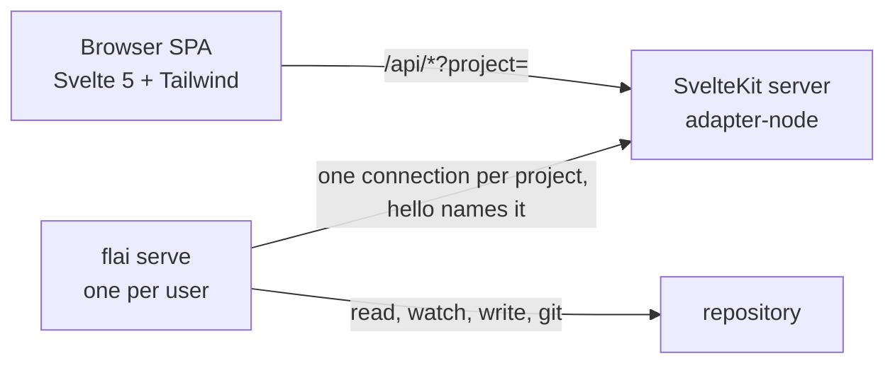

# flaiover dashboard

`flaiover` is the web view of a conforming repo. It renders every markdown document, searches `design/` and `wip/`, shows the kanban board, and charts the flow metrics defined in [metrics.md](metrics.md). It runs locally in Docker with the repo mounted read-write and is started by `flai dashboard`.

Source: `./flaiover` in this monorepo. Image: `ghcr.io/bytepunx/flaiover`, one multi-platform manifest for `linux/amd64` and `linux/arm64` under each tag (S-0119).

## Shape

SvelteKit with `adapter-node`. The browser side is a single-page app (`ssr = false` at the root layout) so navigation is instant and state lives in the client. The server side is a thin set of `+server.ts` endpoints under `/api` that ask flai on the host for everything they show and change (ADR-0029); the container holds no file of the project ([ADR-0031](../adrs/0031-the-dashboard-s-container-holds-nothing-of-the-project-a-port-and-two-secrets.md)). "SPA" here means the UI, not the deployment. See ADR 0007.


```mermaid
flowchart LR
    B[Browser SPA<br/>Svelte 5 + Tailwind] -->|/api/*?project=| S[SvelteKit server<br/>adapter-node]
    F[flai serve<br/>one per user] -->|one connection per project, hello names it| S
    F -->|read, watch, write, git| R[repository]
```

## Views

The header's site menu has two tiers (S-0172, `SiteMenu.svelte`): three groups in the top row, and the open group's pages in a row below. **Workflow** has Overview, Board, Inbox, Threads, Activity, Planner (S-0259), Orchestrator, and Analyzer (S-0229); **Status** has Charts, ADRs, Docs, and Search; **Host** has Updates (`/host`), Settings, and License (S-0231). The groups, their pages, and which group and page a path belongs to are `$lib/sitemenu.ts` (`SITE_MENU`, `locate`); `/items`, `/review`, and `/new` belong to Workflow and `/edit` to Status, with no page current. A group is a button: hovering it with a mouse or a pen, clicking it, or tapping it opens its row, and leaving the menu with the pointer, pressing Escape, or arriving on a page opens the page's own group again. A touch opens a group only by its click, because a touch ends with a pointerleave. The open group and the page shown are bold in the accent colour, with `aria-expanded` on the group and `aria-current="page"` on the page. A group shows its pages' indicators beside its name (`groupBadges`), so Workflow carries the Inbox count. Each group's row follows its button in the DOM and is drawn last in the header's flex row (`order-last`), so the keyboard reaches a group's pages straight after it. Menu links keep `?project=`.

| Route | View | Data |
|-------|------|------|
| `/` | Overview: WIP by column, throughput this week, aging items, epics burn-up sparkline; a project list with each one's glance (review, threads awaiting, agent attending) in its place while more than one project is known and none is chosen (S-0080) | `/api/stats`, `/api/projects` |
| `/board` | Kanban board: one column per state with WIP count against the limit, and below its name a line counting the epics, stories, and tasks the column holds, `1 \| 2 \| 4`, whichever types are shown, with `1 epic, 2 stories, 4 tasks` as its tooltip and accessible name (`laneCounts`, `shortCounts`, and `longCounts` in `$lib/lanes.ts`, S-0256; the done column counts what `doneLane` keeps), cards of the types ticked in a checkbox each for epics, stories, and tasks, stories alone by default and the choice kept per browser in `localStorage` (`$lib/boardtypes.svelte.ts`, `BoardTypes.svelte`, S-0141), with age in column, nature, blocked flag, and the parent's ID bottom right with its title as tooltip and accessible name (`BoardCard.svelte`, S-0048), a dot beside the ID for what the story's agent is doing (S-0104), a held story's hold code and the stories it waits for after the blocked flag (S-0129), `DRAFT` after the blocked flag on a draft story, from `draft` on its card (S-0201), a story's tasks from `tasks` on its card in `board.get` when it has any: how many are in progress, ready, and waiting, those at none left out, or how many are done when all are, and how many layers its plan has, in full as the tooltip and accessible name (`tasksLine` in `$lib/taskplan.ts`, S-0176), that detail row in one size under a thin divider, wrapping when crowded (S-0054); the card's background tinted by nature and its left edge striped by type, a red ring on a blocked card, a dashed faded card while dragged, and a legend above the columns built from the same map as the cards (`$lib/cardcolour.ts`, `BoardLegend.svelte`, S-0055); drag to another column to transition, refused moves show the rule; a card dropped on `cancelled` first opens `CancelConfirm.svelte`, which lists the open items that go with it from the move endpoint's dry run, calls out stories in review, names the branches and worktrees that stay, and takes the reason (S-0070, ADR-0028); `backlog` and `ready` are laid out in the pull order (`inPullOrder` in `board.ts`, flai's rule from [workflow.md](workflow.md)) and a story dragged within either is placed with `flai order`, with an insertion marker while dragging, up and down buttons beside the card's link on hover and keyboard focus, and Alt+arrow on a focused card (`$lib/reorder.ts`, `CardReorder.svelte`, S-0057); a drag within any other column is not a drop target; refreshes on SSE (S-0013). A right click on a lane's empty space opens the lane's menu (S-0167, `LaneMenu.svelte`, its entries from `laneEntries` in `$lib/lanes.ts`) when the board is writable, Shift with the mouse keeping the browser's own: create an item starting in that lane (`/new?status=`), move stories forward from backlog to ready or back one column from ready, in-progress, review (with the reason flai requires), and cancelled ([ADR-0055](../adrs/0055-a-story-moves-back-one-column-from-ready-in-progress-review-or-cancelled-and.md)) in `LaneMoveDialog.svelte`, which lists the lane's stories to tick, the card right-clicked ticked first, and moves each through `POST /api/items/:id/move` with one notice for what moved and what was refused, and change the WIP limit of ready, in-progress, or review in `WipLimitDialog.svelte`. A card has a menu of its own (S-0202, `CardMenu.svelte`) on a writable board: a right click on the card opens it at the pointer, Shift with the mouse keeping the browser's own, and the context-menu key or Shift+F10 on the focused card, a long press on touch (500 ms held within 10 px, the click it ends in swallowed, `routes/board/longpress.ts`), and the `⋯` button beside the card's link, shown on hover and focus like the reorder buttons (`aria-haspopup`, `aria-expanded`), open it below the card. Its entries are `cardMenu` in `$lib/cardmenu.ts`, the item page's actions by the same rules: **Open** (the card's own link), **Finalize** on a draft story not archived, **Start agent** or **Retry** for a story by `agentAction` in `$lib/activity.ts`, the rule `StoryAgent.svelte` uses too, **Plan** on an epic or a story not archived, done, or cancelled while the `plan` host action is on, the rule `PlanAction.svelte` uses too (S-0263), **Block…** or **Unblock** on an item not archived (Block only while not done or cancelled), and **Cancel…** while not done or cancelled; then, under the lane's name, the lane menu's entries, a move starting with that card ticked. Each runs the write the item page runs, `POST /api/items/:id/finalize`, `.../block` with the reason asked for, `.../unblock`, `.../agent` with `start` or `restart`, `.../plan`, or `CancelConfirm` then the move to cancelled, and the board then says what came of it in its notice and asks for the board again (and the agents, after an agent action or Plan), so the card shows the result. A read-only board offers neither menu nor the button. Both menus are `Menu.svelte`: the first entry focused, the arrows moving through it, Escape (focus back on the card), Tab, a click elsewhere, focus leaving it, or a choice closing it, and kept inside the viewport | `/api/board`, `POST /api/items/:id/move`, `POST /api/items/:id/order`, `POST /api/board/limit`, `POST /api/items/:id/finalize`, `.../block`, `.../unblock`, `.../agent`, `.../plan` |
| `/new` | Create an epic or a story from markdown (`NewItemForm.svelte`, S-0059), reached from the board's "+ new" action and from the **New story**, **New sibling**, **New epic**, or **Create story** link on an item page, none of which a read-only dashboard shows: type, parent among the open epics, nature with its meaning and release consequence (`$lib/natures.ts`), title, optional tags and touches, for a story the agent (`AgentFields.svelte`, S-0103: harness, model, and config one `key=value` a line, the project's default from `/api/manifest` as placeholders, and only what is typed sent), for an epic or a story its cost of delay inputs (`CostOfDelayPanel.svelte`, `$lib/costofdelay.ts`, S-0204: a `<details>` closed by default that says in one line what is set while closed; revenue and penalty per week labelled in `planning.currency` from `/api/manifest`, default USD, and time lost per cycle, a duration; only the inputs given are sent, as `cost_of_delay` on `item.new`, which runs `flai story new` or `flai epic new` with `--revenue-per-week`, `--penalty-per-week`, and `--time-lost-per-cycle` and so stamps them with the operator), and the body from the template with the explorer's preview beside it; no front matter. Since S-0167 the lane it starts in, backlog, ready, or in-progress, from `?status=` (the board's lane menu; any other lane is backlog, `$lib/lanes.ts`): flai makes the item in backlog and the form moves it on through `POST /api/items/:id/move`, one column at a time; a refused move names the item made and the move, links it, and the form makes nothing again. Since S-0171 the type from `?type=` and the parent epic from `?parent=` (an item page's New link), dropped when that epic is no longer open. A refusal shows the findings and keeps the text; success lands on the item | `POST /api/items`, `POST /api/items/:id/move`, `GET /api/items/template`, `GET /api/items` |
| `/items/:id` | Item detail: what the story's agent is doing (`StoryAgent.svelte`, S-0104), front matter (a story's agent as one line, S-0103; an item's usage as a line and one per model, `$lib/usage.ts`, S-0143, and below it a line per kind of strategic agent that spent on the item, apart from its agents' usage and shown even when no agent has worked it (`strategicLines`, S-0225, [ADR-0083](../adrs/0083-a-planner-activity-s-usage-is-charged-to-the-item-it-planned-and-the-items.md)); an epic's or story's cost of delay, its value per week, or that there is none yet, and its inputs, each with who set it and when, and a note when the value is stale because the inputs changed after it ([ADR-0080](../adrs/0080-a-cost-of-delay-stamps-its-inputs-and-its-value-apart.md), S-0204), and a story's forecast with who set it and when, read only, `$lib/planning.ts`, S-0199; after the forecast, the expected cost of an item with a forecast duration or an estimate, from `expected_cost` beside the item in `item.get`, marked estimated with what it was priced from, `expectedCostLine` in `$lib/usage.ts`, S-0225), rendered body, children, on a story with tasks its task plan from `plan` beside the item in `item.get` (`TaskPlan.svelte`, `$lib/taskplan.ts`, S-0176): each task linked, as ready to start, waiting with the tasks it waits for linked, in progress, done, or cancelled, then the layers of tasks that can run at once, layer 1 first, and any open task in no layer named as in a cycle; transitions timeline, on a story, its narrative's open questions from the shared inbox (`OpenQuestions.svelte`, S-0173), each with the inbox's answer form (`QuestionAnswer.svelte`) when writable, the one `?question=<inbox key>` names outlined and scrolled into view, and a line saying so when it is answered already; the threads on the item opened on the one `?thread=<TH-id>` names and scrolled into view (S-0155), blocked intervals, narrative link, and actions for allowed moves (a cancellation through the same confirmation as on the board), block, unblock, and a narrative log entry (S-0013). Below the line with the type, nature, and status, a done story says who accepted it and on which day, `Accepted by <by> on <date>`, from its last transition to done; when that is the orchestrator and the body has `### Accepted by the orchestrator`, the line links to that section of its Notes, where the orchestrator's evidence is (S-0221, [ADR-0093](../adrs/0093-with-accept-reviews-on-the-orchestrator-accepts-a-story-in-review-through-flai.md)). The history shows each transition's `by` as before. A draft story says `[Draft]` beside its title, and a writable dashboard shows **Finalize** among the actions while it is not archived, which posts to `/api/items/:id/finalize` and asks for the item again, so the marker goes without a reload; an epic's list of children says `Draft` after a draft story's state (S-0201, [ADR-0077](../adrs/0077-a-story-that-was-a-draft-records-who-finalized-it-and-when-and-the-dashboard.md)). On an epic's or a story's page that a writable dashboard may edit (open, not done, cancelled, or archived), **Plan** follows the actions while the `plan` host action is on (`PlanAction.svelte`, S-0208, [ADR-0082](../adrs/0082-flai-serve-starts-the-planner-for-an-epic-or-a-story-behind-the-plan-host.md)): it asks `GET /api/items/:id/plan` for each item, again on every work item change, and again when flai serve's `agent` notification names the item, which it does when the item's planner starts or ends (the hub passes on the `item` such a notification names as it passes on a story); it posts to it when pressed, and puts what flai answered, the run's PID and log or why it refused, in the page's notice; while the item's newest planner run has not ended it says `planner running since <time>`. At the top, beside the title, a writable dashboard shows on a story's page **New story**, which opens `/new?type=story` for a story on its own (S-0192), and on an epic's page **New epic** (`/new?type=epic`), whatever the item's state (S-0171). On a story under an epic, **New sibling** follows it and opens `/new?type=story&parent=` that epic (S-0192); the page asks `/api/items/:id` for the epic once per item and parent, and shows the link only while the epic is open, not done, cancelled, or archived, and not when the epic cannot be read, because the form offers only open epics as parents. **New epic** is followed on an open epic that is not archived by **Create story** (`/new?type=story&parent=` the epic, S-0191), which a done, cancelled, or archived epic does not show because the form offers only open epics as parents; a task's page has none, because tasks are the agent's to write. The page follows the project (S-0154): on each change event, debounced, it asks for the item again and shows the status, history, children, and front matter as they are now, drawing the body again only when it changed; its threads ask again too; and under a thread whose last entry is the operator's, while the story's agent is `working`, or `waiting` on that thread after it ended asking, a status line of three bouncing dots (`motion-safe`) says the agent is working on the reply. `StoryAgent` hands the story's activity to the page through `onactivity` for that | `/api/items/:id`, `POST .../move`, `.../block`, `.../unblock`, `POST .../finalize`, `GET` and `POST .../plan`, `POST /api/streams/:id/log` |
| `/review/:id` | Review of one story in review (S-0041), linked from the item page and from cards in the review column: acceptance criteria with their ticks, the narrative's current state and next steps, open threads, the story branch's diff against main (`DiffView.svelte`): a summary line per file with its status, path, and lines added and removed, which is a button with a mark that shows whether its panel is open (S-0164), and the panel with the file's hunks as runs of consecutive lines (`patchRuns` in `$lib/review.ts`), the `+` or `-` of each added or removed line in a margin of its own, the theme's `good-soft` or `danger-soft` behind the line, and one outline in `good` or `danger` round each run of consecutive added or removed lines, as wide as the longest line so it holds when the panel scrolls; and the release plan with blockers and uncommitted files from the acceptance preview. An Issues section (S-0198) lists open issues that no open story links, from `issueRows` in `$lib/issues.ts`: first each one this story recorded or bumped, checked, then every other one, unchecked. It reads two lists, the main checkout's and the story's own (`?story=`, read from its worktree), and the story's copy of an issue wins. Each row links the issue's document. The section is left out when there is none. Accept runs as the designer and shows each step as it completes, then the tags, or flai's error verbatim with the story still in review. The message after an acceptance names who accepted, from the `by` of the acceptance's answer, and the commit the orchestrator's verifier passed when the answer has `verified`: `S-nnnn is accepted by <by>.`, or `... by orchestrator at <commit>.`; an answer from a flai older than S-0221 has neither, and the message is `S-nnnn is accepted.` ([ADR-0093](../adrs/0093-with-accept-reviews-on-the-orchestrator-accepts-a-story-in-review-through-flai.md)). With a box checked the button reads Accept and Create Stories (`acceptLabel`): once the acceptance succeeds, the page makes one backlog story per checked issue, one at a time, from the main checkout, and names each story made and each issue that failed with flai's reason. A failed acceptance makes none. Send back asks for the reason in the page and moves the story to in-progress | `/api/items/:id`, `/api/items/:id/diff`, `/api/items/:id/acceptance`, `POST /api/items/:id/accept`, `POST /api/items/:id/move`, `/api/issues`, `POST /api/issues/:id/story`, `/api/docs/file`, `/api/threads` |
| `/activity` | Who is working on what (S-0042), derived from the narratives: each active stream with its agent and session, the story's state and blocked flag, the task in progress, and the last log entry with its age. Nothing is written for presence: an agent that stops logging ages out. Since S-0142 each card whose story has had an agent flai serve started shows the agent's dot and state and its stream (`AgentStream.svelte`), opened when the agent runs and closed only by the reader (S-0178), and an agent at work on a story with no narrative yet gets a card of its own. Since S-0170 an agent that runs or waits for an answer has **Stop**, after a confirmation. Since S-0218 the project's orchestrator, which flai serve runs while the `orchestrate` host action is on, has a card of its own above the stories: its newest run from `agent.status`'s `orchestrator`, with its harness and model, agent, session, start, end, and how it ended, and its stream, open while it runs; a run that could not be started shows why and no stream. Its own page, with its decisions and a Stop, is S-0228's | `/api/activity`, `/api/host-agent`, `/api/agent-stream/[story]`, `/api/agent-stream/orchestrator?orchestrator`, `/api/items/[id]/agent` |
| `/workflow/planner` | The planner (S-0259), after Activity in the site menu's Workflow group (`PlannerPanel.svelte`): whether the `plan` host action is on, and while it is off the command that turns it on (`flai serve enable plan`); the run under way, the newest planner run that has not ended, with its item, agent, start, and trigger, and its stream in `AgentStream.svelte` told `plan`; the activity document's totals (accrued cost and time, activities, last run) and its entries newest first, each with its trigger, items, duration, and cost; each item's newest planner run, newest first, with its outcome and its cost, the sum of the entries logged between its start and its end, since a run records no cost of its own (`$lib/planner.ts`); and a form that plans an epic or a story through `POST /api/items/[id]/plan`, disabled with the reason while the action is off. Below them is the planner's settings panel, `StrategicSettings.svelte` told `planning` (S-0229, [Strategic agents' settings](#strategic-agents-settings-s-0229)). Past runs are what `agent.status` keeps, each item's newest. The page loads again when the planner's document (a narrative to `$lib/changes`) or a work item changes, when flai serve says a run started or ended, and every 15 s while one runs. Its settings are read apart, from `/api/settings`, on arrival, after a save, and when `system-flow.yaml` changes, never on the timer, so that a read does not refill the form while the operator types | `/api/planner`, `/api/agent-stream/[id]?plan`, `/api/items/[id]/plan`, `/api/settings` |
| `/workflow/orchestrator` | The orchestrator's settings (S-0229), after Planner in the site menu's Workflow group: `StrategicSettings.svelte` told `orchestration`, the permissions, `orchestration.policy`, and the `orchestration.release` keys ([Strategic agents' settings](#strategic-agents-settings-s-0229)). It holds only the panel for now; the orchestrator's status, activity, and runs come with S-0228 (TH-0199). Read from `/api/settings` on arrival, after a save, and when `system-flow.yaml` changes. When `settings.get` has no `host.strategic`, it says the project may not be open or flai may be older than the dashboard | `/api/settings` |
| `/workflow/analyzer` | The analyzer's settings (S-0229), last in the Workflow group: `StrategicSettings.svelte` told `analysis`, `analysis.agent` and `analysis.schedule`, read as the Orchestrator page reads them. Its runs, activity, and an Analyze button come with S-0228 | `/api/settings` |
| `/inbox` | What needs a human (S-0042): threads awaiting the designer, open questions from narratives, stories in review, blocked items, and `wip.overlap` warnings, each linking to its page and never to a document, where it could not be answered (`hrefFor`, S-0173): a story in review to `/review/:id`; an open question to its story's page with `?question=<key>`; a thread on an item, or on a path that is an item's file or narrative (live or archived), to that item's page with `?thread=<TH-id>` (S-0155); any other thread, such as one on a design issue, to `/threads?thread=<TH-id>` (TH-0041); a blocked item or an overlap to its item; anything else to the board. A count badge in the navigation; both refresh on change events. A per-browser toggle, off by default, raises a desktop notification for an entry that appears while the page is open. A hand-written open question (one with no thread of its own) can be answered right there, and on its story's page, when the dashboard is writable (S-0090, S-0173): it moves to the narrative's Decisions and drops off the list. A thread whose recommendation awaits the designer ([ADR-0090](../adrs/0090-a-thread-entry-is-marked-a-recommendation-in-its-heading-and-cites-its-source.md)) shows it marked, with its author, text, and source linked to the document and heading, and **Confirm** in place when the dashboard is writable; the entry still links to the thread | `/api/inbox`, `POST /api/streams/:id/answer`, `POST /api/threads/:id/confirm` |
| `/threads` | Threads in the site menu's Workflow group (S-0173, TH-0041): every open thread of the project in `Threads.svelte` without `on`, so with the item page's view (one at a time, the pager, show resolved, reply, resolve, confirm) and opened and scrolled to the one `?thread=<TH-id>` names. Each thread links to its anchor, the item or else the document; no new thread is started here, since a thread needs an anchor. Where an inbox thread on no item leads | `/api/threads`, `POST /api/threads/:id/confirm` |
| `/charts/cycle-time` | Cycle time scatter by nature with p50 and p85 lines (S-0014) | `/api/stats` |
| `/charts/burn-up` | Scope and done, per epic or total | `/api/stats` |
| `/charts/cfd` | Cumulative flow diagram | `/api/stats` |
| `/charts/time-in-state` | A stacked bar per day with items completed and the share bar | `/api/stats` |
| `/charts/throughput` | Weekly bars by nature | `/api/stats` |
| `/charts/cost` | What agents spent on each item (S-0143, [ADR-0051](../adrs/0051-work-items-record-the-tokens-and-cost-their-agents-spent-measured-from-the.md)), from `items[].usage` and `usage` in `flai stats --json` ([metrics.md](metrics.md#usage-s-0143-s-0163)): each completed item's cost stacked by model with `*` on an estimated one (titled $ / Item since S-0169). What strategic agents spent on an item, its `usage.strategic` costs summed, is stacked on top as one series of its own, `strategic`, drawn only when some item has it, in slot 7 (`STRATEGIC_SLOT` in `palette.ts`), which no model takes; it is estimated, so its item has `*`, and the tooltip gives it apart from the item's total, which is the agents'. An item with only strategic usage has a bar of that alone (S-0225, [ADR-0083](../adrs/0083-a-planner-activity-s-usage-is-charged-to-the-item-it-planned-and-the-items.md)). The two completion charts of S-0143 are gone ([ADR-0057](../adrs/0057-the-dashboard-charts-agent-time-and-cost-per-item-per-model-over-time-instead.md)). A model's colour is its family's fixed slot (`modelSlot` in `palette.ts`: opus 0, sonnet 2, haiku 5, fable 6, another 3 or 4 by name), whatever a type or filter leaves. With no item carrying usage the page says how to fill it in. The table view lists item, completed, model, tokens, tokens per agent minute, and cost | `/api/stats` |
| `/charts/token-rate`, `/charts/tokens-spent`, `/charts/tokens-per-item`, `/charts/tokens-per-dollar`, `/charts/cost-spent`, `/charts/cost-per-item`, `/charts/time-per-model`, `/charts/cost-per-model` | What agents spent over time (S-0163, [ADR-0053](../adrs/0053-usage-is-charted-as-spend-over-time-in-buckets-for-every-item-type-at-once-and.md)), from `usage.spend` in `flai stats --json` ([metrics.md](metrics.md#spend-over-time-s-0163)), one point per bucket. Titles since S-0169 ([ADR-0057](../adrs/0057-the-dashboard-charts-agent-time-and-cost-per-item-per-model-over-time-instead.md)) in brackets. Token rate [Tokens / Min]: each model's tokens per agent minute, as lines, in place of S-0143's point per item in tokens per agent hour. Tokens per day and Cost per day [Tokens / Day, $ / Day, titled for the bucket: Tokens / Hour, $ / Week]: what the items done in each bucket spent, as bars stacked by model, with the running mean per bucket as a dashed line. Cost per day stacks `buckets[].strategic.cost` on top as a series of its own, `strategic`, in `STRATEGIC_SLOT`, when any bucket has it; it is estimated, the tooltip says so, and the running mean stays the agents' (S-0225, [ADR-0083](../adrs/0083-a-planner-activity-s-usage-is-charged-to-the-item-it-planned-and-the-items.md)). Tokens per day and every other chart over time leave strategic spend out. Tokens per item and Cost per item [$ / Work Type]: the mean an item took, one line per item type (epic, story, task), with no type to choose. Tokens per dollar [Tokens / $]: what a dollar bought, per model. Avg. Time / Model and Avg. Cost / Model: per model, the mean agent minutes (`minutes_per_item`, worked out from `seconds` when an older flai sends none: `minutesPerItem`) and the mean dollars an item of the chosen type took, over the items it worked on. With two models or more, every chart per model adds a dashed line for all of them (`perModel`). The axis is UTC, as the buckets are, and runs a bucket either side of what is drawn. A model and an item type each have a mark as well as a colour (`MODEL_SYMBOL`, `TYPE_SLOT`, `TYPE_SYMBOL` in `palette.ts`). The page asks flai for the bucket chosen (`bucket=`), offers an hour only over 31 days or less, and offers no epic, since flai sums the buckets. When the host's flai sends no `usage.spend` the page says it is older than the dashboard. The table view (`SpendTable.svelte`, rows from `spendRows`) lists each bucket with items, newest first: whole and per model, or per item type, with items done, tokens, cost, agent minutes, tokens, cost, and agent minutes per item, tokens per agent minute and per dollar, and the running means; for cost per day, also a `strategic` row per bucket with strategic spend, estimated, even one with no agents' items | `/api/stats` |
| `/docs/<path>` | Documentation explorer: collapsible tree of `design/` (including `conventions/`, `issues/`, `experiments/`, and the analyzer's reports in `analysis/`, listed by name beside its `README.md` as any folder is, S-0223), `docs/`, and `wip/`; rendered markdown with Mermaid, highlighted code, task lists, heading anchors, rewritten links; front matter panel (S-0012), which for a report shows its `focus` and its window, `from` and `to` | `/api/docs/tree`, `/api/docs/file` |
| `/edit/<path>` | Editor for one document ([ADR-0023](../adrs/0023-documents-are-saved-through-flai.md), S-0040), reached from the Edit link on the document and item pages when the dashboard is writable. flai decides what may be edited: body and front matter for design and docs, body only for work items, narratives, and the board (front matter shown read-only), nothing for generated files, threads, issues, and the archive. A textarea with the explorer's renderer as preview; the "being worked on by" warning from `touches`; a thread can be opened on the heading under the cursor. Save reports the commit, a refusal with the check's findings, or a conflict with a diff and the choice to load the current version or save over it | `/api/docs/edit`, `PUT /api/docs/file`, `/api/threads` |
| `/conventions` | The conventions in read order with project additions highlighted; the same set `flai prime` prints | `/api/conventions` |
| `/adrs` | ADR list with status, date, and supersession chain linking into the explorer (S-0012) | `/api/docs/adrs` |
| `/adrs/new` | Record an architecture decision from markdown (`NewAdrForm.svelte`, S-0060), reached from "+ new ADR" on `/adrs`, which shows only when flai answers; the list also has an accept button on proposed records, shows `refines` in the chain column, and follows the files over SSE. The form: title, proposed or accepted, supersedes and refines chosen from the existing records (not both for one ADR), and the body from the project's template sections with the explorer's preview; no front matter. A refusal keeps the text; success lands on the ADR in the explorer | `POST /api/adrs`, `GET /api/adrs/template`, `POST /api/adrs/:id/accept`, `GET /api/docs/adrs` |
| `/streams` | Active narratives with current state and next steps | `/api/streams` |
| `/host` | Updates in the site menu's Host group (S-0172). The dashboard container with check, restart, upgrade, and stop (`HostPanel.svelte`, S-0081). Below it, flai host with a row each for serve and the MCP servers (state, version, restarts), with Start, Stop, and Restart per row, one Check for upgrade, and one Upgrade (`HostProcesses.svelte`, S-0107) | `/api/dashboard`, `/api/host` |
| `/settings` | The host's settings for this project (`SettingsPanel.svelte`, S-0105, [ADR-0039](../adrs/0039-a-settings-host-action-turned-on-only-in-a-shell-lets-the-dashboard-change-the.md)), in the site menu's Host group after Updates. It has a section each for: host actions (a checkbox each, with what it does, both as flai's `settings.get` lists them from every host action flai has, `plan` and `orchestrate` among them, so a new action needs nothing here; `settings` itself and an action on for every project are shown, not changed); the default agent (`AgentFields`); when `flai serve` plans again on its own, read-only, from `settings.get`'s `host.planning`: the `plan` action, `planning.replan`, and `planning.schedule` with its next run (S-0211, [strategic-agents.md](strategic-agents.md#on-the-settings-page)), with a link to the Planner page, where the planning keys are edited (S-0229); the agent's name, minutes, and command; each harness's program and arguments; the checks and time limit, or the manifest's when the host has none; the import folders; the projects `flai serve` serves, and those below the import folders it does not (S-0122); the project's shared paths, `settings.get`'s `host.shared`, each pattern with **Remove** and a field to add one through `settings.shared`, and a Check field, offered even while settings are read-only, that asks `settings.shared_check` with a path or a story's ID (`sharedQuery`) and says, for the path or each entry of the story's claim, which pattern it lies inside or that none does; flai's refusal of a pattern is shown beside the field without the manifest's path (`sharedRefusal`), and the section is left out when an older flai sends no `host.shared` (S-0295, [ADR-0096](../adrs/0096-a-story-in-review-holds-nothing-an-overlap-inside-the-manifest-s-shared-paths.md)); the MCP and dashboard tokens. Each section is read-only, with the command that allows changing it, until `settings` is on here, or everywhere for what the host keeps for every project (`HOSTWIDE` in `$lib/settings.ts`). A command is edited one argument a line (`argv`, `lines`), so nothing is quoted or split. Each change says what flai answered in its section and reads the settings again. A rotated token is shown once | `/api/settings` |
| `/license` | License, last in the site menu's Host group (S-0231): the Bytepunx Shield License the dashboard, flai, and the repository are distributed under, rendered with the explorer's renderer from the `LICENSE.md` the image carries at `/app/LICENSE.md`. The one page that asks flai for nothing: the file is the image's own, not the project's. When the image carries none, the page shows the API's error | `/api/license` |
| `/search` | Search across `design/` and `wip/`, `docs/` on request, with snippets and routes (S-0012); item hits tinted by nature and striped by type (S-0055), and `Draft` after a draft story's status (S-0201) | `/api/search?q=&docs=` |

The charts are listed in two groups, flow and usage (S-0163). Every chart has the same filter bar, with the controls it uses (`controls` in `src/lib/viz/charts.ts`): window (a day to a year), type, epic where the chart supports it, and on the charts of spend over time the bucket (per hour, day, or week). The charts per item draw every item type and offer no type; the "compare" control of S-0163 is gone, since the charts per model show the models ([ADR-0057](../adrs/0057-the-dashboard-charts-agent-time-and-cost-per-item-per-model-over-time-instead.md)). A summary strip shows completed, cancelled, WIP, throughput, and cycle time percentiles, or on a usage chart what the items done spent and what that comes to per item, per agent minute, and per dollar; a table view sits under every chart. Every chart spans the window ([ADR-0054](../adrs/0054-every-chart-spans-the-window-chosen-its-time-axis-runs-from-the-window-s-start.md), S-0166): a time axis runs from the report's `window_start` to its `generated_at` (`span` and `overTime` in `charts.ts`), and the charts per item and their tables take only the items completed between them (`completedIn`, `withUsage`). Time in state draws one stacked bar per UTC day with items completed, the mean hours per state of those items, on an axis of days laid out as the spend series are (`buckets` in `charts.ts`; [ADR-0056](../adrs/0056-time-in-state-is-one-stacked-bar-per-day-of-the-window-the-mean-hours-per-state.md), S-0168). The page draws only the answer to the last window, type, or bucket it asked for. The window is kept per browser in localStorage (`chartWindow` in `src/lib/chartwindow.svelte.ts`, S-0168), like the theme, so every chart opens at the window chosen last, after a remount too; the page asks for the stats at mount without waiting for the epic list, and draws them without it when it cannot be read.

A banner an action leaves on the page until the next action is dismissible (S-0151): the board's notice after a move, an order change, or an acceptance; the item page's notice after a tick, a move, or a save; the notice on `/adrs` after an acceptance; the document editor's saved notice; and the result of **Publish** above the done column. Each is `DismissibleNotice.svelte`, which shows the text and a right-aligned X, labelled Dismiss, that clears the page's state for it, so the next action's notice shows again. Banners that show state are not dismissible, because they would be wrong the moment they were hidden: host flai not connected, `HostAgentNotice` (collapsible instead, S-0150), and the pending publish plan with its refusal. The standing `UnpushedNotice` was one until S-0195 removed it ([ADR-0067](../adrs/0067-accepted-work-reaches-the-remote-only-when-it-is-published-and-agents-publish.md)).

## API (S-0011)

| Route | Returns |
|-------|---------|
| `GET /api/manifest` | `system-flow.yaml` parsed |
| `GET /api/license` | `{ name, text }`: the license the image carries (S-0231), read by `$lib/server/license.ts` from `FLAIOVER_LICENSE`, else `LICENSE.md` beside the server (`/app` in the image), else one directory up (a checkout run from `flaiover/`); `name` is its first heading. Not asked of flai: the file is the dashboard's own, and `no-project-files.test.ts` accounts for the read. 503 with `error` when no file is there |
| `GET /api/items?type=&status=&archived=` | Every item from kanban and archive without bodies, sorted by ID; timestamps as `YYYY-MM-DDTHH:MM:SSZ` strings. The type and state are asked of flai, and the archive unless `archived=false`, which a page that does not show the archive sends (S-0162): the overview, the document explorer, and the editor. A type or state that is not one is 400 |
| `GET /api/items/count` | `{ active, archived }`: how many items there are of each (`items.count`, S-0162), for the overview, which shows the archive's size and not the archive |
| `POST /api/items` `{ type, title, nature?, parent?, tags?, topics?, touches?, agent?, body }` | Creates an epic or a story with the designer's markdown as its body (S-0059, ADR-0016): `flai <type> new --body-stdin --autocommit` with the designer as owner and the dashboard's trailer. Values reach flai as `--flag=value` and the title after `--` (the wrapper puts `--json` before it), so nothing typed is read as a flag. Tasks are refused (400). 422 `{ error, findings }` when the check refuses, and then nothing was created |
| `GET /api/items/template?type=epic\|story` | `{ type, body }`: the body the project's item template gives the type (`flai <type> new --print-body`), which the form starts from |
| `GET /api/threads?on=<path\|id>&all=1`, `POST /api/threads` `{ on, heading?, title, text }`, `POST /api/threads/:id/reply` `{ text }`, `POST /api/threads/:id/resolve` `{ reason? }`, `POST /api/threads/:id/confirm` | Threads read from `wip/threads`, written through `flai thread` with the manifest owner as author (S-0038). Each entry read carries `operator: true` when its author is the manifest owner, or `designer` when there is none, the person flai's own inbox counts as the designer (S-0127), and flai's `recommendation` and `source`; each thread its `pending_recommendation`. Confirm asks flai's `thread.confirm`, which makes the pending recommendation the answer (ADR-0090) |
| `POST /api/login` | `{ token }` from the login page; sets the session cookie (S-0036) |
| `POST /api/logout` | Clears the session cookie |
| `GET /api/items/:id` | `{ item, children }` with the body; the ID may be given with any zero padding or none, so a two, three, or four digit spelling of the same number resolves to the same item |
| `GET /api/docs/tree` | Three trees (design, docs, wip) of `{ name, path, kind, title?, children? }`; a file's front matter is read with `/api/docs/file` since S-0162 |
| `GET /api/docs/file?path=` | `{ path, frontMatter, body, raw }` for one markdown file; paths outside the repo or non-markdown are 400, missing 404 |
| `GET /api/docs/edit?path=` | `flai doc show`: `{ path, content, hash, mode, reason? }`, mode `full`, `body`, or `none` |
| `PUT /api/docs/file` `{ path, content, hash, message? }` | `flai doc save` with the content on stdin. 200 `{ path, hash, committed, commit?, warnings[] }`; 409 `{ error, current, hash, diff }` when the file changed since it was loaded; 422 `{ error, findings[] }` when flai refuses the content (a check error on the file, or front matter it owns was changed) |
| `GET /api/events` | Server-sent events: `ready` once, then `change` with `{ path, kind }` per changed file under design, docs, wip, or the manifest (the kind since S-0161, as `$lib/changes.ts` reads the path), and `agent` with `{ story }` when flai serve says a story's agent started, could not be started, or ended (S-0154), which changes no file. In the browser `listen()` in `$lib/events.ts` serves every listener on a page from one `EventSource` per project, opened by the first and closed with the last (the inbox, the item page, its threads, and its agent panel), because a browser allows few connections to one origin; `follow(kinds, f)` calls a page once for the changes of the kinds it shows that arrive within 500 ms of each other, and at least every 2 s in a burst that does not settle (S-0161): the board, the Publish banner, the item page, and the charts follow work items; the agent panels work items and threads, and `agent`; the threads threads and work items; the inbox work items, threads, and narratives; activity work items and narratives; the ADR list ADRs. The manifest and a path the server could not tell apart count for every page |
| `GET /api/search?q=&docs=` | `{ query, indexed, hits[] }`; each hit has `path`, `kind`, `itemId?`, `title`, `scope`, `status?`, `type?`, `nature?` (S-0055), `draft?` (true on a draft story, S-0201), `score`, `snippet`, `route` |
| `GET /api/docs/adrs` | ADR front matter: `id`, `title`, `status`, `date`, `supersedes[]`, `supersededBy[]`, `path` |
| `POST /api/adrs` `{ title, status?, supersedes?, refines?, body }` | Records an ADR through `flai adr new --body-stdin --autocommit` with the dashboard's trailer (S-0060, ADR-0016). ADR references are reduced to numbers, values go as `--flag=value`, and the title follows `--`. 422 `{ error, findings }` when the check refuses, and then nothing was created |
| `GET /api/adrs/template` | `{ body }`: the sections of the project's `design/adrs/0000-template.md` (`flai adr new --print-body`). It answers only when flai is available, so the ADRs page uses it to decide whether to offer writing |
| `POST /api/adrs/:id/accept` | `flai adr accept`: a proposed ADR becomes accepted, dated today, its index row updated, committed on its own |
| `GET /api/board` | `{ wip_limits, order, writable, columns: { <state>: card[] } }`; a card has `id`, `type`, `title`, `nature`, `parent`, `parent_title` (the parent item's title, absent without a parent; S-0048), `status`, `blocked`, `age_seconds`, `entered_at`, and `draft: true` on a draft story, absent otherwise (S-0201) |
| `POST /api/items/:id/move` `{ to, reason?, by?, include_uncommitted?, dry_run? }` | flai move; `dry_run: true` on a move to `cancelled` changes nothing and answers `{ id, cancelled[], left_behind[] }`, what the cancellation would take with it; a real cancellation answers the same fields (S-0070); `include_uncommitted: true` on a move to done is the designer's choice in the confirmation to put uncommitted files outside `wip/` into the acceptance commit and becomes flai's `--yes`, the only way the dashboard passes it (S-0051); `{ id, status, warnings[] }` or 400 `{ error }` with the rule. A story moved to done is accepted: the response also carries `merged` (S-0046); since S-0087 acceptance tags and pushes nothing, so `tags`, `pushed`, and `push_error` are gone from it — see `/api/publish` below |
| `POST /api/board/limit` `{ column, limit }` | flai's `board.limit` on the host (S-0167): `flai board limit <column> <n>` sets the WIP limit of `ready`, `in-progress`, or `review` in `board.md`, 0 for none; any other column, or a limit outside 0 to 99, is refused as a 400. Returns `{ column, limit, wip_limits }` |
| `POST /api/items/:id/order` `{ before \| after \| top \| bottom }` | Runs `flai order <id>` with exactly one placement (S-0057, ADR-0016: `board.md` is never edited by the dashboard). Only item IDs are passed to flai. Returns `{ id, status, sequence, order }`; flai's refusals (an epic or task, another state, a reference in another column) are 400 with its reason |
| `GET /api/publish`, `POST /api/publish` | S-0087, `publish.preview`/`publish.run`: `{ plans: PendingPlan[], remote, unplanned, push_enabled }` — every component with something accepted and unreleased for it since its last tag, the highest level among it, and the story IDs it bundles; `remote` (S-0174, `null` when there is nothing to say) how the clone's release tags stand against its remote's, and `unplanned` (I-0024) the accepted items no plan covers, with why; `remote.branch` (S-0195) is set when the remote branch this clone tracks has commits it lacks; `POST` runs `flai release --pending` (applies, tags, pushes) as the push host action, the one way the dashboard sends accepted work to the remote ([ADR-0067](../adrs/0067-accepted-work-reaches-the-remote-only-when-it-is-published-and-agents-publish.md)). `PublishBanner.svelte` at the top of the board's done column lists the plans and offers **Publish** when enabled; the board fetches once and also uses it to flag a done card `waiting to publish` when its story is in one of the plans. `GET /api/unpushed` and its `POST` (`push.pending`, `push.run`, S-0063 and S-0078) were removed in S-0195 |
| `GET /api/agent` | Whether a flai on the host has this dashboard connected, and `project.info` asked over the channel (S-0072): `{ configured, connected, since, flai, serves, info }` or `error` in place of `info` |
| `GET /api/projects` | `{ projects: [{ key, name, connected, since?, review?, threadsAwaiting?, agentAttending? }] }`: every project ever connected here, connected or not, with a glance for each connected one, each asked on its own 3s timeout and gathered with `Promise.allSettled` so a stalled or slow project cannot delay another's row (S-0080) Since S-0098 a repository offered for import is listed with `candidate: true` while it is connected, and without a glance. Since S-0122 the first connected project's `settings.get` (on the same 3s timeout, in parallel with the glances) says what `flai serve` serves: each such project gets `served: true`, one not connected gets `lastError` (flai serve's last error, or why it is unavailable), and one never connected here is added, not connected. Without a connected project, or with a flai that does not answer, the list is the registry's. Asked by `projectState` alone, once per page load and past the browser's cache (S-0186, see One dashboard for every project) |
| `GET /api/import`, `POST /api/import` | For the candidate `?project=` names (S-0098, [ADR-0035](../adrs/0035-repositories-under-folders-the-operator-names-can-be-imported-from-the-board.md)). GET is `import.preview`: the layout, moves, sub-projects, and `tests` with `tests_from` (`host`, `repository`, or `none`). POST is `import.run`, streamed as NDJSON as an acceptance is: `{event: progress, msg}` as each test starts and ends, then `{event: done, result, committed}` (committed false when a test failed, -32013 mapped to 422, with each test's outcome and output in `result.commit.tests`) or `{event: error, error, status}` |
| `GET /api/items/:id/acceptance` | `flai accept --dry-run`, without `--yes` so it checks what the move checks: `{ plan, branch, blockers[], uncommitted[], worktree_uncommitted[] }`, shown in the confirmation dialog before a story is dropped on done. Blockers disable accept. Uncommitted paths in the story's worktree (S-0140) are shown by `WorktreeUncommitted.svelte`, in the confirmation and on the review page, instead of flai's matching blocker, with **Have an agent commit them**, which posts `{ action: 'commit' }` to `/api/items/:id/agent` (flai's `agent.commit`). Uncommitted paths outside `wip/` are listed with a checkbox, off by default, to include them; accept waits for it (S-0051). A research or experiment story's plan is a no-release plan with `unreleased: [{ component, files }]`, which the confirmation and the review page list (`UnreleasedList.svelte`, ADR-0025, ADR-0066). An experiment story is accepted like research once its results document is on its branch; while it is missing, flai's blocker names `design/experiments/<S-nnnn>-<slug>.md` and accept stays disabled. The dashboard has no rule of its own for a nature |
| `GET /api/issues?story=` | flai's `issue.list` (S-0198), `flai issue list --json`: every issue, closed ones too, with `stories`, the stories its occurrences name, and `story`, the open story that links it, or `""`. With `story`, only the issues that story recorded, read from its worktree while it has one |
| `POST /api/issues/:id/story` `{ epic? }` | flai's `issue.story` (S-0198), `flai issue story <id> --owner <designer> --autocommit`: a backlog story made from an open issue, committed on its own. Returns `{ id, title, nature, path, issue, committed, commit?, commit_error? }`; a closed issue, or one an open story links, is flai's error, and a story the check refuses is 422 with its findings |
| `GET /api/items/:id/diff` | `flai stream diff`: `{ branch, base, files: [{ path, old_path?, status, additions, deletions, binary, truncated, patch }], truncated }`, the story branch against its merge base with the main branch |
| `POST /api/items/:id/accept` `{ include_uncommitted? }` | Runs `flai accept <id> --by <designer>`, the designer being the manifest's `owner` as for threads and board moves: one project token has one holder (ADR-0018). The response is newline-delimited JSON, written as flai runs: `{ event: "progress", msg, ... }` for each step flai logs, then `{ event: "done", result }` with what `flai accept --json` printed, or `{ event: "error", error, blockers? }` with flai's message verbatim. The HTTP status is 200 once the stream has started; the last line says how it ended. Since S-0087 acceptance never pushes, whatever the push host action is set to: it merges, archives, and commits, nothing more. Publishing what accumulates is `/api/publish`, above |
| `GET /api/activity` | `{ streams: [{ stream, title, agent, session, updated, age_seconds, status, blocked, task?: { id, title }, last_log?: { at, text }, path }] }`, newest first, from `wip/agents/*.md` and the items |
| `GET /api/agent-stream/[story]?after=N` | flai's `agent.stream` as it answers (S-0142): `{ story, agent, started, ended?, running, outcome?, from, next, size, more?, skipped?, entries: [{ kind, tool?, text, error? }] }`, the log's tail without `after`; 404 when flai serve started no agent for the story. With `plan` in the query (S-0259) the path names an epic or a story and the read is of the newest planner run flai serve started for it, `agent.stream` with `plan` in place of `story`, answering `item` and an empty `story`; 404 when it started no planner for the item. With `orchestrator` in the query (S-0218) the read is of the project's newest orchestrator run, `agent.stream` with `orchestrator: true`, whatever the path names (the activity page names `orchestrator`); 404 when it started no orchestrator for the project |
| `GET /api/planner` | The Planner page's read (S-0259): `{ plan_enabled, activity: { kind, accrued_cost, accrued_seconds, tasks_completed, last_run, path, entries: [{ at, summary, trigger?, items, seconds, cost, estimated }] }, runs: [PlanRun] }`. `plan_enabled` is `project.info`'s `host_actions.plan`, false when flai cannot be asked; `activity` is flai's `activity.document` for `planner`, entries oldest first and an entry's missing items an empty list, and failing to read it is the answer's error; `runs` is `agent.status`'s `plans`, each item's newest planner run, newest first, empty when flai cannot be asked |
| `GET /api/inbox` | `{ total, counts: { thread, question, review, blocked, overlap }, entries: [{ key, kind, title, detail?, href, at?, item?, recommendation? }], notes[] }`. Threads count when the last entry is not the designer's (the manifest's `owner`), or when a recommendation awaits their confirmation: `recommendation` is `{ author, at, text, source? }`, from flai's `pending_recommendation`, its text without the `Source:` line (ADR-0090). Questions are the bullets under a narrative's `## Open questions`, outside the generated threads block; `item` is the story, so a question entry can be answered in place (S-0090) and leads to its story's page (S-0173). Overlaps are the `wip.overlap` findings of `flai check --json`, cached until the repository changes; without flai they are left out and `notes` says so |
| `/mcp`, any method | 410 with a JSON-RPC error that says where MCP lives now: flai serves it on the host, over stdio and over HTTP ([ADR-0030](../adrs/0030-mcp-is-served-by-flai-on-the-host-over-stdio-and-http-and-the-dashboard-s-api.md), S-0076). No token is needed, because the answer says nothing about the project. The dashboard served MCP here from S-0043 until then (ADR-0024, superseded) |
| `POST /api/items/:id/block` `{ reason }`, `POST /api/items/:id/unblock` | flai block and unblock |
| `POST /api/items/:id/finalize` | flai's `item.finalize` (S-0201): finalizes a draft story as the designer, recorded in its `finalized` block. A story that is not a draft is 400 with flai's reason, and an ID that is not a story is 400 |
| `POST /api/items/:id/criteria` `{ hash, tick? \| untick? }` | flai's `item.criteria` (S-0282, [ADR-0089](../adrs/0089-acceptance-criteria-are-ticked-through-flai-by-number-by-the-story-s-agent-once.md)), `flai criteria tick` or `untick <id> <n>,... --hash --by <designer> --autocommit`: ticks or unticks the criteria named by number, from 1 as `flai criteria list` numbers them, as the designer, committed. One call ticks or unticks, not both. A stale hash is 409, an archived or closed item or what flai check finds 422, a number with no box or a body of another shape 400. Answers flai's edit result with `criteria`, `[{ n, text, ticked }]`, as they now are. The story page has no checkbox for it yet |
| `GET /api/items/:id/plan`, `POST /api/items/:id/plan` | S-0208, [ADR-0082](../adrs/0082-flai-serve-starts-the-planner-for-an-epic-or-a-story-behind-the-plan-host.md). `GET` answers `{ plan_enabled, run }`: whether the `plan` host action is on, from `project.info`'s `host_actions.plan`, and the item's newest planner run from `agent.status`'s `plans`, or `null`, both asked of flai each time; a flai that cannot be asked reads as the action off and no run. `POST` is flai's `plan.run` `{ id }`, which runs `flai plan <id> --json` and answers the run (`item`, `agent`, `harness`, `command`, `pid`, `log`, `session`, `started`). With the action off it is 403 naming `flai serve enable plan`; a task, an item done, cancelled, or archived, and a planner already running for the item are 400 with flai's reason |
| `POST /api/streams/:id/log` `{ entry }` | flai stream log |
| `POST /api/streams/:id/answer` `{ question, answer }` | flai stream answer: `question` must read exactly as the inbox entry's own title. Removes it from Open questions, records it with `answer` under Decisions |
| `GET /api/stats?since=&type=&by=&bucket=` | `flai stats --json` verbatim (see metrics.md), cached per query and cleared on change; bad arguments are 400. `bucket` (S-0163) is what spend over time is laid out in |
| `GET /_health`, `GET /_ready`, `GET /metrics` | Liveness, readiness with named dependency checks (flai connected, and the manifest through it, nothing more since S-0162), Prometheus metrics (S-0032, see docs/operators) |

Errors are `{ error }` with the status. The reader caches by path and mtime and is invalidated by the watcher.

## Writes (S-0075, ADR-0029)

Every write is a named method of flai on the host, asked over the channel; nothing runs in the container, and the image holds no `flai`, no `git`, and no `ssh`. flai validates the arguments as data, builds the command line itself, and runs the same command the CLI has, so its rules are the only rules ([ADR-0016](../adrs/0016-dashboard-delegates-to-flai.md), [ADR-0023](../adrs/0023-documents-are-saved-through-flai.md)). The previews, the diff, the statistics, and the pending push change nothing and are answered by `flai serve` from the code those commands print with, with the answer the command gave (S-0159). The mount is still given to the container and is no longer used; S-0077 removes it.

- **The routes** map a request body to a method and pass the answer through: `item.move` (and `item.move.preview` for a cancellation's dry run), `item.order`, `item.block`, `item.unblock`, `item.new`, `item.template`, `accept.preview`, `accept.run`, `stream.diff`, `stream.log`, `stream.answer`, since S-0198 `issue.list` and `issue.story`, `thread.new`, `thread.reply`, `thread.resolve`, `doc.show`, `doc.save`, `adr.new`, `adr.template`, `adr.accept`, `stats.get`, since S-0087 `publish.preview`, `publish.run` (`push.pending` and `push.run` until S-0195), and since S-0081 `dashboard.status`, `dashboard.check`, `dashboard.restart`, `dashboard.upgrade`, `dashboard.stop`. They name nobody: flai records a change as the manifest's owner, so a request cannot sign a move with another name (`by` in a body is ignored).
- **`Repo.write()`** adds a request ID and a 60 second limit (ten minutes for an acceptance). When the connection is lost before the answer and flai is back within five seconds, the same request is sent once more with the same ID, and flai answers from its journal if it had already done it. A detached write (a restart or upgrade, a checks run, an import) is recorded before it acts in `serve/requests.json`, which outlives flai serve, so a repeat that reaches the next serve after the write ended the one that took it is answered from that record, and a repeat while it runs is told it is under way (S-0109). The host panel still sends serve, all, and upgrade with `retry: false`, because it may be answered by a flai older than that record. `Repo.run()` is for what changes nothing (previews, templates, the diff, statistics, the pending push) and carries no ID. After a write everything asked before is forgotten.
- **Errors** keep their meaning: a workflow rule is 400 with flai's sentence, an argument that is not what it should be is 400, a document that changed since it was loaded is 409 with the current version and its hash, content the check refuses is 422 with the findings, no flai is 503, no answer in time is 504, and anything else flai reports is 500 with its message.
- **Acceptance** (`POST /api/items/:id/accept`) streams NDJSON as before. The steps arrive as `$/progress` notifications for the request while flai runs the acceptance, and the hub hands them to the route. When the connection is lost on the way the last line is an error that says the acceptance may have completed on the host and how to find out, because the dashboard cannot know.
- **An older flai.** The image no longer brings a flai of its own commit, so the flai on the host can be older than the dashboard. flai names the methods it offers when it connects; the hub compares them with `REQUIRED_METHODS` and `/api/agent` reports what is missing as an error, which the banner shows on every page with the advice to upgrade flai. A Go test (`contract_test.go`) fails when that list and flai's table drift.
- **`/mcp`** is gone since S-0076: MCP is flai's on the host ([ADR-0030](../adrs/0030-mcp-is-served-by-flai-on-the-host-over-stdio-and-http-and-the-dashboard-s-api.md)), the bridge and its settings were removed, and the route answers 410 with where to go. With it went the last thing in the dashboard's server that started a process; a test keeps it so.
- **Agents started by flai (S-0079).** `GET /api/host-agent` is flai's `agent.status`, asked each time because the state lies on the host. Since S-0263 it carries `plan_enabled` too, `project.info`'s `host_actions.plan` (false when flai cannot say), so the board's card menu knows whether to offer **Plan**. `HostAgentNotice` on the board shows nothing while the operator has not enabled the action or nothing has happened; else that an agent was started, for which story, by which command's name, as whom, and when; that a command could not be started, with the reason; that the last one ended, with its exit code; and why a ready story waits. Each state has a bold title (`Agent started`, `No agent could be started`, `Agent ended`, `A ready story is waiting`), and its one button, the caret beside the title, collapses it to that title and expands it again (S-0150). The collapse is kept in localStorage (`flaiover-host-agent-collapsed`) as what the notice said when it was collapsed, its command, running, last, and waiting, so a reload or the 15 s re-ask that answers the same leaves it collapsed, and any change opens it again and forgets the collapse. No button on the notice acts on the agent. The dashboard cannot configure an agent. The starts it can ask for are `StoryAgent`'s **Retry** (S-0116, S-0118) and **Start agent** (S-0115): `POST /api/items/<id>/agent {action: 'restart' | 'start'}`, flai's `agent.restart` and `agent.start`, gated by the `agent` action. It stops one from the activity page (S-0170, below).
- **Each story's agent (S-0104, [ADR-0038](../adrs/0038-flai-serve-starts-a-story-s-own-agent-through-an-adapter-with-what-the-operator.md)).** `agent.status` carries `stories`: for each story flai started an agent for, its newest run and what it is doing, as `working`, `waiting` (running with a question of its own open on the story or the story blocked, ended asking, to be started again on the answer, or queued by a retry until there is room, S-0118, S-0243), `failed` with `why`, or `worked`. The board asks once per load (`$lib/activity.ts`) and hands the answer to `HostAgentNotice` and to each card. It asks again every 15 s while an agent runs or waits, because an agent ends without changing a file. `AgentDot.svelte` puts a dot beside a card's ID: green working, yellow waiting, red failed, nothing once it worked. The dot has its own colour tokens (`--t-dot-working`, `--t-dot-waiting`, `--t-dot-failed`) because the theme's `warn` is a text colour, brown in the light theme; its label says the state in words. `StoryAgent.svelte`, at the top of a story's page, shows the same dot with the harness, the model, the agent's name, when it started and ended, the question it waits on, or why it failed, where its log is on the host, and that moving the story back to ready or changing its agent while it is in ready starts another (S-0116). For a failed agent of a story in ready or in progress it offers **Retry** to someone who may write, at the right of the pane's header (S-0118). Retry posts `restart`. It disappears when pressed and stays hidden until the state shows a newer run, and comes back only with flai's reason when flai refuses. With the in-progress limit or review full (S-0243), flai queues the agent ([ADR-0044](../adrs/0044-a-retry-of-a-failed-agent-on-a-ready-story-with-the-in-progress-limit-full-is.md)). The pane then shows it as waiting, with a yellow dot and the queued reason, and offers no Retry. For a story in ready that has no run it says that flai serve has started no agent for it, with the story's reason from the state's `waiting` when there is one, and offers **Start agent** to someone who may write while the action is on (S-0115). The item page passes the story's `status` and `writable`. It asks again on the project's change events, on an `agent` event for its story (S-0154), and on the same 15 s while an agent runs, for a flai that sends no `agent` event.
- **An agent's stream (S-0142).** The activity page asks `/api/host-agent` beside `/api/activity`, again on each change event and every 15 s while an agent runs, and hands every story's activity to `ActivityView.svelte`. A card whose story's run has `started` (a held story's stand-in has none) shows its dot, its activity line, and `AgentStream.svelte`: a `<details>`, opened when the agent is working or waiting and closed only by the reader (S-0178), holding a scrolled list of the entries flai reads from the agent's log (`agent.stream`, `$lib/activity.ts`'s `AgentStreamRead`). The first read is the log's tail; each next one asks from the `next` the last gave, at once while `more`, every 2 s while `running`, and not at all once the agent has ended. A read whose `started` differs from the last names another run, whose log is another file, so the list starts over from its tail. The page keeps the newest 500 entries and says when earlier ones are only in the log. It stays at the end as entries arrive unless the reader has scrolled up. The page holds still under the reader while it reads again (S-0178): the stream follows the values of its story and run, as `$derived`, not the objects each reload of `/api/activity` and `/api/host-agent` makes anew, whose re-reads used to empty every window and shorten the page; a reload of `/api/activity` that fails says so above the cards last shown rather than in their place; a host answer with no `state`, as while no flai is connected, keeps the agents last known, with `enabled` as flai now says; and `projectState` keeps the chosen project on an empty `/api/projects` list, which would otherwise remount the page under the layout's `{#key}`. A tool call reads `▸ <tool> <input>`, its answer `↳ <text>`, failures in the danger colour. When flai refuses or cannot answer, the window says why and tries again after 10 s, except for a story flai started no agent for (404). An agent working or waiting on a story that has no open narrative yet gets a card of its own, `no narrative yet`, with its stream. The orchestrator's card (S-0218) reads its stream the same way through `AgentStream.svelte` told `orchestrator`; flai serve's `agent` notification for it carries `role: "orchestrate"` and no story or item, which the hub passes on as the event `agent` naming `orchestrator` (`ORCHESTRATOR` in `$lib/server/agent.ts`), so the page asks `/api/host-agent` again when it starts, fails to start, or ends, and every 15 s while it runs.
- **Stopping an agent (S-0170, [ADR-0058](../adrs/0058-the-agent-host-action-lets-the-dashboard-stop-a-story-s-agent-and-a-stop.md)).** While `agent.status` says the action is `enabled`, each card whose agent `stoppable` (`$lib/activity.ts`: started, not held, not stopped, and working, or waiting while it runs or after it ended asking) has **Stop** on its activity line. Stop opens `AgentStopConfirm.svelte`, a dialog whose warning says the process and all it started end now and cannot be resumed (for one that ended asking: that the answer no longer starts it), that the worktree keeps what it left, committed or not, and that the story stays in its state with no agent until Retry or a move back to ready. **Keep it running** closes it and changes nothing; **Stop the agent** posts `{ action: 'stop' }` to `/api/items/<id>/agent`, flai's `agent.stop`, and on success closes and asks `/api/host-agent` again; a refusal stays in the dialog. A stopped run (`outcome: 'stopped'`) is `failed` with the line `agent stopped by the operator (<harness>)`.
- **A held story (S-0129, [ADR-0046](../adrs/0046-a-ready-story-whose-claim-overlaps-an-open-story-s-is-held-yellow-and-with-its.md)).** `agent.status` reports a story in ready that the claim of a story in progress holds as `waiting` with `hold: {code, reason}`, whether or not it has had an agent, and whether or not the `agent` action is on (S-0128). `storyActivity` in `$lib/activity.ts` keeps every story's activity while the action is on and only the held ones while it is off, so the board and the story page show a hold either way. The card's dot is yellow and its label is flai's reason; the details row says `held (<code>): <IDs>` after `BLOCKED`, where the IDs are the stories the reason names in each `starts when` clause, up to the next semicolon (`holdLine`), read from the text because the hold carries no list of them. An `after` hold that is an overlap too has two such clauses, and a note after one may name the story itself (S-0130). The card is one link, so the IDs on it are not. `StoryAgent.svelte` gives the full reason with each story ID in it linked to that story's page (`reasonParts`), leaves out the run line of a story that never had an agent (flai's stand-in run has no `started`), and offers **Start agent** for a held story that never had one and **Retry** for one whose agent failed, since both override a hold on the host. It tells the item page the hold through `onhold`, and the page's header shows `HELD` after `BLOCKED`, with the reason as its tooltip. A hold clears on the next change event or 15 s re-ask, like any other agent state.
- **A story begun elsewhere (S-0177, [ADR-0064](../adrs/0064-a-story-in-ready-or-in-progress-with-no-agent-run-on-this-host-is-started-here.md)).** `agent.status` reports a story in progress that this host's `flai serve` has had no agent for as `waiting` with `elsewhere: {by, at, agent?, host?, here?}`: who last moved it to in-progress and when, and the agent and host its narrative names (`here` when that host is this one, outside `flai serve`). Its `why` is `begun by <agent> on <host | another host | this host, outside flai serve> at <time>; no agent here`, and its run is a stand-in with no `started`. `storyActivity` keeps it while the `agent` action is off, as it keeps a hold, and `anyRunning` leaves it out, since nothing here runs for it. The card's details row says `begun by <agent> on <host>; no agent here` (`elsewhereLine`, without the time), and its dot is yellow with flai's why as its label. `StoryAgent.svelte` shows the why and, for a writer with the action on, **Start agent**, which posts `restart`: `agent.restart` starts a story with no run here, telling its agent where the story was begun (ADR-0064). A refusal shows under it. The activity page lists only agents that ran (`ran`), so such a story is shown there only by its narrative.
- **Editing a story or an epic (S-0085).** `GET /api/items/:id/edit` is flai's `item.show` (fields, the body below the heading, the hash, whether it may be edited and why not, the natures and the open parents it may be given). `PUT` is `item.edit`: `{ hash, title?, nature?, tags?, topics?, touches?, after?, parent?, agent?, cost_of_delay?, body? }`, only what is given is changed, a story's `agent` is replaced whole or, as `null`, removed (S-0103), and a story's `after` and a story's or epic's `topics` are replaced, or removed as `[]` (S-0130, S-0135); 409 `{ hash, current }` when the item changed after it was read, 422 `{ findings }` when the check refuses and nothing was changed, 400 for what is not allowed, 404 for an item or parent that is not there. `ItemEditor.svelte` sends only the fields that differ from what it loaded (for a story's agent, the three agent fields as one, `null` when all are emptied; for a story's or epic's cost of delay, in the same closed panel as `/new` labelled in the currency `item.show` gives, only the inputs that changed as text, an emptied one as `""`, which flai removes, so that clearing all three removes the inputs and leaves the planner's value, never sent, S-0204), keeps the text on a refusal, and on a conflict offers to load the current version or to save over it with the hash the conflict gave, which overwrites only the fields being sent. The item page shows `edit…` for an open story or epic, makes the rendered acceptance criteria tickable (`toggleCriterion` flips the nth criterion line of the section and nothing else; each tick is a `PUT` of the body with a fresh hash), and says on a task's page that tasks are the agent's to write. Values reach flai only as flag values or on standard input. Finalizing a draft story (S-0201, [ADR-0077](../adrs/0077-a-story-that-was-a-draft-records-who-finalized-it-and-when-and-the-dashboard.md)) is `POST /api/items/:id/finalize`, flai's `item.finalize`, which runs `flai edit <id> --no-draft` as the designer and is in `REQUIRED_METHODS`; unlike `item.edit` with `draft`, which answers unchanged, it refuses a story that is not a draft, such as one someone finalized meanwhile. `ItemEditor.svelte` warns on a draft story that it cannot go to ready until it is finalized, with a **Finalize** button that posts to the route and keeps the form: it asks `item.show` again and takes the new hash only when the words it loaded are unchanged, so a save after it is not refused as a conflict of its own making, while a change someone else made meanwhile still is.
- **Pushing (S-0078, removed in S-0195).** The standing `UnpushedNotice` on the board and a done item's page, its **Push now** (`push.run`, `flai push --pending --publish`), and `/api/unpushed` were removed when publishing became the one way accepted work reaches the remote ([ADR-0067](../adrs/0067-accepted-work-reaches-the-remote-only-when-it-is-published-and-agents-publish.md)). The dashboard neither sees nor changes the `auto-publish` host action: `project.info`'s `host_actions` and the settings page leave it out, and `settings.action` refuses it. An acceptance's notice and the review page say the accepted work stays local until it is published, from Publish or with `flai release --pending` on the host.
- **Publishing (S-0087).** Acceptance stopped computing or applying a release; `GET /api/publish` (`publish.preview`) answers what publishing now would release, per component, and `push_enabled`, whether the push host action that gates it is on ([ADR-0032](../adrs/0032-accepting-a-story-merges-it-publishing-is-a-deliberate-batched-step-over.md)). `POST /api/publish` (`publish.run`) applies, tags, and pushes everything pending: 403 with what enables it while the push host action is off, 409 with the reason when the remote has moved. It is the one way accepted work leaves the board for the remote (ADR-0067). `PublishBanner` at the top of the board's done column lists what is pending and offers **Publish** when enabled, off says what enables it; a done card whose story is in one of the plans is flagged `waiting to publish`. A clone missing release tags its remote has (S-0174), or whose remote branch has commits it lacks (S-0195), gets no plan: the banner (`publish-behind`) names each tag it lacks and the one it has, or the remote branch, its head, and whether that is fetched here but not merged, and the command that brings the clone in step (`remote.fix`: `git fetch --tags`, or `git fetch` and `git merge`, with rebasing as the alternative), and offers nothing to publish. While tags lag, the done lane leaves out the archived cards flai keeps there only because they look unpublished (`BoardCard.archived`, `doneLane` in `$lib/publish`), since pending cannot be told from published until the tags are fetched; a clone behind only on its branch keeps them listed. A remote that could not be asked is a warning over the plan, with no **Publish** (flai would refuse it). Accepted items no plan covers are listed with the reason (I-0024) and flagged `waiting to publish`.
- **The host's settings (S-0105).** `GET /api/settings` is flai's `settings.get`. `POST /api/settings` with `{kind, ...params}` runs `settings.<kind>` for a `kind` in `SETTINGS_KINDS` (else 400) and passes flai's 403 through, with `enable` and `hostwide`. `shared` is `settings.shared`, `{action: add|remove, pattern}`, which flai runs as `flai shared add` or `remove --autocommit` and answers with `{added|removed, shared}`; a refused pattern is a rule error (S-0295). A `kind` in `SETTINGS_READS`, only `shared_check`, is no write: the route asks `settings.shared_check` with `{paths?, story?}` and no request ID or host action, as a read, and answers `{entries, warnings}`, each entry `{entry, path, shared, pattern?, story?}` as `flai shared check --json` gives it. For `dashboard_token` the route calls `setToken` with the token flai answered with (unless authentication is off) and sets the asking request's cookie to it: the rest of the sessions end, this one goes on without a restart. The answer carries the `login_url`, never the token alone. `manifest` is `settings.manifest`, `{set, unset}`, the strategic agents' settings (S-0229): its refusal keeps flai's `refused`, each `{field, reason}`, in the body beside `error`, 422 for flai's own refusal and 400 for a key or a value the host API refuses before it runs flai; 403 with `enable` while `settings` is off ([Strategic agents' settings](#strategic-agents-settings-s-0229)).
- **Managing the dashboard from its own page (S-0081).** `GET /api/dashboard` (`dashboard.status`) answers what the shared container is running and `dashboard_enabled`, the `dashboard` host action; `POST /api/dashboard` with `{action}` in `check`, `restart`, `upgrade`, `stop` — `check` is `dashboard.check`, a read that pulls the configured image to compare it against what is running and changes nothing; the other three gate on the `dashboard` action, the same 403 shape `publish.run` uses. `HostPanel.svelte`, at `/host` (linked from the header's host flai badge), shows the running image and, once enabled, the four actions. Restart always, a swapping upgrade, and a stop that is the last project stop the very container answering the request that asked for it: the client races each of those three fetches against a short timeout and treats a network error or that timeout as "proceeding", not a failure, then (restart and a swap) polls `GET /api/dashboard` until it answers again and reports whether the image changed, or (stop) says the container is gone, since there is nothing left to reconnect to. `check`, a no-op upgrade, and a refused write all behave like an ordinary route. An upgrade never stops the running container until a temporary one, started from the new image, has answered `/_health`; a failed upgrade is therefore an ordinary error, the running container untouched, not a partial state the page has to reconcile. Real Docker, not the fake-runner unit tests, found that the command backing these three writes was itself getting killed mid-run by the very connection death it causes (T-0325): `internal/hostapi`'s `spec.detachTimeout` runs them with a background context instead of the request's, so completing the swap no longer races its own cancellation.
- **The processes flai host keeps (S-0107).** `GET /api/host` answers flai's `host.status`: the host's pid and version, and its `children`, each `serve` or `mcp` with a `root`, a `state`, a `version`, and `restarts`. It also answers `host_enabled`, the `host` host action from `project.info`. No flai connected (503), or a serve that runs without a host, reads as `running: false` with the reason and not as an error. `POST /api/host` takes `{action, process}`. `check` is `host.check`, a read. `start`, `stop`, and `restart` of `serve`, `mcp`, or `all` are `host.process` with `{process, action}`, and `upgrade` is `host.upgrade`. All four writes gate on the `host` action; a bad action or process gets a 400. `HostProcesses.svelte`, on `/host` below `HostPanel`, shows one row for serve and one for the MCP servers as a group, because the host acts on them as one process. Each row has Start, Stop, and Restart, each disabled when it would do nothing, and the area has one Check for upgrade and one Upgrade. The dashboard reaches the host through serve, so a serve stop asks first and says only `flai host start serve` on the host brings serve back. A serve restart and an upgrade race their fetch against a short timeout, as `HostPanel` does, then poll `GET /api/host` until it answers and report the version that came back. The route sends those writes, and `host.process` for `serve` or `all`, with `retry: false` (`WriteOptions` in `$lib/server/repo.ts`). A lost connection is the expected outcome for them, and the serve that comes back has no record of the request: tried live, the usual one retry restarted serve a second time. The page takes the route's 502 for these writes as the work going ahead, not as a failure. It then waits for a new serve pid, or for a newer version after an upgrade, rather than taking the old process still answering.
- **A write on an item that is not there** answers 404 with flai's words, as a read does (S-0077). Until then it answered 500: the command runs as a process, its exit code for that is the generic one, and `outcome()` knew only mapped codes and `rule:`. It now recognises workitem's "<ID> not found", and a test takes the wording from the lookup itself so the two cannot drift apart.
- **Tried** with the image run by hand with no project mount, only the two secrets: moves, a rule's refusal, an argument that is a flag, block, unblock, order, a new story committed as the host's user with the dashboard's trailer, a story the check refused (422, nothing created), a thread opened, answered, and resolved, a document saved and then refused as changed (409), an ADR recorded and accepted, statistics, the pending push, the acceptance preview, the branch diff, and an acceptance of a story on its own branch and worktree, streamed step by step in 230 ms, from the API and from the review page in a browser. With `flai serve` frozen the acceptance ended after 11 seconds with the error above, and had in fact not run. The container held no `flai`, `git`, or `ssh`. The image is 692 MB against 740 MB.

## Strategic agents' settings (S-0229)

The orchestrator's, the planner's, and the analyzer's settings in `system-flow.yaml` are edited on their own pages, the Orchestrator, Planner, and Analyzer pages of the Workflow group, while the `settings` host action is on for the project ([ADR-0101](../adrs/0101-with-the-settings-host-action-on-the-dashboard-edits-the-strategic-agents.md), refining [ADR-0039](../adrs/0039-a-settings-host-action-turned-on-only-in-a-shell-lets-the-dashboard-change-the.md)). Every save is `flai manifest set` on the host, so the dashboard writes no YAML and judges no value itself ([project-manifest.md](project-manifest.md)).

- **What the pages read.** `settings.get`'s `host.strategic` is `{editable, enable, settings}`: `editable`, whether `settings` is on for the project; `enable`, the command that turns it on; and `settings`, each key `flai manifest set` writes, in the catalog's order (`manifest.Settings`), with its `key`, `kind` (`boolean`, `choice`, `number`, `duration`, `cron`, `agent`, or `text`), `values` for a choice or a boolean, `default` as it would be written, `meaning`, `risk` for a permission, `whole` for a count, its `value` as the manifest has it, and `set`. A permission written `false` reads as unset, as it acts. The block is left out when the project cannot be opened, and a page then says so.
- **The panel.** `StrategicSettings.svelte`, told its block (`orchestration`, `planning`, or `analysis`), lists that block's keys, grouped under `permissions` and `release` for the orchestrator. Each key has an input by its kind: a switch for a boolean; a list of its values for a choice, with "default (…)" or "unset" first; a number field, whole for a count; a text field for a duration, a cron expression, or a text; and for an agent a harness, a model, and its config one `key=value` a line. Beside it are its meaning and, for a permission, its risk, and while it is unset its default, or "the project's agent". An agent's `roles` are not shown and are kept as they are on a save.
- **Saving.** **Save** sends only the keys whose fields changed (`strategicChange` in `$lib/settings.ts`). An emptied field, or an agent with every field emptied, is sent in `unset`, so that its default applies; a boolean is sent as `true` or `false`, a number as a number, and the rest as typed. A number that is not one, or a config line that is not `key=value`, is said under its field without asking flai. A save flai takes says its commit, `saved in <hash>`, and the page reads the settings again.
- **A refusal.** flai's refusal, or the host API's, comes back with `refused`, each `{field, reason}`. The panel keeps what was typed, marks each refused field (`aria-invalid`), and says its reason under it. A reason about a key the panel does not show, such as a problem elsewhere in the manifest, which blocks every save because the manifest is checked whole, is said at the top of the panel with its field.
- **Read-only.** While `editable` is false every input and **Save** are disabled, and the panel says why: the `settings` host action is off for this project, so the dashboard may not change `system-flow.yaml`; on the host, in the project, the command `enable` names turns it on. A 403 on a save says the same with flai's `enable`.
- **Reading again.** A page reads `/api/settings` on arrival, after a save, and when a change to the project's manifest arrives, never on a timer, so that a read does not refill a form being typed in. The Settings page's planning section links to the Planner page and edits nothing.

## Search

Search is flai's since S-0074: see [search.md](../tech/search.md). What follows describes the page and the route, which are unchanged.

Server builds a MiniSearch index over title, tags, ID, headings, and body text of every markdown file under `design/` (conventions and issues included) and `wip/`, rebuilt on file change. Results link to the docs explorer or the item page.

## Runtime

- The image is built by `release-flaiover.yml` on an amd64 runner for both platforms, with QEMU for arm64 (S-0119). The Dockerfile's build stage runs on `$BUILDPLATFORM` for every target: the SvelteKit output and the production `node_modules` are plain JavaScript, so only the runtime stage's `apk add tini` runs emulated. A production dependency that ships a native binary would break the arm64 image and would need the build stage to run on the target platform instead. `flai dashboard` pulls the image for the Docker daemon's platform (`docker version`), not flai's own architecture, and pulls again when the image it has was built for another platform.
- Container listens on `3000`, named `flaiover` for every project on the host, not for one of them: `flai dashboard` starts it once and every later call, from any project, registers with the running one. It is published on the configured host port, default `4242`, on every interface by default (`dashboard.bind` or `--bind` restricts it, for example to `127.0.0.1`), and runs as the host user (`--user uid:gid`), so that it can read the two secret files, which are the host user's alone; the image must work as an arbitrary non-root UID: no privileged ports, no writes outside `/tmp`, and a writable working directory is not assumed.
- `flai dashboard` gives the container a published port and two secrets mounted read-only under `/run/secrets` (the login token and the agent credential), and nothing else: no project volume, no `PROJECT_DIR`, no git identity, excludes, or push key (S-0077, [ADR-0031](../adrs/0031-the-dashboard-s-container-holds-nothing-of-the-project-a-port-and-two-secrets.md), which supersedes ADR-0022, ADR-0026, and ADR-0027). Since S-0080 both secrets are per user, kept beside `flai serve`'s own state, not any one project's `.flai-cache`; every project registered with the same `flai serve` is handed the same two files ([ADR-0033](../adrs/0033-one-login-token-and-one-agent-credential-per-user-serve-every-project.md)). `PROJECT_DIR` remains only as how tests and development outside Docker name the directory that `testing.ts` asks flai about. `flai dashboard status` reads a running container's mounts, says when one was started by an older flai and still has a project mounted, and lists every project it currently serves.
- The image has a `HEALTHCHECK` that asks its own `/_health` every 15 seconds, so docker marks a container that stops answering unhealthy. `flai dashboard status` probes the published port itself and says running, not answering, or gone, with docker's verdict beside it. flai host restarts a dashboard that is gone or not answering, from the image reference `flai dashboard` recorded, with a back-off, unless `dashboard.no_restart` is set ([ADR-0062](../adrs/0062-flai-host-restarts-the-dashboard-container-flai-dashboard-recorded-when-it-is.md), S-0184); the container still runs `--rm`, with no docker restart policy.
- Everything the dashboard shows and everything it changes is asked of flai on the host (S-0073 to S-0075, below); the image holds no `flai`, `git`, or `ssh`, and `/_ready` is not ready without a connected flai.
- The scheme of a request (S-0083). adapter-node builds `event.url` from a protocol header and, when none is configured, assumes `https`. With none configured, `isSecure()` was always true, the session cookie was always `Secure`, and a browser kept it only on `http://localhost`: from any other plain-HTTP address a correct token led back to the login page. `server.js` now sets `PROTOCOL_HEADER` (default `x-forwarded-proto`) before it imports the handler, and `scheme.js` leaves every request with exactly `http` or `https` in that header: the first value a proxy sent when it is one of the two, else what the socket is (`encrypted`). Anything else is replaced, because adapter-node answers an odd value with an error per request. An operator's `ORIGIN` still overrides. The header is trusted from anyone on purpose: a client that lies about it only loses its own cookie. `scheme.js` lies beside `server.js`, outside the build, and is copied into the image with it; its test imports it from `src/lib/server/scheme.test.ts`. The login page asks for `/api/agent` after a successful login and says when the token was right and the cookie was not kept.
- The image's entry is `node server.js`, not `node build`: see the channel to flai on the host, below. `FLAIOVER_AGENT_KEY_FILE` names the agent credential `flai dashboard` mounts.
- File watching is flai's on the host (S-0073): its `change` notifications invalidate what was asked and the search index, and push updates to open tabs with server-sent events.
- No authentication. It is a local tool bound to localhost by `flai`. Operators exposing it further are told not to in `docs/operators`.

## Internal structure

```text
flaiover/
├── src/
│   ├── lib/
│   │   ├── server/       # repo reader, front matter, metrics port, search index, watcher
│   │   ├── components/   # board, cards, charts, doc tree, markdown renderer
│   │   └── stores/       # client state
│   └── routes/
│       ├── +layout.ts    # ssr = false
│       ├── api/          # +server.ts endpoints
│       └── ...           # views above
├── static/
├── Dockerfile            # multi-stage, node:24-alpine runtime
└── tests/                # vitest unit, playwright e2e against the template sample repo
```

## What the container can reach (S-0077, [ADR-0031](../adrs/0031-the-dashboard-s-container-holds-nothing-of-the-project-a-port-and-two-secrets.md))

Nothing of the project. While the clone was mounted (ADR-0022) a process in the container could leave something git would later run on the host as the operator (I-0022); S-0064 closed the routes git itself offers with read-only mounts (ADR-0027) and left three open by necessity: refs and the index, tracked files, and ignored files the host executes. S-0077 removed the mount, and with it every one of those routes, closed and open alike. Tried from inside a container started the new way: see the story's narrative.

| Within the container's reach | What it allows |
|------------------------------|----------------|
| Its published port and the network | Serving the dashboard |
| `/run/secrets/flaiover_token`, read-only | Checking a login; a compromised container could present it, which gains it nothing it lacks |
| `/run/secrets/flaiover_agent_key`, read-only | Proving itself to `flai serve`, and so asking for the channel's named methods |
| The channel's methods (`internal/hostapi`) | Reads of Markdown under the manifest's three folders and the manifest; moves, blocks, saves, thread entries, new items, and the acceptance of a story in review, each validated and performed by flai on the host. No command line, no path outside those folders, no git |
| `/tmp` | Its only writable place; gone with the container |
| `/app/LICENSE.md`, copied in at build (S-0231) | Showing the license the image is distributed under on Host › License; the dashboard's own file, nothing of the project |

## Theme (S-0044)

The dashboard wears the brand palette (`#f7f3e3`, `#23b5d3`, `#119822`, `#645853`, `#054a91`) through a token layer in `src/routes/layout.css`: CSS custom properties per theme, mapped to Tailwind utilities with `@theme inline` (`bg-ground`, `text-ink`, `border-line`, `text-accent`, ...). Dark is a selected theme: `data-theme` on `<html>`, stamped before first paint from `localStorage` (`flaiover-theme`) or the system preference, cycled by the button in the navigation (`src/lib/theme.svelte.ts`). The palette has no dark colour, so the dark ground and surface are deep steps of the warm grey hue. Pages and components use tokens only; `src/lib/theme.test.ts` parses the stylesheet and checks every text pair at 4.5:1 and every control pair at 3:1.

| Token | Role | Light | Dark |
|-------|------|-------|------|
| ground | page background | `#f7f3e3` (brand) | `#191615` |
| surface | cards, header | `#fdfbf3` | `#272220` |
| raised | hover and code backgrounds | `#ece6d3` | `#38312e` |
| ink | body text | `#1c1917` | `#f7f3e3` (brand) |
| ink-soft | secondary text | `#3d3633` | `#e6dfd0` |
| muted | captions, metadata | `#645853` (brand) | `#a79a95` |
| line / line-strong | card borders / input borders | `#d5cfcd` / `#8b7b74` | `#433b38` / `#7b6c66` |
| primary / on-primary | buttons, active states | `#054a91` (brand) / `#ffffff` | `#0866c8` / `#ffffff` |
| accent / accent-strong | links, focus ring / indicators and badges | `#17788c` / `#23b5d3` (brand) | `#23b5d3` (brand) |
| good / good-strong / good-soft | success text / success fills with ink text / soft background | `#0c6e19` / `#119822` (brand) / `#d1fad6` | `#62c96f` / `#119822` (brand) / `#084910` |
| warn, danger, info (+ -soft) | status text on status backgrounds, always with a label | `#7a4a00`, `#9b1c1c`, `#0f5d70` | `#f0c36b`, `#f28b82`, `#6fd0e6` |
| nature-feature, -improvement, -remediation, -research, -experiment | board card background, by the item's nature (S-0055) | `#e9f1fa`, `#eaf5e8`, `#fdeedd`, `#f0ecfa`, `#fae9f1` | `#1b2634`, `#1c291e`, `#322517`, `#262035`, `#321d2d` |
| type-epic, -story, -task | board card left stripe and legend swatch, by the item's type (S-0055); carries no text | `#8f7fd6`, `#4fb0c8`, `#b3a392` | `#a99be0`, `#7cc4d6`, `#c9bcae` |

Board cards are colour coded (S-0055): a pastel tint per nature as the card's background and a colour per type as a 4 px stripe on its left edge, chosen by the operator from rendered options, with the pastels softened at their request. The card still writes the nature, the type, and BLOCKED, and for that reason the operator waived colour blindness checks on the palette: telling the colours apart is never the only way to read a card. Reading the text on a tint is not waived, and `theme.test.ts` holds ink, muted, and danger at 4.5:1 on every nature tint in both themes (the lowest is muted at 5.4:1). A nature or type outside the schema keeps the plain card. The same coding appears wherever an item is named by its kind, from the same maps (`KindChips.svelte`): the item page's header writes the type beside a swatch of its stripe colour and the nature on its tint; an item hit in search is tinted and striped like a board card, its hit now carrying `nature`, and a document hit stays plain; the item table under the cycle time charts shows the nature on its tint. Chart series do not take the pastels, because a mark needs a saturated colour to be seen on the chart surface: they keep the fixed slot per nature in `$lib/viz/palette.ts`, which is the same hue as the nature's tint, and `cardcolour.test.ts` holds each pair within 25 degrees of hue in both themes.

Contrast (WCAG): ink on ground 15.7 light and 16.2 dark; muted on ground 6.2 and 6.6; accent on ground 4.6 and 7.4; white on primary 8.8 and 5.6; good on ground 5.8 and 8.7; line-strong on ground 3.6 and 3.6; primary against ground 7.9 and 3.2. `#23b5d3` reads at 2.2:1 and `#119822` at 3.4:1 on the cream ground, so light-theme text uses the darker steps `#17788c` and `#0c6e19`, and the brand cyan and green fill indicators and badges with ink text (7.2:1 and 4.6:1).

Charts (`src/lib/viz/palette.ts`) follow the same brand: slot 0 is the blue family, slot 2 the cyan family, slot 5 the green family, with supplementary hues stepped to the light band (L 0.43–0.77) and the dark band; both palettes pass the dataviz validator against the chart surfaces (`#fdfbf3`, `#272220`) on 2026-09-18. Workflow states and natures keep fixed slots so an entity's colour never changes with the filter. Item types have slots 6, 5, and 4 for epic, story, and task on the charts that compare them (S-0163): of the slots not kept for cancelled work and work over the p85, the three that pass the validator for every pair in both modes (2026-09-29).

## Workbench (E-0006)

The dashboard becomes the designer's workbench: authenticated (ADR-0018), able to edit documents and commit through flai, host threads anchored to documents and items (ADR-0020), show who is working on what (`touches`, ADR-0019), review and accept stories, and expose `flai mcp` over HTTP for remote agents.

- Authentication: one login token per user, shared by every project the container serves, kept beside `flai serve`'s own state and mounted read-only (S-0080, [ADR-0033](../adrs/0033-one-login-token-and-one-agent-credential-per-user-serve-every-project.md)); `Authorization: Bearer` primary, HttpOnly cookie set by `/login` from a URL fragment; `/_health` and `/_ready` open; `/metrics` behind the token unless `FLAIOVER_METRICS_PUBLIC=true`.
- Editing: body editable, flai-owned front matter read-only, save validated by `flai check`, committed on `main` with the designer as author, content-hash conflict detection.
- Threads: `wip/threads/*.md` rendered beside their anchor, each entry as markdown with the explorer's renderer and relative links resolved from the repository root (S-0126); the operator's entries on the right in the primary tint and agents' on the left in the neutral one, each naming its author and time (S-0127); one thread at a time, with a pager `← n of m →` beside the Threads heading and again under the thread, whose Left and Right keys page while one of its arrows has focus (S-0153), a thread of more than two entries showing its last two with a per-thread toggle for the earlier ones (S-0153, TH-0035), the thread being read held by ID across reloads, the one in its place shown when it is resolved away, and a thread just opened shown (S-0133); a recommendation marked as one, its source a link to the document and heading, and, under a thread whose recommendation is pending, **Confirm** on a writable dashboard, which makes it the answer (ADR-0090); posting writes through `flai thread`.
- Review: branch diff against `main`, criteria, narrative, threads, `flai accept` and send-back.
- Presence and inbox: derived from `wip/agents` and threads; optional notifications.
- Hub readiness: every `/api/*` response carries `project: { name, key }`. MCP was served at `/mcp` until S-0076 and is flai's on the host since ([ADR-0030](../adrs/0030-mcp-is-served-by-flai-on-the-host-over-stdio-and-http-and-the-dashboard-s-api.md)); how a dashboard and a host reach each other was decided by ADR-0029.

## Project identity in responses

Every `/api/*` response names the project it came from (ADR-0024, S-0043; carried forward by [ADR-0030](../adrs/0030-mcp-is-served-by-flai-on-the-host-over-stdio-and-http-and-the-dashboard-s-api.md), under which `flai mcp` over HTTP sends the same two headers): JSON object bodies carry `project: { name, key }` from `system-flow.yaml`, and every response, arrays, streams, and errors included, carries `X-Flai-Project-Key` and `X-Flai-Project-Name` (URI-encoded). List endpoints that answer with an array (`/api/items`, `/api/threads`, `/api/docs/tree`, `/api/docs/adrs`) keep their shape and are identified by the headers. `flai check` warns when the manifest has no `key`.

## The channel to flai on the host (S-0072, ADR-0029)

The first step of reaching a project only through flai on the host: the channel exists, one method is asked over it, and the mount is unchanged.

- **The endpoint.** `/agent`, a WebSocket that `flai serve` opens. SvelteKit cannot upgrade a connection, so the image runs `flaiover/server.js`: adapter-node's `handler` on a plain `http.Server`, whose `upgrade` event goes to `globalThis.__flaioverAgentUpgrade`, set by the server's `init` hook (`exposeAgentUpgrade` in `$lib/server/agent.ts`). A Vite plugin in `vite.config.ts` does the same for the development server and leaves Vite's own upgrades alone. `server.js` also closes idle connections on SIGTERM and every connection `SHUTDOWN_TIMEOUT` seconds later (default 5), so that an open event stream cannot keep a server that no longer listens alive (I-0025).
- **The hub.** `AgentHub` in `$lib/server/agent.ts`, one per process, reads the credential once from `FLAIOVER_AGENT_KEY_FILE`. It refuses any path but `/agent` (404), any request with an `Origin` (403), everything when it has no credential (503), and a fifth unproven socket (429). The handshake: flai's `hello` (protocol 1, its nonce, its version, the project), the hub's answer (its nonce, `HMAC(key, "dashboard|c|s")`, its version), flai's `hello.prove` (`HMAC(key, "flai|s|c")`), compared in constant time, within five seconds, or the socket is closed (4401 not proven, 4408 timed out, 4400 malformed). A newer proven connection for a project that has one is judged first ([ADR-0063](../adrs/0063-the-dashboard-refuses-a-second-flai-for-a-project-with-close-code-4409-while.md), S-0184): the hub pings the one it has, and while that answers within two seconds (`probeMs`) the newcomer is closed with 4409 (`CLOSE_HELD`, "the project is held by a flai that answers"); a holder that does not answer, or has closed, is closed with 4000 and the newcomer adopted. Adoptions are judged one at a time, and what a newcomer sends while judged is handled once it is adopted. flai waits a minute before it dials again after 4409. Pings every 4 seconds; a missed pong terminates.
- **Asking.** `agent().ask(method, params, timeoutMs)` sends a JSON-RPC request with the connected project's key added to the params and resolves with the result. It rejects with `AgentError`: 503 when no flai is connected (the message names the commands that start one), 504 when the answer does not come in time (and sends `$/cancel`), 502 when flai answers with an error (its message and code kept) or goes away first. Messages are capped at 16 MiB.
- **Status.** `GET /api/agent` answers `{ configured, connected, since, flai, serves, info }`, where `info` is `project.info` asked over the channel with a two second limit, so connected means it answers; `error` replaces `info` when it does not. `HostFlai.svelte` in the header polls it every ten seconds: "host flai: connected", or "not connected" with the command in its tooltip; nothing when `configured` is false, which is a container started by an older flai.
- **Tests.** `agent.test.ts` runs the hub on a real HTTP server with a `ws` client as flai: the handshake, a wrong credential, an `Origin`, another path, no credential, a request in flight when flai goes, a timeout and its cancel, flai's error passed on, a newer flai refused while the holder answers, a holder that does not answer replaced, one that closed replaced at once, and a flai that stops answering pings.

## One dashboard for every project (S-0080)

One `flaiover` container, one login, one credential `flai serve` proves itself with, for every project on a host that serves more than one ([ADR-0033](../adrs/0033-one-login-token-and-one-agent-credential-per-user-serve-every-project.md)).

- **The container is named for what it is, not a project.** `flai dashboard` starts `flaiover` only when it is not already running; when it is, it registers the calling project with it and starts nothing. `flai dashboard stop` unregisters and only stops the container once no project is left registered.
- **The two secrets are per user, not per project**, kept beside `flai serve`'s own state; see Runtime, above.
- **`AgentRegistry`** (`$lib/server/agent.ts`) replaces the single `AgentHub` of S-0072: it performs the one shared-key handshake and then keeps a per-project `AgentHub`, chosen by the `project.key` each connection's `hello` names. `solo()` is the backward-compatible path: while exactly one project has ever connected, every request with no `?project=` is handed that one hub, so a single-project dashboard needs no configuration change at all.
- **flai still refuses a mismatch.** Every ordinary request repeats its project's key; flai's `Client.call()` compares it against the project that connection's `hello` named and refuses (`CodeUnknownProject`) a different one, unchanged since S-0072 and now exercised with two projects sharing one credential. Sharing a credential proves who flai is, not which project a connection may answer for.
- **Routing per request, server-side.** `hooks.server.ts` reads `?project=` from the URL and runs the rest of the request inside `withProject(key, ...)`, an `AsyncLocalStorage` that `repo()` and `agent()` read to pick the right project's cache and connection. No parameter falls back to `solo()` (agent) and a `defaultProjectKey` bucket (repo cache), so a single-project dashboard's URLs are unchanged.
- **Each `Repo` is bound to its own project (S-0095).** `repo()` makes a `Repo` for the key current when it is first asked for, and that `Repo` asks `agentFor(key)` at every call, so it answers for its own project even outside a request (the inbox webhook, a change handler). Its watcher listens at the registry, which re-emits every hub's `connected`, `gone`, and `change` with the project's key first, and keeps those that `concerns(key, from)`: its own project, or, for the default key, whichever project is the only one known when the event arrives. Before S-0095 a `Repo` bound to the hub `agent()` resolved when it started watching; the default `Repo`, watched at startup before any flai had connected, bound to `solo()`'s never-connected placeholder and heard nothing afterwards, and so did the inbox webhook's start-on-connect. `project-events.test.ts` holds both cases with real connections.
- **Every `Repo` watches from the moment `repo()` makes it (S-0117).** Until S-0117 only the default `Repo` was watched, by `hooks.server.ts` at startup, and `/api/events` and `/api/stats` watched the `Repo` of the project they were asked for; a `Repo` made for a request naming its project (`?project=sf`) that neither of those had reached kept its answers until the container restarted, so stories accepted and archived on another machine stayed in its done lane. `repo()` now calls `watch()` on each `Repo` it makes. `watch()` stays idempotent and does nothing for a `Repo` given its own source, as tests give. `project-events.test.ts` asks a named project's board, reports a removed story file from its flai, and asks again.
- **Repositories offered for import (S-0098, [ADR-0035](../adrs/0035-repositories-under-folders-the-operator-names-can-be-imported-from-the-board.md)).** A connection whose hello says `kind: candidate` is adopted as a candidate (`ConnInfo.candidate`, kept on the hub as `candidate` once it goes). Its missing methods are never counted, since it answers only the import methods by design. `list()` leaves it out once it is not connected: it was imported, or its folder is no longer named. `solo()` never counts it, so one project and several candidates still leave a request with no `?project=` meaning the project; the client likewise picks the one project when nothing is chosen. The switcher and the overview's project list show it as "(not imported)". The layout shows `ImportPrompt` in place of the page while the current project is a candidate. The prompt says what an import does and which tests it runs, then offers Import or Not now. Not now says to pick a different project, and is the prompt's own state, not remembered, so picking the repository again asks again. Import streams its steps and, once committed, waits for the project the repository became to connect and picks it. When a test failed it shows each failure's output and "not committed", with Open the project. While it shows what became of an import, `projectState.hold` keeps the candidate in the list after `flai serve` stops offering it. `/api/agent` does not ask a candidate for `project.info`, the host flai badge and banner say nothing on a candidate's page, and the inbox is not asked for one.
- **A project flai serve no longer serves (S-0121).** The notification `removed` on a hub's connection marks the hub `removed`; `list()` leaves a removed hub out while it is not connected, and `solo()` does not count it, so the switcher drops a project taken out with `flai serve project remove` or `flai dashboard stop` on its next refresh, with no restart. A project whose flai only went away (a restart of `flai serve`) is not removed and stays listed as not connected. `adopt()` clears the mark, so a project added again comes back.
- **Choosing a project, client-side.** `projectState` (`$lib/project.svelte.ts`) holds the known projects and the chosen one, remembered in `localStorage` and reflected in the URL; `api()` and every `EventSource` tag their path with it. Since S-0095 `ProjectSwitcher.svelte` always names the active project in the top bar, and since S-0102 it is always a `<select>`, even with one project: the projects, then an `<optgroup>` "Not imported yet" with the candidates (S-0098), and, with nothing connected, disabled and saying so. It was a plain label with one project, which left the operator with no control to switch or import with, and a pick switches every screen in place rather than reloading: `+layout.svelte` renders the page inside `{#key projectState.current}`, so the page remounts, its `onMount` asks again for the project picked, and the `EventSource` it opened closes with it and reopens tagged for the new one; the header's badges outlive the page, so the layout restarts the inbox (`inboxState.restart()`, which also forgets the old project's entries so none of the new one's is announced as new) and re-asks the host flai status. Nav links carry `?project=`, so a copied link shows the same project, and the list is asked for again every 30 seconds and whenever the switcher gets focus, so a project whose flai connects later joins it without a reload.
- **Serving and removing projects from the settings page (S-0122).** The Projects section of `SettingsPanel.svelte` shows `settings.get`'s `host.projects`: each served project with its key, name, root, and `health()` (connected since, the last error, why it is unavailable, or that `flai serve` is not running), and under "Below the import folders or the folder flai serve was started in, not served" each project `flai serve` does not serve, with why; one the operator removed has `removed: true` and says so (S-0123). Serve posts `serve` (`settings.serve`): on a removed project `flai serve project add` takes it off the list of removed projects and it is served from below again; on the others (no key, a key served already) it shows flai's refusal. On success it asks `projectState.refresh()` again every half second, up to thirty times, until the project is in the switcher and connected, then reads the settings again, every half second up to six times, until `flai serve`'s state, written once a second, says it is connected too. Remove is offered on every served project, asks first in place (saying no file is touched, and, where `below` is set, that it will be listed as removed and Serve brings it back, otherwise how to serve it again on the host), and posts `unserve`; it then asks the switcher again until the project has left it, and reads the settings again. `below` is set for every served project below a folder `flai serve` serves from, registered or not (`servedBelow`), since removing any of them lists it. A project served from below a folder also says which folder serves it (TH-0014, TH-0016). Each action is disabled, with the command that allows it, where the project's own `settings` is off. `ProjectSwitcher.svelte` labels a served project that is not connected "(served, not connected)", with `lastError` as the option's title, and while any project is not connected shows a link to `/settings` saying how many; from a project that is itself not connected the link picks a connected one first, since the settings page asks the current project's flai.
- **The root page** shows a list of every known project, each with a glance (`GET /api/projects`), while more than one is known and none is chosen; otherwise the single-project overview it always showed (T-0309, see Views above).
- **How the projects and their glances are loaded (S-0186, I-0033).** `projectState` is the one place a page asks `/api/projects`, and it keeps each answer whole, glances included (`review`, `threadsAwaiting`, `agentAttending` on each `Project`); the root page's list reads `projectState.list` and asks nothing of its own. So the list includes a repository being imported, which `projectState` keeps (S-0098), and its glances update with every refresh, not only on mount. `refresh()` returns the request already in flight when there is one, so callers that ask together share one answer: on a page load the layout (once signed in) and the root page (on mount, for fresh glances when it is reached by a link) ask in the same flush, and one request goes. A call made after that answer has come makes a new request. That covers the switcher getting focus, the 30-second look, and the settings page and import prompt asking every half second until a project connects. Each answer gathers every connected project's glance on the 3 s timeout, so before S-0186 a slow project was paid for once per caller. `refresh()` gives up on a request after 15 s, so one that never answers does not hold every later call. It also asks with `cache: 'no-store'`. Measured in Chromium against a server answering after 1 s: three concurrent GETs of one URL took 1, 2, and 3 s, and the server never held more than one, because the HTTP cache lock sends a GET of a URL already in flight only once the first has answered. A `cache-control: no-store` on the response does not change that; `no-store` on the request makes the three take 1 s together. That lock, not the dashboard, was I-0033's "N concurrent calls take N × 3 s". The dashboard serves concurrent calls side by side. `hub.ask` sends at once and matches answers by id. flai answers each request on a goroutine of its own and locks only the socket's write. A route test pins it: three concurrent calls against a flai that takes 300 ms over each answer finish in under three times that. On flai's side, `board.get` reaches `release.PendingIDs`, which takes the process-wide release history lock. Publishing takes it too, but only while it reads local git history; `git ls-remote` runs before the lock is taken. So concurrent glances can wait on each other there only for local git reads.

## Where the data comes from (S-0073)

Everything the dashboard shows is asked of flai on the host over the channel: the project, work items, threads, and the board since S-0073, and documents, the ADR list, narratives and activity, the designer's inbox, and search since S-0074. flaiover's server reads no file of the project and parses none: no front matter parser, no YAML, no search library, no file watcher, no path guard of its own. `no-project-files.test.ts` fails when server code imports `node:fs` outside a short list with a reason for each entry (the two secrets handed to the container, the lookup of the flai binary that still performs writes until S-0075, and test support). The mount is still there for those writes only; with it removed by hand, every page that reads worked (tried, S-0074).

- **`Repo`** (`$lib/server/repo.ts`) takes an `Ask`, by default the hub's. `docsTree()` is `docs.tree` and `docFile()` is `doc.get`; flai decides what a document is (a Markdown file under the manifest's three folders, by its real location) and refuses the rest as a bad argument, which the route answers as 400. `search.ts`, `inbox.ts`, and `activity.ts` ask `search.query`, `adrs.list`, `inbox.designer`, and `activity.get`, and add only what is the dashboard's own: the route of a search hit, the link of an inbox entry (`hrefFor`), and an age counted from `updated` at the time of the request. `manifest()` is `project.info`, `items()` is `items.list` without bodies, by type and state, with the archive only when asked, each query kept on its own, and `itemCount()` is `items.count` (S-0162), `itemById()` is `item.get` with the body, `threads()` and `threadsFor()` are `threads.list`, and `boardView()` is `board.get` with epics and tasks. Each answer is kept until flai says a file changed, and none is kept from a flai that has gone: the hub's `gone` forgets them, so a missing flai is a 503 and never yesterday's board. flai's refusals become the statuses the routes answer with: not found 404, a bad argument 400, no flai 503, no answer in time 504.
- **`board.ts`** maps flai's board view to the shape the page uses and counts a card's age from `entered_at`. The pull order and the columns are flai's; the TypeScript copy of the ordering rule is deleted.
- **Changes.** `flai serve` watches each project's design, docs, and wip folders and its manifest and sends `change` with the repository-relative path. The hub emits it, `Repo.changed()` forgets the answers that path affects and re-emits it with its kind, and `/api/events`, the search index, the stats and inbox caches, and the notifier listen as they did to chokidar, which is gone. A flai that connects is announced as a change to `system-flow.yaml`, so open pages look again by themselves. The inbox webhook starts when a flai first connects, because its address is in the manifest.
- **What a change forgets (S-0161).** `$lib/changes.ts` gives a path its kind against the manifest's layout, and `/api/events` sends it beside the path as `{ path, kind }`. The `Repo` forgets only the answers read from that kind, by a table of what each is read from in flai:

| Kind | Path | Forgets |
|------|------|---------|
| `project` | `system-flow.yaml` | everything |
| `item` | under `<wip>/kanban` (`board.md` included) or `<wip>/archive` | `board.get`, `items.list`, `items.count`, `item.get`, `stats.get`, `threads.list` (a thread's view names its story), `inbox.designer`, `activity.get`, `docs.tree` |
| `narrative` | under `<wip>/agents` | `inbox.designer`, `activity.get`, `docs.tree` |
| `thread` | under `<wip>/threads` | `threads.list`, `inbox.designer`, `docs.tree` |
| `adr` | under `<design>/adrs` | `adrs.list`, `docs.tree` |
| `document` | any other file under the three folders | `docs.tree` |
| `other` | anything else | everything |

`doc.get` of a file is forgotten by a change to that file alone, and `project.info` only by `project` and `other`. An answer the table does not name is forgotten by every change. Until the `Repo` has read the manifest, every path but the manifest is `other`, and the first change asks for the manifest so the next is told apart. A write through the dashboard still forgets everything. `repo-forget.test.ts` pins which paths forget which answers.

- **Without a flai.** `/api/manifest`, `/api/board`, `/api/items`, `/api/items/:id`, `/api/threads`, and whatever composes them answer 503 with "no host flai is connected; run flai dashboard in the project, or flai serve start"; `/_ready` has a `host_flai` check and is not ready. `HostFlaiBanner.svelte` under the header says on every page what is missing and the commands that bring it back, and tells a container started by an older flai apart; it and the header badge share `$lib/hostflai.svelte.ts`, which looks every three seconds while flai is away and every ten while it is there.
- **Tests.** `flaiAsk(root)` in `$lib/server/testing.ts` answers a `Repo` by running `flai hostapi` from this tree on a fixture folder, so the tests read what the dashboard will be served, by the same code; `useRepo()` swaps the process-wide `Repo` for route tests. `repo-channel.test.ts` covers the keeping and forgetting (`repo-forget.test.ts` what each kind of change forgets), the item shape, the statuses, and the board mapping with a fake `Ask`.
- **Measured** on a copy of this repository (350 items, 428 Markdown files under wip), the published 0.19.1 image reading the mount against this story's image asking flai, thirty requests each after the first:

| Request | 0.19.1, mount: first, then median | S-0073, channel: first, then median |
|---------|-----------------------------------|-------------------------------------|
| `/api/board` | 56 ms, 41 ms | 81 ms, 2 ms |
| `/api/items/S-0070` | 40 ms, 39 ms | 59 ms, 2 ms |
| `/api/items` (217 KiB) | 41 ms, 41 ms | 69 ms, 5 ms |
| `/api/threads?all=1` | 7 ms, 5 ms | 14 ms, 2 ms |
| `/api/manifest` | 3 ms, 2 ms | 5 ms, 2 ms |

The first request after a change costs more, because flai reads every item file again and the answer crosses the channel; every request after it costs a twentieth of what it did, because the mount was stat-ed file by file on every request. A move made on the host reached an open event stream in about half a second (the watcher's 300 ms look plus one tick of debounce).

## Hub shape

Sketched here, then built differently by S-0080 (above): ADR-0024's hub is superseded by [ADR-0030](../adrs/0030-mcp-is-served-by-flai-on-the-host-over-stdio-and-http-and-the-dashboard-s-api.md), and [ADR-0029](../adrs/0029-the-dashboard-reaches-a-project-only-through-flai-on-the-host.md) has flai dial the dashboard rather than the reverse. What follows is the sketch as it stood before either story, kept for its identity ideas: a hub fronts several projects for one designer, each project's flaiover dialling out over a websocket and the hub routing a request to a connection by project key. The direction did not survive (flai dials out, not the dashboard's projects), but the identity model mostly did: `project: { name, key }` in every response, and a hub (`AgentRegistry`) that routes by the key a connection names — one credential per user, though, not one bearer token per project.
