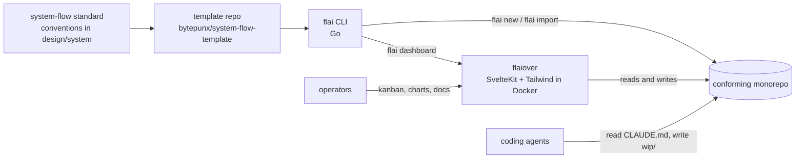

# System overview

system-flow is an agentic lean project management system. It treats a monorepo as the single source of truth for what the system is (`design/`), how it is explained to others (`docs/`), and what is being worked on right now (`wip/`). Agents and humans both read and write those folders, and tooling derives boards and metrics from them without a separate database.

## The four parts

1. **The standard.** A directory layout, a work item hierarchy with measurable front matter, and rules for how agents record their narrative. Defined in this folder and captured as decisions in `design/adrs`.
2. **The template.** A git repository that holds a rendered-on-demand skeleton of a conforming monorepo, including a baseline `CLAUDE.md`. Prototyped in `./template` in this repo and later published as its own repository. See [template.md](template.md).
3. **flai.** A Go CLI that creates conforming projects, imports existing ones, manages work items, validates the repo, and runs the dashboard. See [flai-cli.md](flai-cli.md).
4. **flaiover.** A SvelteKit dashboard, shipped as a Docker image, that renders documentation, searches `design/` and `wip/`, shows the kanban board, and charts flow metrics. See [flaiover-dashboard.md](flaiover-dashboard.md).

## Principles

- **Files are the database.** Every fact the tooling needs is in markdown front matter or in the directory structure. Tooling may cache but never owns state.
- **Measure the process, not the people.** Timestamps on state transitions exist so the *process* can be tuned. Metrics are aggregated by state and nature, not by owner.
- **Defer detail.** Epics get stories when they are next up. Stories get tasks when they become ready. Backlog items are one paragraph.
- **Recoverable by default.** If the environment dies, `wip/agents` plus the kanban item is enough for a fresh agent to resume without the human reconstructing context.
- **The repo builds itself.** system-flow is developed inside a system-flow monorepo. Every convention is exercised here before it is shipped in the template.

## Delivery sequence

| Order | Deliverable | Epic |
|-------|-------------|------|
| 0 | Agent conventions: a `conventions` folder of norms every agent primes with, shipped by the template | E-005 |
| 1 | Standard and template prototype | E-001 |
| 2 | flai CLI | E-002 |
| 3 | flaiover dashboard and Docker image | E-003 |
| 4 | User-facing documentation | E-004 |

Work on 2 and 3 starts once the template decisions in E-001 are settled, which this document set represents. E-005 was added on 2026-09-15 and takes priority over the remaining stories in every other epic; its design lands in `conventions.md` in this folder and an ADR.
