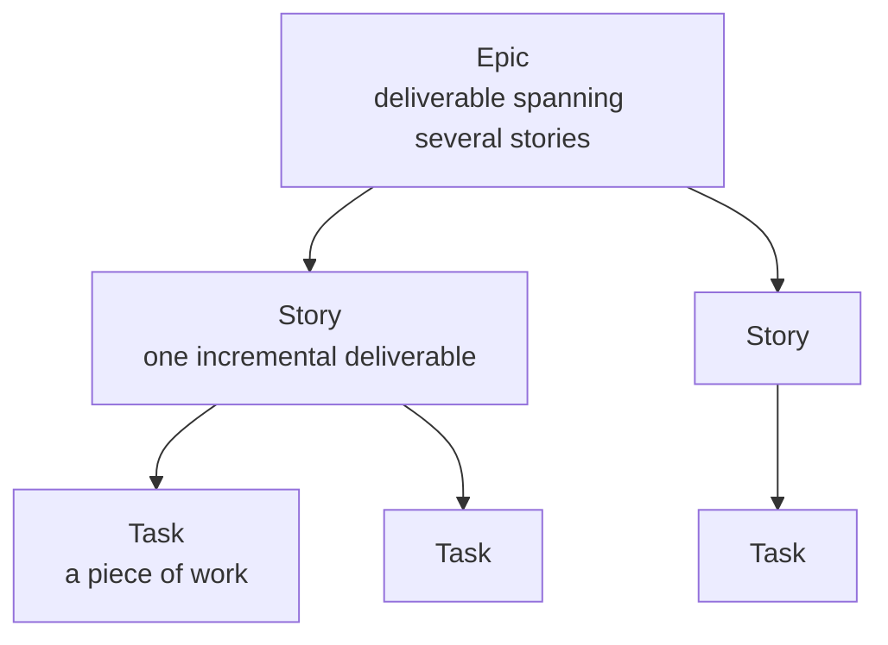
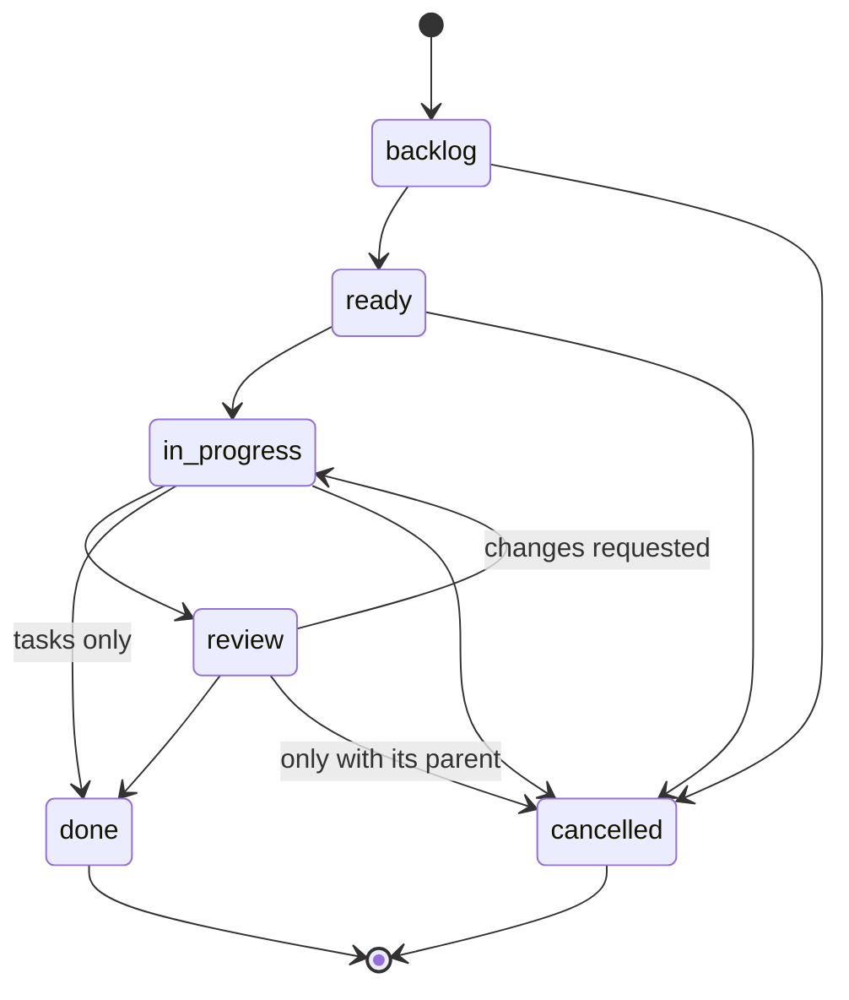

# Work item hierarchy and schema

Work is specified top-down and delivered bottom-up.



| Level | Represents | Sized so that | Owned by |
|-------|------------|---------------|----------|
| Epic | A deliverable that spans multiple stories | It closes when its stories close | Human, sets direction |
| Story | One incremental, demonstrable deliverable | An agent can complete it in one to a few sessions | Agent or human |
| Task | A distinct piece of work required by its story | It is done or not done, no partial state | Agent |

Every item, at every level, has a **nature** that says what kind of deliverable it is to the system:

| Nature | Meaning |
|--------|---------|
| `feature` | New capability that did not exist |
| `improvement` | Existing capability made better, faster, or clearer |
| `remediation` | Fixing something that is wrong, including defects and tech debt |
| `research` | Producing knowledge, a spike or investigation, with a written finding as the deliverable |
| `experiment` | Testing a hypothesis with a defined success measure, may be thrown away |

Natures are a closed list. Adding one requires an ADR because the dashboard groups metrics by nature.

## Identifiers

IDs are a type letter, a dash, and a sequence zero-padded to four digits: `E-0001`, `S-0012`, `T-0134`. Sequences are per type and per repo and never reused. `flai` allocates the next ID by scanning `kanban/` and `archive/`; the next number is one more than the highest existing number whatever its width. Repositories created before ADR-0017 carry three-digit IDs; those stay valid side by side with four-digit ones, sorting is numeric, and commands accept an ID with any zero padding or none, so a two, three, or four digit spelling of the same number names the same item. Issues under `design/issues` follow the same width (`I-0012`). `flai migrate ids` widens an existing repository in one step: it renames every item, narrative, and issue with `git mv` and rewrites every reference under `design/`, `docs/`, `wip/`, the root markdown and yaml files, and each project's root markdown files. Run it with `--dry-run` first.

File name: `<ID>-<slug>.md` in `wip/kanban/<epics|stories|tasks>/`.

Stories and tasks may carry `touches`, a list of repository paths or component names the work is expected to change (ADR-0019, S-0037; set with `--touches` on `new` or `flai touches`). It is advisory: `flai check` warns on overlap between in-progress items, and the dashboard shows it.

## States

One state machine for all three levels:



| State | Meaning | Clock |
|-------|---------|-------|
| `backlog` | Captured, not committed, may be one paragraph | Lead time starts at `created` |
| `ready` | Refined enough to start: goal and acceptance criteria present. Tasks are written by the agent that starts the story | Queue time |
| `in-progress` | Being worked | Cycle time starts on first entry |
| `review` | Work complete, awaiting verification or human acceptance | Review time |
| `done` | Accepted | Cycle and lead time end |
| `cancelled` | Will not be done, reason recorded | Terminal |

Tasks may go straight from `in-progress` to `done`: review is the human acceptance step and happens at story level, so a task-level review column would only add ceremony. Stories and epics must pass through `review`.

Blocked is not a state. It is a flag with a timestamped interval so the item keeps its column and blocked time is measured separately. See the `blocked` key below.

## Front matter schema

```yaml
---
id: S-0004
type: story                      # epic | story | task
nature: feature                  # feature | improvement | remediation | research | experiment
title: CLI scaffold and config
status: ready                    # backlog | ready | in-progress | review | done | cancelled
parent: E-0002                    # required for task; optional for story (S-0092), absent for epic
owner: agent                     # free text: agent, a person's handle, or team
created: 2026-09-15T16:10:00Z
updated: 2026-09-15T16:40:00Z
transitions:                     # append-only, one entry per state change
  - to: ready
    at: 2026-09-15T16:40:00Z
    by: agent
blocked:                         # optional, append-only, open interval has no `until`
  - from: 2026-09-16T09:00:00Z
    until: 2026-09-16T11:30:00Z
    reason: waiting on template repo access
estimate: 4h                     # optional, Go duration, used for estimate-vs-actual
tags: [cli, config]              # optional, free text
stream: S-0004                    # tasks only: the narrative file in wip/agents they report to
agent:                           # stories only, optional (S-0103): who works it
  harness: claude-code
  model: claude-opus-5-5
  config:                        # optional: options for the harness
    effort: high
---
```

Rules:

- `created`, `updated`, and every `at` are UTC ISO 8601 timestamps.
- Titles and other free text that contain a colon followed by a space, or start with a YAML-special character, are double-quoted. `flai` writes them that way; hand edits must too.
- `transitions` is the source of truth for state. `status` must equal the `to` of the last transition; `flai check` enforces this. Creation implies `backlog` and is not recorded as a transition.
- `started` and `completed` are not stored. They are derived as the first `in-progress` transition and the `done` or `cancelled` transition. See [metrics.md](metrics.md).
- An epic cannot be `done` while any child story is not `done` or `cancelled`. A story cannot be `done` while any child task is not `done` or `cancelled`.
- A cancelled epic has no open story and a cancelled story has no open task: cancelling a parent cancels what is open under it, including an item in `review`, which can be cancelled in no other way ([ADR-0028](../adrs/0028-cancelling-an-item-cancels-everything-open-under-it.md)). `flai check` reports a tree where this does not hold.
- Who changes what after an item is made (S-0085). `title`, `nature`, `tags`, `touches`, `parent`, a story's `agent`, and the body below the heading are the item's own words and change with `flai edit`, or from a story's or an epic's page in the dashboard, which runs it. A title also lives in the heading, the file's name, the parent's list, and a story's narrative; `flai edit` keeps them in step, a hand edit does not. `id`, `type`, `status`, `transitions`, `blocked`, `owner`, `created`, and `updated` are the item's state and change only through the commands that own them (`flai move`, `flai block`, `flai accept`). No key is added to the front matter to record an edit: it is parsed strictly, and a key an older flai does not know would make it refuse the item.
- A story's `agent` names the harness, the model, and the harness's options that work it (S-0103, [ADR-0037](../adrs/0037-a-story-carries-its-agent-copied-from-the-project-s-default-when-it-is-made.md)). A story made while the project has a default agent (`agent` in `system-flow.yaml`) gets a copy, with what `flai story new --harness --model --agent-config` or the dashboard gives laid over it. A story made with neither has no `agent` key, so a project that does not use agents stays readable by an older flai. Only a story carries one. `flai edit --harness/--model/--agent-config/--clear-agent`, MCP's `item_edit`, and the story's page change it.
- A story cannot be `ready` without an acceptance criteria section with at least one checkbox. It can be `ready` and `in-progress` with no tasks, and cannot be `review` without at least one ([ADR-0021](../adrs/0021-story-ready-without-tasks.md)).

## Body structure

The body below the front matter has fixed headings so agents and the dashboard can find things.

Epic:

```markdown
# E-0002 flai CLI

## Outcome
One paragraph: what is true when this epic is done.

## Stories
Maintained by flai. A list of child IDs and titles.

## Notes
Anything else.
```

Story:

```markdown
# S-0004 CLI scaffold and config

## Goal
What this increment delivers and for whom.

## Acceptance criteria
- [ ] Checkable statements. Required before `ready`.

## Tasks
Maintained by flai. A list of child IDs and titles.

## Notes
Decisions, links to ADRs, anything discovered on the way.
```

Task:

```markdown
# T-0021 Read and write ~/.flai/config.json

## Work
What to do, concretely.

## Done when
A single sentence.

## Notes
```
