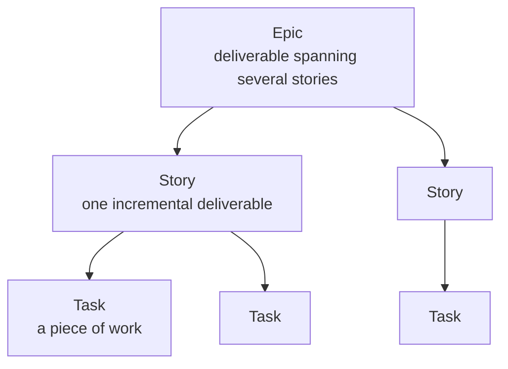
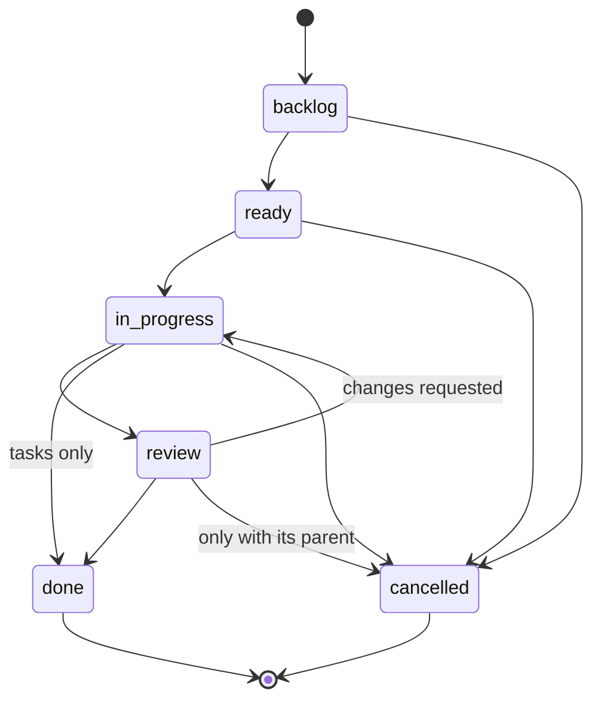

# Work item hierarchy and schema

Work is specified top-down and delivered bottom-up.


```mermaid
flowchart TD
    E[Epic<br/>deliverable spanning several stories] --> S1[Story<br/>one incremental deliverable]
    E --> S2[Story]
    S1 --> T1[Task<br/>a piece of work]
    S1 --> T2[Task]
    S2 --> T3[Task]
```

| Level | Represents | Sized so that | Owned by |
|-------|------------|---------------|----------|
| Epic | A deliverable that spans multiple stories | It closes when its stories close: its state follows theirs, and it is accepted with its last open story (S-0200, [workflow.md](workflow.md#an-epic-follows-its-stories)) | Human, sets direction |
| Story | One incremental, demonstrable deliverable | An agent can complete it in one to a few sessions | Agent or human |
| Task | A distinct piece of work required by its story | It is done or not done, no partial state | Agent |

Every item, at every level, has a **nature** that says what kind of deliverable it is to the system:

| Nature | Meaning |
|--------|---------|
| `feature` | New capability that did not exist |
| `improvement` | Existing capability made better, faster, or clearer |
| `remediation` | Fixing something that is wrong, including defects and tech debt |
| `research` | Producing knowledge, a spike or investigation, with a written finding as the deliverable |
| `experiment` | Testing a hypothesis with a defined success measure, may be thrown away |

How a nature is accepted and released is in [workflow.md](workflow.md#natures-that-do-not-release-adr-0025-adr-0066): `research` and `experiment` are accepted like any other nature and give no component a bump, and an `experiment` story is accepted only with its results document, `design/experiments/<S-nnnn>-<slug>.md`, whose code and findings may still be dropped ([ADR-0066](../adrs/0066-an-experiment-story-is-accepted-like-any-other-and-records-its-results-in-a.md)).

Natures are a closed list. Adding one requires an ADR because the dashboard groups metrics by nature.

## Identifiers

IDs are a type letter, a dash, and a sequence zero-padded to four digits: `E-0001`, `S-0012`, `T-0134`. Sequences are per type and per repo and never reused. `flai` allocates the next ID by scanning `kanban/` and `archive/`; the next number is one more than the highest existing number whatever its width. Repositories created before ADR-0017 carry three-digit IDs; those stay valid side by side with four-digit ones, sorting is numeric, and commands accept an ID with any zero padding or none, so a two, three, or four digit spelling of the same number names the same item. Issues under `design/issues` follow the same width (`I-0012`). `flai migrate ids` widens an existing repository in one step: it renames every item, narrative, and issue with `git mv` and rewrites every reference under `design/`, `docs/`, `wip/`, the root markdown and yaml files, and each project's root markdown files. Run it with `--dry-run` first.

File name: `<ID>-<slug>.md` in `wip/kanban/<epics|stories|tasks>/`.

Stories and tasks may carry `touches`, a list of repository paths or component names the work is expected to change (ADR-0019, S-0037; set with `--touches` on `new` or `flai touches`). It is advisory: `flai check` warns on overlap between in-progress items, and the dashboard shows it. Since S-0128 it is also a claim that holds a ready story ([workflow.md](workflow.md#branches-and-collisions-adr-0019)).

A story may carry `after`, a list of the stories that must be done before it starts, for a dependency that is not about files ([ADR-0046](../adrs/0046-a-ready-story-whose-claim-overlaps-an-open-story-s-is-held-yellow-and-with-its.md), S-0130; set with `flai edit --after`, or `flai story new --after` and MCP's `item_new` since S-0176, cleared with `--clear-after`). While any story it names is not done, a ready story is held (`after`) as an overlapping one is. A cancelled story it names keeps the hold, and so does one that does not exist. `flai check` reports (`story.after`, an error) an entry that names no story, the story itself, or anything but a story, and every cycle, once, on its lowest story. The field is for stories and tasks, in canonical IDs, and is written only when it is not empty; an epic carries none. A flai older than S-0130 refused an item that carried it, and with it the listing that read the item (board, `flai serve`, MCP), because front matter was parsed strictly; since S-0181 such a flai reads past the field with a warning, though it does not hold the story (see [Fields an older flai does not know](#fields-an-older-flai-does-not-know)).

A task may carry `after` too, a list of the tasks of the same story that must be done before it starts (S-0176): the plan the story's agent writes with the tasks, so that it runs together the tasks that wait for nothing undone and do not overlap in `touches`. It is set with `flai task new --after` and `flai edit --after`, cleared with `--clear-after`, and set by MCP's `item_new` and `item_edit` `after`. A creation or an edit that sets it runs `flai check` with the change in place and is refused, leaving nothing written, when the check reports something new. `flai check` reports (`task.after`, an error) an entry that names no task, a task of another story (naming that story), the task itself, or anything but a task, and every cycle among a story's tasks, once, on its lowest task. flai does not hold a task: `flai move` to in-progress, and the MCP `item_move`, warn while a task its `after` names is neither done nor cancelled, and move it, and the story's agent reads the plan, which `flai show` and the board give ([flai-cli.md](flai-cli.md)). flai 1.28.0 is the first release that carries it. A flai older than 1.28.0 knows `after` but refuses it on a task: its `flai check` reports every such task as an error (`item.front-matter`, `after is for stories`), and cannot set or clear it. Publishing 1.28.0 raised `flai.minimum` to 1.28.0, because the field list changed (see [Fields an older flai does not know](#fields-an-older-flai-does-not-know)), so the host must run flai 1.28.0 or newer before any task carries `after`: upgrade it first (`flai self-upgrade`).

Stories and epics may carry `topics`, a list of words naming what the work is about beyond the components it reaches, such as `logging` or `release` ([ADR-0047](../adrs/0047-an-agent-is-primed-with-what-its-story-s-topics-claim-and-links-select.md), S-0135; set with `--topics` on `flai story new` and `flai epic new`, `flai edit --topics`, cleared with `--clear-topics`, and from the dashboard). Each is one word of letters, digits, dot, dash, or underscore. `tags` keep their one meaning, the component a story delivers to; `topics` choose what an agent is primed with. A story's topics are the union of:

- its own `topics` and its epic's;
- the name, tags, and kind in `system-flow.yaml` of every sub-project that one of its `tags` names, or that its claim reaches: its `touches` and those of its open tasks, an entry reaching a sub-project when it is the sub-project's name or one of its tags, or when it and the sub-project's path overlap (ADR-0046's rule);
- `code`, when one of those sub-projects is not the template;
- `all`.

A touch outside every sub-project, such as `design/system`, and a tag that names none add nothing. `flai show S-nnnn` prints the story's topics with where each came from, and `--json` returns every source (`own`, `epic`, `tag`, `claim`, `code`, `all`, with the item, the sub-project, and the tag or touch). The topics stories and epics declare are words that `flai check` accepts on a document's topics. A task carries none. As with `after`, a flai older than S-0135 refuses an item that carries `topics`: upgrade the flai on the host first.

Epics, stories, and tasks may carry `usage`, what agents spent on them: the tokens each model read and wrote, what they cost in US dollars, and the seconds of agent work ([ADR-0051](../adrs/0051-work-items-record-the-tokens-and-cost-their-agents-spent-measured-from-the.md), S-0143). No command takes it as an argument; flai writes it:

- `flai serve` measures a story from the logs it keeps of the agents it started for the story, and each of its tasks from the calls of the sub-agents started for it and a share of the rest while it was in progress, when an agent ends and when a task of a running agent enters done; `flai serve agent usage --write` does the same by hand. Such usage has `source: log`. How the logs are read is in [flai-cli.md](flai-cli.md).
- Whenever an item enters done, by `flai move`, MCP's `item_move`, or `flai accept`, each item above it whose usage was not measured is given the sum of its children's, archived ones and cancelled ones included, up to its epic, with `source: sum`. A story measured from its log keeps its measurement, which already holds its tasks'; its epic sums it with its other stories.
- A task's usage is its story's session totals in the share of their input and cache tokens that are its own: the calls of the sub-agents started for it, and an even share, among the tasks in progress at the time, of every other call made while it was in progress ([ADR-0071](../adrs/0071-a-task-s-usage-is-the-calls-of-the-sub-agents-started-for-it-and-an-even-share.md), S-0230). So it is `estimated`; so is any cost the harness did not report, priced at the rate the logs report for the model.
- `strategic` is what strategic agents spent on the item, one entry per kind: `planner`, then `orchestrator`, then `analyzer` ([ADR-0083](../adrs/0083-a-planner-activity-s-usage-is-charged-to-the-item-it-planned-and-the-items.md), S-0225). Each entry has `kind`, `seconds`, `estimated: true`, and `models`, in the shape of the agents' models. It is apart from the agents' figures and never added to them: an item's tokens, cost, seconds, and models are its agents' alone. When flai serve logs a planner activity, it charges the share of the run's usage that the activity's entry has to the item the planner was started for, and to every item above it, up to its epic, at once. An item with no usage is given `source: sum`, no seconds, and no models beside it. Roll-up and a story's measurement keep `strategic` as it is. A story moved to another epic after it was planned leaves its planning on the old epic: the charge was added up the hierarchy when it was made. An item may carry `usage` with nothing but `strategic`; agent aggregates leave it out. `strategic` is listed in `front-matter-fields.txt`, so the release that carries it raises `flai.minimum`.

Only agents flai serve starts with the `claude-code` harness are measured: their stream-json logs are the only record flai reads. As with `after`, a flai older than S-0143 refuses an item that carries `usage`: upgrade the flai on the host before any item is measured.

Stories and epics carry planning data that the planner, the orchestrator, and the analyzer of E-0016 read and write, each block saying who set it ([ADR-0074](../adrs/0074-work-items-carry-planning-data-a-story-s-draft-flag-an-epic-s-or-story-s-cost.md), S-0199). Every field is set through flai: `flai edit`, MCP's `item_edit`, and the dashboard's `item.edit`, which runs `flai edit`. Each edit changes only the keys it names, and an empty value removes a key. A block that changes is stamped with the editor (`--by`, else `FLAI_AGENT`, else the config author) and the time, a cost of delay's inputs and value each apart; an edit that changes no value stamps nothing.

A story may carry `draft: true`, which marks a story an agent wrote, by the planner or from an issue, that the operator has not yet read. It is set with `flai story new --draft`, MCP's `item_new` `draft`, and `flai edit --draft` on a story in the backlog. A draft cannot go to ready: it is finalized first, by `flai edit --no-draft` and the dashboard's `item.finalize`, which runs it, or as it moves by `flai move <story> ready --yes` and the dashboard's `item.move` `finalize`. No agent may finalize until the orchestrator's permission to finalize exists (S-0218): MCP's `item_move` refuses a draft to ready, and `item_edit` refuses `draft: false`. `flai check` warns (`story.draft`) on a draft story in ready or later. Only a story is a draft, and the key is written only when it is true.

A story that was a draft keeps `finalized`, who cleared the flag and when ([ADR-0077](../adrs/0077-a-story-that-was-a-draft-records-who-finalized-it-and-when-and-the-dashboard.md), S-0201), so the item still says it was a draft once the flag is gone. `flai edit --no-draft` stamps it with the editor; a finalizing move stamps it with the move's `by` and time, as its transition. Clearing the flag of a story that is not a draft stamps nothing and leaves an earlier block as it is. `flai edit --draft` removes the block, since the story is a draft again. It is written last, where the flai of S-0199 writes back a key it does not know, and it is a new field, so the release that carries it raises `flai.minimum` as S-0199's did.

Epics and stories may carry `cost_of_delay`, what each week of waiting for the item costs. Its `inputs` are the operator's, each optional: `revenue_per_week` and `penalty_per_week`, amounts, and `time_lost_per_cycle`, a Go duration counted over `planning.cycle`. Its `value` is the cost of delay per week that the planner derives. A story with no inputs of its own may carry only a `value`, its share of its epic's. Amounts are plain numbers of zero or more in `planning.currency` ([project-manifest.md](project-manifest.md)). It is set with `flai edit --revenue-per-week`, `--penalty-per-week`, `--time-lost-per-cycle`, and `--cost-of-delay-value`, and removed with `--clear-cost-of-delay`. A cost of delay with neither inputs nor a value is refused.

A cost of delay stamps its inputs and its value apart ([ADR-0080](../adrs/0080-a-cost-of-delay-stamps-its-inputs-and-its-value-apart.md)). `inputs` carry their own `by` and `at`, set when an input is added, changed, or removed and inputs remain. The block's `by` and `at` are the value's, set when `value` is added or changed and removed with it. So the operator's change to an input leaves the planner's stamp on the value, and removing every input leaves the value with its own. `flai story new` and `flai epic new` stamp the inputs they are given with the owner, and a story made from an issue stamps them `flai`. The value is stale when there are both and the inputs' `at` is later than the value's; `flai show` says so. A block written with one stamp, as ADR-0074 had it, is read with the stamp as the inputs' when there is no value, and as the value's and the inputs' both when there is one, so it does not read as stale; flai writes it in the new shape the next time it writes the item. `inputs.by` and `inputs.at` are new keys, so the release that carries them raises `flai.minimum`.

A story may carry `forecast`, the planner's figure for how long it will take and when it will land: `duration` (agent wall clock, a Go duration), `delivery` (a UTC timestamp), and `basis` (what it rests on, in one sentence). `estimate` stays the human's figure; the metrics compare each with the actual (S-0205). It is set with `flai edit --forecast-duration`, `--forecast-delivery`, and `--forecast-basis`, and removed with `--clear-forecast`. A forecast with neither a duration nor a delivery is refused.

`Validate`, and through it `flai check` (`item.front-matter`), refuses a planning field on a type that does not carry it, a negative or non-finite amount, a duration that is not a Go duration longer than zero, a timestamp that is not UTC, a block without `by` and `at` (for a cost of delay: inputs without `inputs.by` and `inputs.at`, a value without the block's, and either stamp without what it stamps), and `finalized` on a story that is still a draft. `flai show` and MCP's `item_get` give the draft flag, the cost of delay, and the forecast; `flai show` and `flai edit --show` give `finalized` too. The fields are written after `usage`, where an older flai writes back the keys it does not know, so either writes the same bytes. A flai older than the release that carries S-0199 reads past them with a warning and does not act on them: it lets a draft go to ready. Publishing that release raises `flai.minimum` to it, because the field list changed (see [Fields an older flai does not know](#fields-an-older-flai-does-not-know)), so the host must run it before any item carries them.

## States

One state machine for all three levels:


```mermaid
stateDiagram-v2
    [*] --> backlog
    backlog --> ready
    ready --> in_progress
    in_progress --> review
    in_progress --> done: tasks only
    review --> in_progress: changes requested
    review --> done
    backlog --> cancelled
    ready --> cancelled
    in_progress --> cancelled
    review --> cancelled: only with its parent
    done --> [*]
    cancelled --> [*]
```

| State | Meaning | Clock |
|-------|---------|-------|
| `backlog` | Captured, not committed, may be one paragraph | Lead time starts at `created` |
| `ready` | Refined enough to start: goal and acceptance criteria present. Tasks are written by the agent that starts the story, or drafted by the planner when the operator asks it to plan the story (S-0255) | Queue time |
| `in-progress` | Being worked | Cycle time starts on first entry |
| `review` | Work complete, awaiting verification or human acceptance | Review time |
| `done` | Accepted | Cycle and lead time end |
| `cancelled` | Will not be done, reason recorded | Terminal |

Tasks may go straight from `in-progress` to `done`: review is the human acceptance step and happens at story level, so a task-level review column would only add ceremony. Stories and epics must pass through `review`.

Blocked is not a state. It is a flag with a timestamped interval so the item keeps its column and blocked time is measured separately. See the `blocked` key below.

## Front matter schema

```yaml
---
id: S-0004
type: story                      # epic | story | task
nature: feature                  # feature | improvement | remediation | research | experiment
title: CLI scaffold and config
status: ready                    # backlog | ready | in-progress | review | done | cancelled
parent: E-0002                    # required for task; optional for story (S-0092), absent for epic
owner: agent                     # free text: agent, a person's handle, or team
created: 2026-09-15T16:10:00Z
updated: 2026-09-15T16:40:00Z
transitions:                     # append-only, one entry per state change
  - to: ready
    at: 2026-09-15T16:40:00Z
    by: agent
blocked:                         # optional, append-only, open interval has no `until`
  - from: 2026-09-16T09:00:00Z
    until: 2026-09-16T11:30:00Z
    reason: waiting on template repo access
estimate: 4h                     # optional, Go duration, used for estimate-vs-actual
tags: [cli, config]              # optional, free text
topics: [logging]                # stories and epics, optional (S-0135): what it is about beyond its components
stream: S-0004                    # tasks only: the narrative file in wip/agents they report to
after: [S-0002, S-0003]          # stories and tasks, optional: what must be done before it starts, a story's stories (S-0130), a task's tasks of the same story (S-0176)
agent:                           # stories only, optional (S-0103): who works it
  harness: claude-code
  model: claude-opus-5-5
  config:                        # optional: options for the harness
    effort: high
  roles:                         # optional (S-0189): the agents of the sub-agents its agent hands work to
    verify:
      model: sonnet
usage:                           # optional, written by flai (S-0143): what agents spent on it
  source: log                    # log: measured from the agents' logs | sum: summed from its children
  seconds: 1083                  # agent work
  estimated: true                # optional: some cost was apportioned or estimated, not reported
  models:                        # one entry per model, by name
    - model: claude-opus-5-5
      input: 256                 # tokens
      output: 89342
      cache_read: 19723140
      cache_write: 327605
      cost: 8.1258               # US dollars
  strategic:                     # optional (S-0225): what strategic agents spent on it, apart from the models above
    - kind: planner              # planner | orchestrator | analyzer, each once, in that order
      seconds: 412               # the share of the agent's runs charged to this item and every item above it
      estimated: true            # always: the share is apportioned
      models:                    # as above
        - model: claude-opus-5-5
          input: 12
          output: 3400
          cache_read: 812000
          cache_write: 40210
          cost: 0.8123
draft: true                      # stories only, optional (S-0199): written by an agent, not yet finalized
cost_of_delay:                   # stories and epics, optional (S-0199): what each week of waiting costs
  inputs:                        # optional, the operator's; each key optional
    revenue_per_week: 1200       # in planning.currency
    penalty_per_week: 300        # in planning.currency
    time_lost_per_cycle: 6h      # Go duration, per planning.cycle
    by: alex                     # the inputs': who last added, changed, or removed one (ADR-0080)
    at: 2026-10-03T09:00:00Z
  value: 1650                    # optional, the planner's: cost of delay per week, in planning.currency
  by: planner                    # the value's: who set it, only beside a value (ADR-0080)
  at: 2026-10-03T09:20:00Z
forecast:                        # stories only, optional (S-0199): the planner's figure, beside the human's estimate
  duration: 6h                   # Go duration, agent wall clock
  delivery: 2026-10-09T17:00:00Z # UTC timestamp
  basis: three tasks like S-0185's # one sentence
  by: planner
  at: 2026-10-03T09:05:00Z
# finalized:                     # stories only, optional (S-0201): who finalized a draft; never beside draft: true
#   by: alex
#   at: 2026-10-03T10:00:00Z
---
```

Rules:

- `created`, `updated`, and every `at` are UTC ISO 8601 timestamps.
- Titles and other free text that contain a colon followed by a space, or start with a YAML-special character, are double-quoted. `flai` writes them that way; hand edits must too.
- `transitions` is the source of truth for state. `status` must equal the `to` of the last transition; `flai check` enforces this. Creation implies `backlog` and is not recorded as a transition; a later move back to `backlog` is ([ADR-0055](../adrs/0055-a-story-moves-back-one-column-from-ready-in-progress-review-or-cancelled-and.md)).
- `started` and `completed` are not stored. They are derived as the first `in-progress` transition and the last transition while the item is `done` or `cancelled`. See [metrics.md](metrics.md).
- An epic cannot be `done` while any child story is not `done` or `cancelled`. A story cannot be `done` while any child task is not `done` or `cancelled`.
- An epic follows its stories (S-0200, [ADR-0076](../adrs/0076-an-epic-follows-its-stories-to-ready-and-in-progress-with-the-first-to-review.md)): a story's move, cancellation, or change of epic moves its epic in the same write, toward the state its stories put it in and only in the direction the story moved, one allowed transition at a time, each recorded in the epic's `transitions` with the story's actor and time. It reaches done only with the acceptance of its last open story, which archives it. The rule is in [workflow.md](workflow.md#an-epic-follows-its-stories); `flai check` warns (`epic.lags-stories`) about an open epic behind its stories.
- A cancelled epic has no open story and a cancelled story has no open task: cancelling a parent cancels what is open under it, including an item in `review`, which can be cancelled in no other way ([ADR-0028](../adrs/0028-cancelling-an-item-cancels-everything-open-under-it.md)). So an epic in review, which has no parent, is moved back to in-progress before it can be cancelled. `flai check` reports a tree where this does not hold.
- Who changes what after an item is made (S-0085). `title`, `nature`, `tags`, `touches`, `parent`, a story's or epic's `topics`, a story's or a task's `after`, a story's `agent`, a story's `draft` and `forecast`, a story's or epic's `cost_of_delay` (S-0199), and the body below the heading are the item's own words and change with `flai edit`, or from a story's or an epic's page in the dashboard, which runs it. A title also lives in the heading, the file's name, the parent's list, and a story's narrative; `flai edit` keeps them in step, a hand edit does not. `id`, `type`, `status`, `transitions`, `blocked`, `owner`, `created`, `updated`, `usage`, and `finalized` are the item's state and change only through the commands that own them (`flai move`, `flai block`, `flai accept`, for `usage` `flai serve`, and for `finalized` the edit or move that clears or sets a draft flag). No key is added to the front matter to record an edit: a key an older flai does not know is one it cannot act on. `finalized` records an act, the finalizing of a draft, not an edit of the item's words (S-0201).
- A story's `agent` names the harness, the model, and the harness's options that work it (S-0103, [ADR-0037](../adrs/0037-a-story-carries-its-agent-copied-from-the-project-s-default-when-it-is-made.md)). A story made while the project has a default agent (`agent` in `system-flow.yaml`) gets a copy, with what `flai story new --harness --model --agent-config` or the dashboard gives laid over it. A story made with neither has no `agent` key, so a project that does not use agents stays readable by an older flai. Only a story carries one. `flai edit --harness/--model/--agent-config/--clear-agent`, MCP's `item_edit`, and the story's page change it. Its `roles` (S-0189) map a sub-agent role, `explore` or `verify`, to a harness, model, and config of that role's own; a story gets the default's, merged role by role, and `--role-harness`, `--role-model`, `--role-config role.key=value`, and `--unset-role` set them. `flai serve` starts `claude-code` with each role's model over the project's sub-agent definition ([agent-context.md](agent-context.md#sub-agents)). The dashboard shows roles and keeps them on a save; flai sets them.
- A story cannot be `ready` without an acceptance criteria section with at least one checkbox, nor while it is a `draft` unless the move finalizes it (S-0199). It can be `ready` and `in-progress` with no tasks, and cannot be `review` without at least one ([ADR-0021](../adrs/0021-story-ready-without-tasks.md)).

### Fields an older flai does not know

The flai installed on the host serves MCP and starts agents, and it lags the tree whenever a release is accepted and not installed (S-0181). Until S-0181, work items, threads, and issues were decoded strictly, so one item carrying a field that flai did not know made it refuse every listing that read the item (I-0051). Now:

- The paths that read work items, threads, and issues to list or serve them (`workitem.ParseItem`, `threads.Parse`, `issues.Parse`) decode leniently. Each top-level key the struct does not name is kept on the value (`Unknown`, a `workitem.Field` with the key's lines as written), and `workitem.WarnUnknown` logs `front matter has fields this flai does not know` with the file and the fields, once per process for each file and set of fields.
- A write gives those keys back unchanged: `Marshal` appends them, as written, after the fields it knows. No write drops a field it did not understand.
- `flai check` stays strict: each unknown key is an error, `item.unknown-field`, `threads.unknown-field`, or `issues.unknown-field`, on the key's line.
- Reading past a field is not acting on it: a flai that does not know `after` does not hold the story. What keeps the host's flai current is the version check and the minimum: `flai serve`, the MCP `inbox`, and the dashboard say when the host's flai is older than the newest flai release in the project's history, and `flai.minimum` in `system-flow.yaml` stops an older flai before it reads any item ([project-manifest.md](project-manifest.md), [flai-cli.md](flai-cli.md#versions-the-hosts-flai-and-the-tree)).
- The fields flai reads are listed in `flai/internal/workitem/front-matter-fields.txt`, which a test keeps equal to the code, with the keys of a story's `agent` block and of each of its roles too (S-0189): the lenient read ignores a key it does not know inside `agent`, and a write would drop it. Its `item.types` line names the types of item that carry each field only some types carry (S-0176), from the table `Validate` refuses the others by: a flai that lets a known field onto a new type, as S-0176 did a task's `after`, is one an older flai disagrees with. A story that adds or removes a front-matter field, or changes which types carry one, changes it, and publishing the flai release that carries the change raises `flai.minimum` to that release.

## Body structure

The body below the front matter has fixed headings so agents and the dashboard can find things.

Epic:

```markdown
# E-0002 flai CLI

## Outcome
One paragraph: what is true when this epic is done.

## Stories
Maintained by flai. A list of child IDs and titles.

## Notes
Anything else.
```

Story:

```markdown
# S-0004 CLI scaffold and config

## Goal
What this increment delivers and for whom.

## Acceptance criteria
- [ ] Checkable statements. Required before `ready`.

## Tasks
Maintained by flai. A list of child IDs and titles.

## Notes
Decisions, links to ADRs, anything discovered on the way.
```

Task:

```markdown
# T-0021 Read and write ~/.flai/config.json

## Work
What to do, concretely.

## Done when
A single sentence.

## Notes
```
