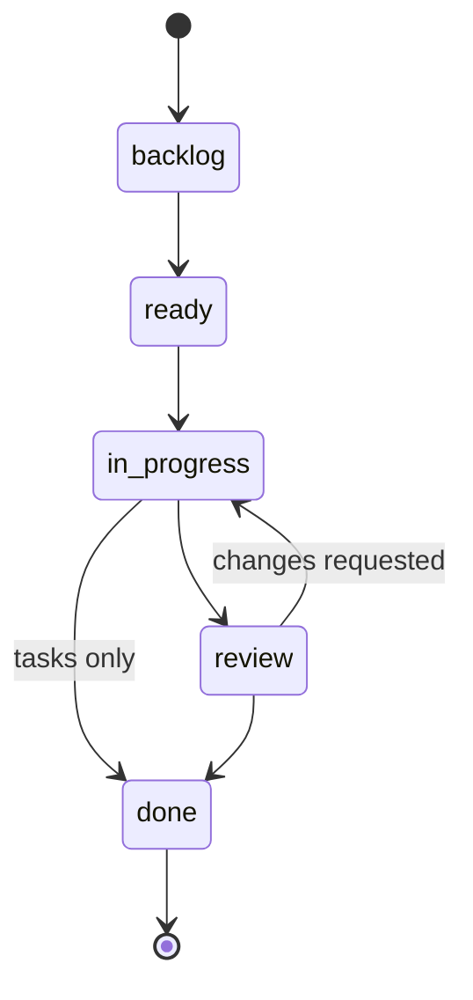

# Conventions guide

system-flow runs a software project from inside its own repository. What the system is, how it is explained, and what is being worked on right now are all markdown files in the repository, so people and coding agents read and write the same source of truth and no separate database is needed. A repository that follows these conventions is called conforming. `flai` creates and checks one, and flaiover draws its board and charts from it, but neither owns anything: every fact is in a file you can read and edit.

This guide explains the conventions in user terms and ends with [a walkthrough](#set-up-a-conforming-repository-by-hand) that builds a conforming repository by hand. The builders' version, with every rule, is in [`design/system`](../../design/system/README.md); links to it are given in each section.

## The layout

```text
my-project/
├── system-flow.yaml        # the manifest: marks the repository as conforming
├── README.md               # the human entry point
├── CLAUDE.md               # the agent entry point: a map, and what to read first
├── .gitignore              # must ignore .flai-cache/
├── design/                 # internal: how the system is and why
│   ├── adrs/               # architecture decisions, one per file
│   ├── system/             # the living design, always current
│   ├── tech/               # every technology in use, with its version
│   ├── conventions/        # how agents work here, read every session
│   └── issues/             # recurring friction, with counts and cost
├── docs/                   # outward-facing: one folder per audience
│   ├── users/
│   ├── operators/
│   └── contributors/
├── wip/                    # work in process
│   ├── kanban/             # board.md, epics/, stories/, tasks/
│   ├── agents/             # one narrative per active story, and index.md
│   ├── threads/            # conversations anchored to a document or an item
│   └── archive/            # finished items and narratives
├── scripts/                # purpose-named shell scripts behind the Makefile
├── Makefile                # the entry point for build, test, lint, check
└── <sub-project>/          # code, one folder per releasable component
```

| Folder | Holds | Written by | Changes |
|--------|-------|------------|---------|
| `design/` | Decisions, the current design, technology choices, agent conventions, recurring issues | The people and agents building the system | When the design changes |
| `docs/` | Guides for readers outside the build: users, operators, contributors, or any audience you add | Whoever changes behaviour those readers see | With the behaviour |
| `wip/` | The board, the work items, the agents' narratives, threads | `flai`, agents, and the dashboard | Daily |

The three top-level names are defaults. A project may rename them, and records the names under `layout` in the manifest; tools always find the folders through it. The subfolders (`design/conventions`, `wip/kanban`) keep their names.

Code lives in sub-projects at the root, one folder each, listed under `projects` in the manifest. A sub-project's design is in `design/system/<name>.md` and its technology in `design/tech/`, not inside the sub-project. Generated metrics, search indexes, caches, agent transcripts, and secrets are never committed. Full contract: [repository-layout.md](../../design/system/repository-layout.md).

## The manifest

`system-flow.yaml` at the root is how `flai` and flaiover recognise a project. `flai` refuses to run project commands where it cannot find one above the current directory.

```yaml
version: 1                  # manifest schema version, required
name: my-project            # required, used in titles
key: mp                     # short key; the dashboard's API names the project by it
description: What the project is, in one line
layout:                     # required, all three keys
  design: design
  docs: docs
  wip: wip
projects: []                # releasable components at the root
```

You edit `name`, `description`, and `dashboard` by hand. `flai` owns `template`, `projects`, and `agent` and rewrites only those keys. A repository made by `flai new` also records which template version it came from under `template`, with the hash of every rendered file in `system-flow.lock.yaml`, so `flai upgrade` can tell your edits from the template's. Every key: [project-manifest.md](../../design/system/project-manifest.md).

## Work items

Work is specified top-down and delivered bottom-up.

| Level | Is | Sized so that | Parent |
|-------|----|---------------|--------|
| Epic | A deliverable that spans several stories | It closes when its stories close | None |
| Story | One incremental, demonstrable deliverable | An agent finishes it in one to a few sessions | An epic, usually |
| Task | One piece of a story's work | It is done or not done, with no partial state | Its story, always |

Every item has a nature, which says what kind of deliverable it is. The dashboard groups metrics by it, so the list is closed.

| Nature | Means |
|--------|-------|
| `feature` | A capability that did not exist |
| `improvement` | An existing capability made better, faster, or clearer |
| `remediation` | Something wrong made right: a defect or technical debt |
| `research` | Knowledge, with a written finding as the deliverable |
| `experiment` | A hypothesis tested against a success measure; may be thrown away |

### States

Every item moves through the same states. Each move is recorded, with who made it and when, and those timestamps are where the charts come from.



| State | Means |
|-------|-------|
| `backlog` | Captured, not committed to. A paragraph is enough |
| `ready` | Refined enough to start: a story has its goal and acceptance criteria |
| `in-progress` | Being worked |
| `review` | Finished by whoever worked it, waiting for someone to accept it |
| `done` | Accepted |
| `cancelled` | Will not be done. Reachable from any open state; an item in review is cancelled only with its parent, and cancelling a parent cancels what is open under it |

Blocked is not a state. A blocked item keeps its column and carries a timestamped interval with a reason, so blocked time is measured apart from the time the item spends in its column.

A story needs acceptance criteria, as at least one checkbox, to be `ready`. It needs no tasks until it is `in-progress`: the agent that starts it writes them. It cannot go to `review` without at least one task, or to `done` while a criterion is unchecked or a task is still open. Stories and epics always pass through `review`; tasks may go straight from `in-progress` to `done`, because acceptance happens at story level.

### Files

An item is one markdown file, named by its ID and a slug, in `wip/kanban/epics/`, `stories/`, or `tasks/`. IDs are a type letter and a four-digit number: `E-0001`, `S-0012`, `T-0134`. Numbers run per type, one past the highest ever used, and are never reused.

The front matter holds everything the tools measure:

```yaml
---
id: S-0004
type: story                  # epic | story | task
nature: feature
title: CLI scaffold and config
status: in-progress          # always the last transition's "to"
parent: E-0002               # required for a task, usual for a story, absent for an epic
owner: agent                 # free text: agent, a person's handle, a team
created: 2026-09-15T16:10:00Z
updated: 2026-09-16T09:02:00Z
transitions:                 # append-only, one entry per move; creation is backlog and is not recorded
  - to: ready
    at: 2026-09-15T16:40:00Z
    by: alex
  - to: in-progress
    at: 2026-09-16T09:02:00Z
    by: agent
tags: [cli]
---
```

Optional keys: `blocked` (the intervals), `estimate` (a Go duration such as `4h`), `touches` (the paths a story or task expects to change, so overlapping work is visible), `stream` (on a task, the story whose narrative it reports to), and `agent` (on a story, the harness and model that work it). Timestamps are UTC, `YYYY-MM-DDTHH:MM:SSZ`, and real. A title with a colon followed by a space is double-quoted.

The body has fixed headings, so agents and the dashboard can find things:

| Type | Sections |
|------|----------|
| Epic | `## Outcome` (what is true when it is done), `## Stories` (its children), `## Notes` |
| Story | `## Goal`, `## Acceptance criteria` (checkboxes), `## Tasks` (its children), `## Notes` |
| Task | `## Work`, `## Done when` (one sentence), `## Notes` |

A parent lists each child by ID in its `## Stories` or `## Tasks`. Full schema: [work-hierarchy.md](../../design/system/work-hierarchy.md).

Use `flai` to create and move items rather than writing front matter yourself: it allocates the ID, writes valid YAML, keeps the parent's list and the transitions true, and refuses a move the rules forbid. Hand edits to the body (goal, criteria, notes) are always fine. The walkthrough below writes items by hand only to show what the files are.

## How work flows

`wip/kanban/board.md` is the board: its front matter sets the WIP limits and the pull order, and its body states any local policy.

```yaml
---
title: Board
updated: 2026-09-24
status: active
wip_limits:
  ready: 5
  in-progress: 2
  review: 3
order: [S-0003, S-0001]      # ready stories first, then backlog stories in refinement order
---
```

- **Work is pulled, not pushed.** Whoever starts work takes the first `ready` story in `order`, not the one they like best. Stories `order` does not name come after the named ones, by ID. Change the order with `flai order` or by dragging a card on the dashboard.
- **WIP limits count stories.** Tasks share their story's place. `flai check` warns when a column is over its limit rather than blocking, and the breach is noted in the narrative.
- **Ready** means a goal and acceptance criteria, under a parent epic that is not cancelled.
- **Done** means every criterion checked, every task done or cancelled, decisions recorded, `docs/` updated where users see a change, and the narrative closed. The worker moves the story to `review`; a person accepts it. Acceptance (`flai accept`, or moving the card to done) merges the story's branch, marks it done, archives it, and commits. Publishing a release is a separate step (`flai release --pending`), over everything accepted since the last one.
- **No sprints.** Flow is continuous. The dashboard's charts (cycle time, burn-up, time per state) replace the status meeting; review them regularly and adjust the limits.
- **One branch per story.** A story is worked on `story/S-nnnn`, in a worktree under `.flai-cache/worktrees/` that `flai stream open` creates. `wip/` stays in the main checkout, so the board is always live.

Who makes each transition, and the rules behind them: [workflow.md](../../design/system/workflow.md).

## The agent narrative

`wip/agents/` exists so that a crash, a context reset, or a hand-off costs minutes rather than hours. Each story in progress has a narrative, `wip/agents/S-nnnn.md`, written by whoever works the story for whoever picks it up next. Tasks report into their story's narrative; epics have none.

| Section | Holds | Kept |
|---------|-------|------|
| `## Context` | What a fresh agent needs to know before touching anything | Rewritten as understanding improves |
| `## Current state` | Where things stand: which tasks are done, what is half done | Rewritten at every task transition, and before anything risky |
| `## Next steps` | An ordered list; the first item is the very next action | Rewritten with the current state |
| `## Decisions` | Choices made, with a one-line reason each | Added to as decisions are made |
| `## Open questions` | Questions for a person, dated. Open threads on the story are mirrored here | Answered questions move to Decisions |
| `## Log` | One timestamped entry per meaningful step | Append-only |

`wip/agents/index.md` is a table of the active streams, one row per narrative. `flai stream open` creates a narrative and `flai stream log` appends to its log; both keep the index true. When the story is archived its narrative moves to `wip/archive/agents/`.

A resuming agent reads `index.md`, then each active narrative's current state and next steps, compares them with `git status`, logs that it recovered and what it found, and carries on from the first next step. A narrative is good when that needs no help from a person. Narratives hold summaries only: never secrets, transcripts, or raw tool output. Full convention: [agent-narrative.md](../../design/system/agent-narrative.md).

## Decisions, conventions, issues, and threads

| Record | Where | Shape | Rule |
|--------|-------|-------|------|
| Decisions | `design/adrs/NNNN-slug.md`, indexed in `design/adrs/README.md` | Front matter `id`, `title`, `status`, `date`; sections Context, Decision, Consequences, Alternatives considered | One decision per file. Never edited once accepted, except to name the ADR that supersedes it. `flai adr new` numbers, names, and indexes it |
| The living design | `design/system/`, `design/tech/` | Ordinary documents | Edited in place whenever the design or a dependency changes, with a link to the ADR that changed it |
| Conventions | `design/conventions/`, indexed in its `README.md` | One file per topic, front matter `title`, `updated`, `audience: agent`, `order`, `status`, and a baseline marker | Everything above the marker is the template's; project rules go under `## Project additions` below it. Read in `order` at the start of every session |
| Issues | `design/issues/I-nnnn-slug.md`, tabulated in `summary.md` | A class (`defect`, `blocker`, `efficiency`, `impression`), a count, an average cost per occurrence, first and last reported | Record each occurrence as it happens with `flai issue`; remediate the most expensive first |
| Threads | `wip/threads/` | A conversation anchored to a document, a heading, or a work item | Opened and answered with `flai thread` or from the dashboard |

Every document under `design/` and `docs/` starts with front matter carrying at least `title`, `updated`, and `status` (`active`, `draft`, or `deprecated`); `README.md` files are indexes and are exempt. Files are lowercase kebab-case, links are relative, diagrams are Mermaid, and dates are ISO 8601 UTC. Every folder a reader might land in has a `README.md` saying what it is for. Full rules: [documentation-standard.md](../../design/system/documentation-standard.md), [conventions.md](../../design/system/conventions.md), [continuous-improvement.md](../../design/system/continuous-improvement.md).

## Set up a conforming repository by hand

`flai new` does all of this in one command, and `flai import` does it for an existing repository. Doing it by hand shows what each piece is for. You need git; `flai` is used at the end only to check the result.

The dates and times in the files below are examples. Write the real time, in UTC, when you write each file: `date -u +%Y-%m-%dT%H:%M:%SZ` prints it. A time in the future breaks the first real move, because every transition `flai` records must come after the ones before it.

1. Make the repository, and ignore the folder where `flai` keeps its caches, worktrees, and dashboard token:

   ```bash
   mkdir my-project && cd my-project
   git init
   printf '.flai-cache/\n' > .gitignore
   ```

2. Write `system-flow.yaml`:

   ```yaml
   version: 1
   name: my-project
   key: mp
   description: What the project is, in one line
   layout:
     design: design
     docs: docs
     wip: wip
   projects: []
   ```

3. Make the folders. git does not keep empty folders, so give each one a `.gitkeep` until it has a file; a fresh clone would otherwise lose them.

   ```bash
   mkdir -p design/adrs design/system design/tech design/conventions design/issues \
     docs/users docs/operators docs/contributors \
     wip/kanban/epics wip/kanban/stories wip/kanban/tasks wip/agents wip/archive wip/threads scripts
   for d in design/adrs design/system design/tech design/issues docs/operators docs/contributors \
     wip/kanban/epics wip/kanban/stories wip/kanban/tasks wip/archive wip/threads scripts; do
     touch "$d/.gitkeep"
   done
   ```

4. Write the conventions. The template's baseline set is twelve files, from `session-start.md` to `telemetry.md`, in `root/design/conventions/` of the template repository; copy them to have the full set. Or start with one of your own. Each file follows this shape, and `README.md` links every file in read order:

   `design/conventions/README.md`:

   ```markdown
   # Agent conventions

   | Order | File | Governs |
   |-------|------|---------|
   | 10 | [session-start.md](session-start.md) | What to read before working |
   ```

   `design/conventions/session-start.md`:

   ```markdown
   ---
   title: Session start
   updated: 2026-09-24
   audience: agent
   order: 10
   status: active
   ---

   # Session start

   What to read before any change.

   ## Rules

   - Read this folder in order, then wip/agents/index.md, then wip/kanban/board.md.

   <!-- system-flow:end-of-baseline -->

   ## Project additions
   ```

   A convention file stays under 120 lines, has exactly one marker line, and has an `order` no other file uses.

5. Write the entry points. `README.md` says what the project is, for people. `CLAUDE.md` (or your agent's equivalent) is the agent's map: read `design/conventions/` in order, then `wip/agents/index.md`, then the board, before any change. The template's `CLAUDE.md` is a complete example.

6. Give each audience a landing page. `docs/users/index.md`:

   ```markdown
   ---
   title: Users guide
   updated: 2026-09-24
   status: draft
   ---

   # my-project for users
   ```

7. Write the board, `wip/kanban/board.md`, with the front matter from [How work flows](#how-work-flows) and an empty `order: []`.

8. Write the active-streams table, `wip/agents/index.md`:

   ```markdown
   ---
   title: Active streams
   updated: 2026-09-24T09:00:00Z
   ---

   # Active streams

   | Stream | Title | Status | Last agent | Updated |
   |--------|-------|--------|------------|---------|
   ```

9. Write a first epic, `wip/kanban/epics/E-0001-first-release.md`:

   ```markdown
   ---
   id: E-0001
   type: epic
   nature: feature
   title: First release
   status: backlog
   owner: alex
   created: 2026-09-24T09:00:00Z
   updated: 2026-09-24T09:00:00Z
   transitions: []
   tags: []
   ---

   # E-0001 First release

   ## Outcome
   What is true when this epic is done.

   ## Stories
   - S-0001 Hello world

   ## Notes
   ```

10. Write a first story under it, ready to pull, `wip/kanban/stories/S-0001-hello-world.md`, and add `S-0001` to the board's `order` (`order: [S-0001]`):

    ```markdown
    ---
    id: S-0001
    type: story
    nature: feature
    title: Hello world
    status: ready
    parent: E-0001
    owner: alex
    created: 2026-09-24T09:00:00Z
    updated: 2026-09-24T09:05:00Z
    transitions:
      - to: ready
        at: 2026-09-24T09:05:00Z
        by: alex
    tags: []
    ---

    # S-0001 Hello world

    ## Goal
    The program prints a greeting, so the build and release path is proven end to end.

    ## Acceptance criteria
    - [ ] Running the program prints "hello"

    ## Tasks

    ## Notes
    ```

11. Commit, and check the result. `flai check` validates everything above; `--strict` treats its warnings as failures too.

    ```bash
    git add -A && git commit -m "chore: conforming repository"
    flai check --strict
    ```

From here, let `flai` keep the files true: `flai move S-0001 in-progress` pulls the story, `flai stream open S-0001` opens its narrative and branch, `flai task new --story S-0001 "..."` writes its tasks, and `flai board` shows where everything stands. Every command: [flai.md](flai.md).
